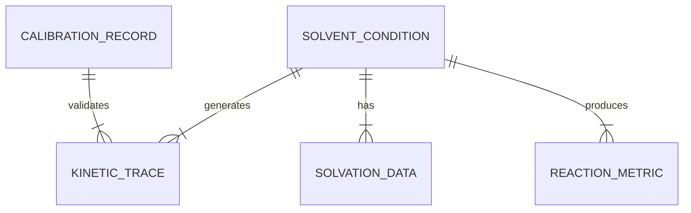

# Data Model: Solvent Effects on Photo-Fries Rearrangement Kinetics

## Overview

This document defines the schema for all data artifacts in the project, ensuring compliance with the Constitution (Principle III: Data Hygiene, Principle IV: Single Source of Truth).

## Entity Relationship Diagram (Conceptual)

## Entities

### 1. Solvent Condition
Represents a specific experimental setup.
-   **ID**: `solvent_id` (string, unique)
-   **Name**: `solvent_name` (string)
-   **Dielectric Constant**: `epsilon` (float)
-   **Temperature**: `temperature_c` (float, target 25.0)
-   **Humidity**: `humidity_rh` (float, target 25.0)
-   **Pressure**: `pressure_hpa` (float)
-   **Lookup Version**: `lookup_version` (string)

### 2. Kinetic Trace
Raw or processed transient-absorption data.
-   **ID**: `trace_id` (string)
-   **Solvent ID**: `solvent_id` (FK)
-   **Replicate ID**: `replicate_id` (int)
-   **Time Series**: `time_ns` (array of floats)
-   **Absorbance**: `absorbance_mOD` (array of floats)
-   **Calibration ID**: `calibration_id` (FK)
-   **Status**: `status` (string: "raw", "processed", "flagged")

### 3. Reaction Metric
Derived lifetime and statistics.
-   **ID**: `metric_id` (string)
-   **Trace ID**: `trace_id` (FK)
-   **Lifetime**: `lifetime_ns` (float)
-   **Confidence Interval**: `ci_lower_ns`, `ci_upper_ns` (floats)
-   **Residual R2**: `r_squared` (float)
-   **Mean (Group)**: `mean_lifetime_ns` (float, if aggregated)
-   **Std Dev (Group)**: `std_lifetime_ns` (float)

### 4. Solvation Data
Computed or reference solvation energies.
-   **ID**: `solv_id` (string)
-   **Solvent ID**: `solvent_id` (FK)
-   **Energy**: `solvation_energy_kcal_mol` (float)
-   **Method**: `method` (string: "SMD", "PCM", "Explicit")
-   **Basis Set**: `basis_set` (string)

### 5. Calibration Record
Instrument validation data.
-   **ID**: `calib_id` (string)
-   **Date**: `calibration_date` (ISO-8601)
-   **Detector Response**: `detector_response` (float)
-   **Wavelength Cal**: `wavelength_error_nm` (float)
-   **Baseline Stability**: `baseline_drift` (float)

## File Formats

-   **Raw Data**: CSV (`time_ns, absorbance_mOD, replicate_id`)
-   **Processed Data**: CSV/JSON (`trace_id, lifetime_ns, ci_lower, ci_upper`)
-   **Configuration**: YAML (`solvents.yaml`)
-   **Metadata**: JSON (`metadata.json` per run)
