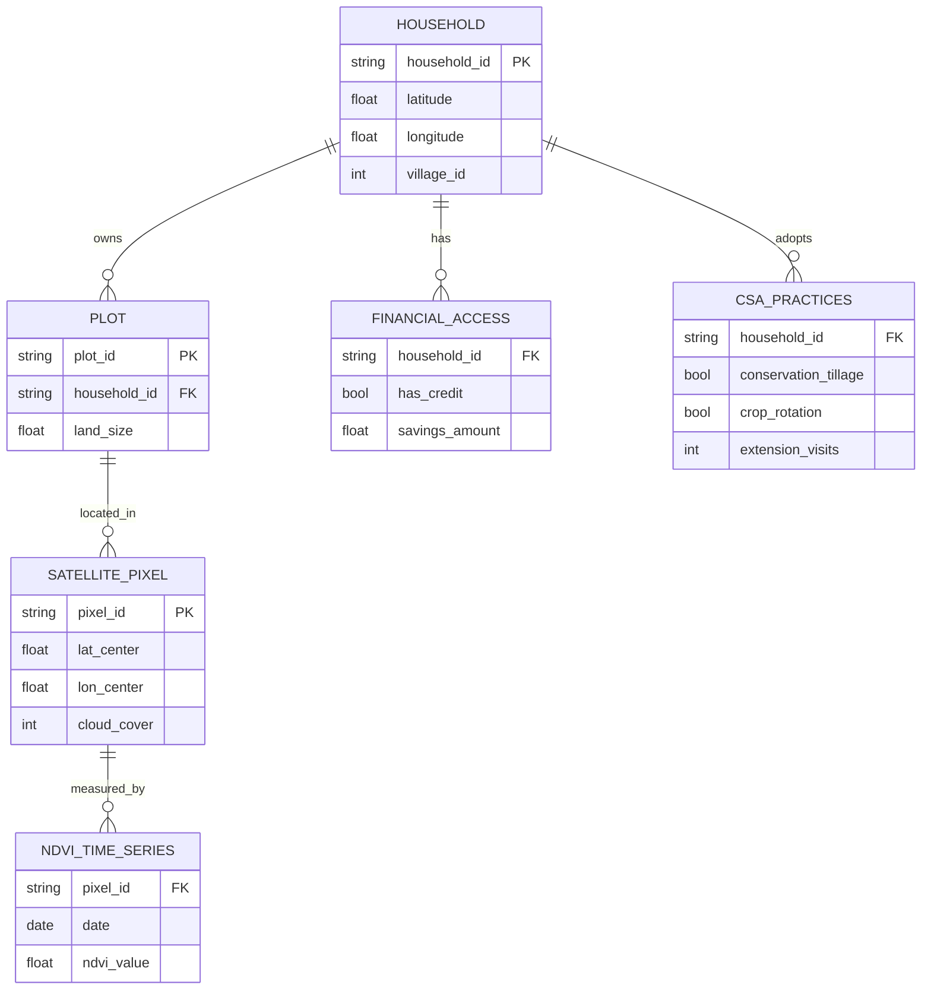

# Data Model: Correlational Analysis of Climate-Smart Agricultural Practices

## 1. Overview

This document defines the data structures, schemas, and transformation logic for the analysis pipeline. The model supports the ingestion of survey and satellite data, the construction of derived variables, and the output of regression results.

## 2. Entity Relationship Diagram (Conceptual)

## 3. Schema Definitions

### 3.1 Raw Input Schemas (Conceptual)
*Note: Actual raw data will be validated against the `contracts/dataset.schema.yaml`.*

-   **Survey Data**: Contains `household_id`, `coordinates`, `CSA_practices`, `Finance`, `HFIAS`.
-   **Satellite Data**: Contains `pixel_id`, `coordinates`, `NDVI`, `date`, `cloud_cover`.

### 3.2 Processed Dataset Schema (`analysis_dataset.csv`)

| Column Name | Type | Description | Source |
| :--- | :--- | :--- | :--- |
| `household_id` | string | Unique identifier | Survey |
| `village_id` | string | Aggregation unit | Survey |
| `CSA_Index` | float | Sum of practice indicators + extension visits | Derived |
| `Stability_Score` | float | $1 / CV(NDVI)$ | Derived (Satellite) |
| `HFIAS` | float | Food insecurity score | Survey |
| `Access_to_Finance` | float | Binary/continuous finance proxy | Survey |
| `Land_Size` | float | Hectares | Survey |
| `Education_Level` | int | Years of schooling | Survey |
| `Rainfall_Anomaly` | float | Deviation from mean rainfall | External/Survey |
| `Cloud_Cover_Mean` | float | Average cloud cover for plot | Derived |
| `is_synthetic` | bool | Flag indicating synthetic data | System |

### 3.3 Output Schema (`regression_results.json`)

| Column Name | Type | Description |
| :--- | :--- | :--- |
| `model_name` | string | "Yield_Stability" or "Food_Security" |
| `coefficient_CSA` | float | $\beta_1$ estimate |
| `p_value_CSA` | float | P-value for CSA coefficient |
| `robust_se_CSA` | float | Robust Standard Error |
| `vif_scores` | dict | VIF for all predictors |
| `n_observations` | int | Sample size |
| `r_squared` | float | Model fit |
| `bonferroni_sig` | bool | Is p-value < 0.0167? |

## 4. Transformation Logic

### 4.1 CSA Index Calculation
$$ CSA\_Index = \sum_{i=1}^{N} Practice_i + \alpha \times Extension\_Visits $$
*Where $Practice_i$ is binary (0/1) and $\alpha$ is a weighting factor (default 1.0).*

### 4.2 Stability Score Calculation
1.  Filter NDVI time-series for the specific growing season.
2.  **NDVI Masking**: Exclude all observations where mean NDVI < 0.2. This threshold is standard for excluding non-vegetated pixels (fallow land, early/late season) to prevent division by near-zero and reduce heteroskedasticity.
3.  Calculate Mean ($\mu$) and Standard Deviation ($\sigma$) of NDVI.
4.  $CV = \sigma / \mu$.
5.  $Stability\_Score = 1 / CV$.
6.  Handle division by zero: If $\mu = 0$, set $Stability\_Score = 0$ and flag.
*Note: This masking is a prerequisite for the validity of the subsequent robust standard error calculation.*

### 4.3 Spatial Join Logic
-   **Input**: Household Lat/Long, Satellite Pixel Lat/Long.
-   **Method**: Nearest Neighbor within a specified radius (e.g., 1km).
-   **Fuzzing**: Coordinates in raw data are fuzzed (jittered) by $\pm 0.01^\circ$ for privacy. The join uses the fuzzed coordinates.

### 4.4 Temporal Alignment Validation
-   **Logic**: Before calculating `Stability_Score`, the pipeline must verify that the `survey_reference_period` (e.g., "Last 12 months") overlaps with the `satellite_growing_season` (e.g., "March-May 2020").
-   **Check**: `survey_year == satellite_year` AND `survey_season_window` overlaps `satellite_season_window`.
-   **Action**: If no overlap, flag the record as `TEMPORAL_MISMATCH` and exclude from analysis. This prevents spurious correlations from mismatched seasons.

### 4.5 Sensitivity Sweep Logic
-   Iterate `threshold` in [20, 40, 60, 80].
-   Filter satellite data: `cloud_cover <= threshold`.
-   Re-calculate `Stability_Score` and run regression.
-   Store `coefficient_CSA` for each threshold.

### 4.6 Model Specification Sensitivity (Non-Linearity)
-   **Diagnostic**: Run Ramsey RESET test on the primary model.
-   **Condition**: If RESET p-value < 0.05, the linear assumption is violated.
-   **Action**: Run a secondary sensitivity model:
    -   `Stability_Score ~ CSA_Index + CSA_Index^2 + Finance + ...`
    -   `Stability_Score ~ CSA_Index * Finance + ...`
-   **Output**: Compare coefficients. If the interaction/quadratic term is significant, report this as the primary finding and note the non-linearity.

## 5. Data Hygiene & Provenance

-   **Checksums**: All raw files under `data/raw/` must have `.sha256` files.
-   **Immutability**: Raw data is never modified. All transformations create new files in `data/processed/`.
-   **Logs**: `data/logs/linkage_validation.json` records the count of matched vs. unmatched households.
-   **PII**: No household names or exact coordinates (beyond fuzzed) are stored in processed files.