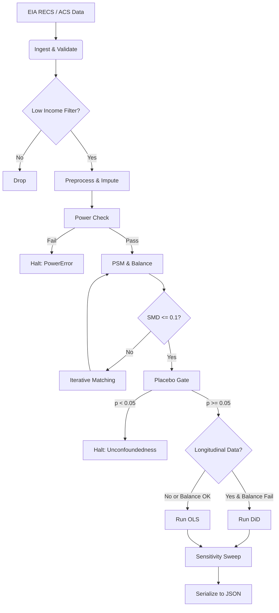

# Architecture: Causal Inference Pipeline

## 1. Executive Summary

This document details the architecture of the PROJ-007 energy systems pipeline. The system is designed to estimate the Average Treatment Effect on the Treated (ATT) of distributed energy resources (DER) on energy cost burdens for low-income households. The architecture strictly follows the Functional Requirements (FR-001 to FR-009) and Constitution Principle VI (Causal Identification Rigor).

**Key Constraint**: This system does **not** perform scaling law analysis. The scope is limited to causal inference on microdata.

## 2. System Components

### 2.1 Data Layer (`src/data/`)

- **Ingestion (`ingest.py`)**:
 - Fetches EIA RECS data from the official URL.
 - Fetches ACS tract-level median income via `censusdata` API.
 - Validates required columns (income, energy_cost, solar_installation, location) immediately.
 - Fails loudly if real data cannot be retrieved (no synthetic fallback).

- **Preprocessing (`preprocess.py`)**:
 - **Filtering**: Retains only households in census tracts with median income < 150% of FPL.
 - **Treatment Construction**: Binary flag `treatment` (1 = DER adopter, 0 = non-adopter).
 - **Imputation**: Median imputation for continuous variables; 'Missing' category for categorical.
 - **Winsorization**: Trims outliers at 1st/99th percentiles for energy cost variables.
 - **Power Check**: Raises `PowerError` if adopters < 50.

### 2.2 Analysis Layer (`src/analysis/`)

- **Propensity Score Matching (`psm.py`)**:
 - Estimates propensity scores using Logistic Regression.
 - Implements `iterative_matching`:
 1. Match with initial caliper.
 2. Calculate SMD.
 3. If SMD > 0.1 and caliper > 0.01: reduce caliper and retry.
 4. If SMD > 0.1 and caliper <= 0.01: prune lowest-weight covariate and retry.
 5. If max attempts exceeded: set `balance_status = FAIL`.
 - Checks common support (excludes extreme scores near 0 or 1).

- **Balance Validation (`balance.py`)**:
 - Calculates Standardized Mean Difference (SMD) for all covariates.
 - Generates love plots for visual inspection.
 - **Placebo Gate (`run_placebo_gate`)**:
 - Runs placebo test on pre-treatment outcome.
 - Returns `False` if p-value < 0.05 (unconfoundedness failure).
 - This result feeds into the `balance_status` logic.

- **Causal Estimation (`causal.py`)**:
 - **OLS**: Primary estimator. `log(energy_cost)` ~ `treatment` + covariates.
 - Uses cluster-robust standard errors (clustered by matched pair).
 - **DiD Fallback**:
 - Triggered ONLY if:
 1. `balance_status == FAIL` AND
 2. Longitudinal data (`pre_treatment_outcome`, `post_treatment_outcome`) is present.
 - Raises `DataUnavailableError` if longitudinal columns are missing.

- **Sensitivity Analysis (`sensitivity.py`)**:
 - Sweeps caliper values (e.g., 0.05 to 0.20).
 - Compiles ATT estimates, p-values, and confidence intervals for each caliper.

### 2.3 Models & Output (`src/models/`)

- **Schemas (`schemas.py`)**: Pydantic models for `Household`, `MatchedPair`, `AnalysisResult`.
- **Output (`output.py`)**:
 - `AnalysisResult.to_json()`: Serializes ATT, p-value, CI, methodology, and sensitivity data.
 - Saves to `data/outputs/analysis_result.json`.

### 2.4 Control Flow (`src/main.py`)

The entry point orchestrates the pipeline:

1. Load config and set seeds.
2. Ingest and preprocess data.
3. Run PSM with iterative matching and balance validation.
4. Execute Placebo Gate.
5. **Decision Logic**:
 - If `balance_status == FAIL` AND longitudinal data available → Run DiD.
 - Else → Run OLS.
6. Run sensitivity analysis.
7. Serialize results.

## 3. Data Flow Diagram

## 4. Adherence to Functional Requirements

- **FR-001 (Data Source)**: Implemented via `fetch_eia_rec` and `fetch_acs` with strict column validation.
- **FR-002 (Low Income)**: Filtered via `filter_low_income` using ACS tract median income < 150% FPL.
- **FR-003 (Covariates)**: Model strictly limited to income, housing type, and location.
- **FR-004 (Balance)**: Enforced via `iterative_matching` and SMD calculation.
- **FR-005 (Placebo)**: Implemented in `run_placebo_gate`; gates causal estimation.
- **FR-006 (Estimator)**: OLS with cluster-robust SE; DiD fallback with strict error handling.
- **FR-007 (Sensitivity)**: `sweep_caliper` generates robustness table.
- **FR-008 (Reproducibility)**: All seeds set in `src/config.yaml` and enforced by `src/utils/logging.py`.
- **FR-009 (Output)**: `AnalysisResult` JSON structure includes all required fields.

## 5. Security & Safety

- **PII Protection**: No PII is written to `data/processed/`. A `detect-secrets` scan is integrated into the CI pipeline.
- **Error Handling**: The system raises specific exceptions (`PowerError`, `DataUnavailableError`, `PlaceboGateError`) to prevent silent failures or invalid inference.
- **No Fabrication**: The pipeline is designed to fail loudly if real data sources are unreachable. No synthetic data generation is implemented.

## 6. Exclusions

- **Scaling Laws**: This architecture explicitly excludes scaling law analysis (e.g., West's sublinear scaling). The project scope is confined to causal inference on microdata.
- **Web/Mobile Interfaces**: This is a backend data pipeline; no frontend artifacts are included.