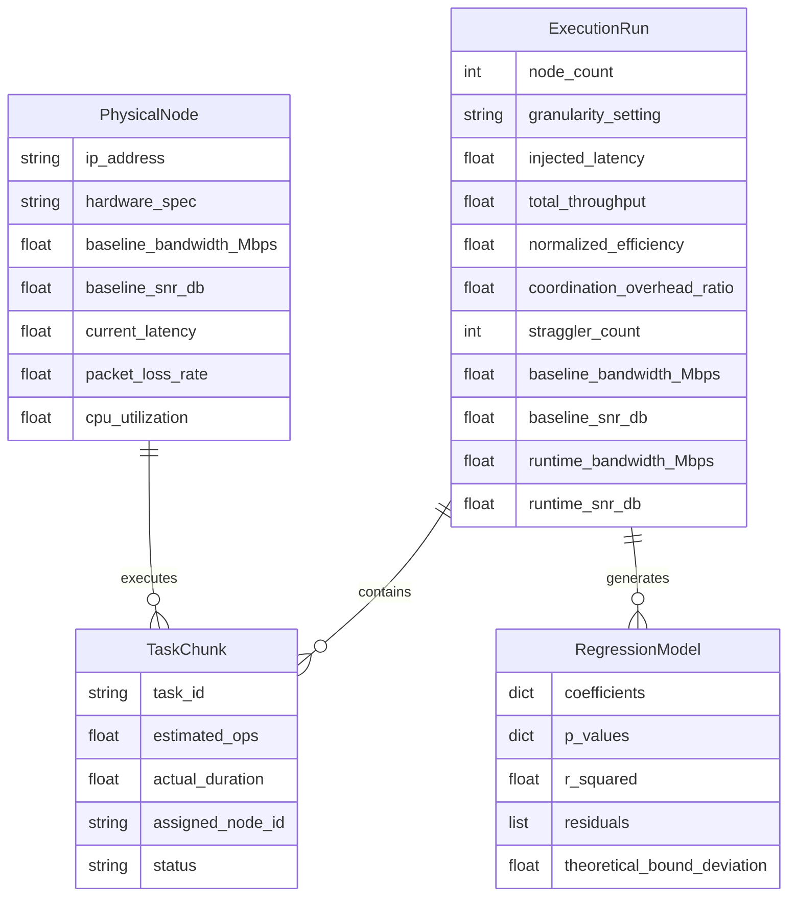

# Data Model: Mesh Network Supercomputer Using Pooled Idle Computing Resources

## 1. Entity-Relationship Overview

The data model consists of four core entities: `PhysicalNode`, `TaskChunk`, `ExecutionRun`, and `RegressionModel`. These entities capture the physical testbed state, task execution details, aggregated metrics, and statistical analysis results.

## 2. Entity Definitions

### PhysicalNode
Represents a real device in the mesh network. Includes **baseline** channel metrics (measured once per session) and **runtime** metrics.

| Attribute | Type | Description | Source |
|-----------|------|-------------|--------|
| `ip_address` | string | Unique IP address of the node | SSH discovery |
| `hardware_spec` | string | CPU model, RAM capacity | `lscpu`, `free` |
| `baseline_bandwidth_Mbps` | float | Bandwidth measured *before* load (static per session) | `iperf` (pre-run) |
| `baseline_snr_db` | float | SNR measured *before* load (static per session) | `iwconfig` (pre-run) |
| `current_latency` | float | Measured network latency (ms) during run | `ping` |
| `packet_loss_rate` | float | Packet loss percentage during run | `tcpdump` |
| `cpu_utilization` | float | CPU usage percentage during run | `mpstat` |

### TaskChunk
A unit of work assigned to a node.

| Attribute | Type | Description | Source |
|-----------|------|-------------|--------|
| `task_id` | string | Unique identifier for the task | Orchestrator |
| `estimated_ops` | float | Estimated operations for the chunk | Benchmark config |
| `actual_duration` | float | Wall-clock execution time (s) | Node log |
| `assigned_node_id` | string | IP address of assigned node | Orchestrator |
| `status` | string | pending, running, failed, completed, re-assigned | Orchestrator |

### ExecutionRun
Aggregated metrics for a specific parameter set. Includes both **baseline** (for bound calculation) and **runtime** (for diagnostics) channel metrics.

| Attribute | Type | Description | Source |
|-----------|------|-------------|--------|
| `node_count` | int | Number of active nodes | Orchestrator |
| `granularity_setting` | string | fine, medium, coarse | Config |
| `injected_latency` | float | Artificially injected latency (ms) | Config |
| `total_throughput` | float | Tasks per second | Aggregation |
| `normalized_efficiency` | float | Throughput / Baseline Theoretical Max | Derived |
| `coordination_overhead_ratio` | float | Handshake time / total time | Aggregation |
| `straggler_count` | int | Number of straggler events | Orchestrator |
| `baseline_bandwidth_Mbps` | float | Average baseline bandwidth (pre-run) | Aggregation |
| `baseline_snr_db` | float | Average baseline SNR (pre-run) | Aggregation |
| `runtime_bandwidth_Mbps` | float | Average bandwidth during run | Aggregation |
| `runtime_snr_db` | float | Average SNR during run | Aggregation |

### RegressionModel
Statistical output from analysis.

| Attribute | Type | Description | Source |
|-----------|------|-------------|--------|
| `coefficients` | dict | Model coefficients (key: variable, value: coef) | `pygam` |
| `p_values` | dict | P-values for each coefficient | `pygam` |
| `r_squared` | float | Coefficient of determination | `pygam` |
| `residuals` | list | Residual errors | `pygam` |
| `theoretical_bound_deviation` | float | Ratio of empirical efficiency to theoretical bound | Validation script |

## 3. Data Flow

1. **Baseline Measurement Phase**: `orchestrator/node_manager.py` measures `baseline_bandwidth` and `baseline_snr` on all nodes before the benchmark starts.
2. **Orchestration Phase**: `orchestrator/scheduler.py` assigns `TaskChunk` to `PhysicalNode`.
3. **Instrumentation Phase**: `orchestrator/instrumentor.py` collects raw logs (`tcpdump`, `mpstat`) from nodes.
4. **Aggregation Phase**: `analysis/regression.py` aggregates `TaskChunk` logs into `ExecutionRun` metrics, calculating `normalized_efficiency` using baseline parameters.
5. **Analysis Phase**: `analysis/regression.py` fits GAM model and outputs `RegressionModel`.
6. **Validation Phase**: `analysis/theoretical_bound.py` compares `RegressionModel` to Ong & Motani (2007) bound parameterized with **baseline** metrics.

## 4. Data Hygiene & Checksums

- **Raw Data**: Stored in `data/raw/` with checksums recorded in `state/projects/PROJ-009-build-a-mesh-network-that-forms-the-larg.yaml`.
- **Derived Data**: Written to `data/processed/` with new filenames; original raw data preserved unchanged.
- **PII Scan**: All data files scanned for personally identifying information before commit.