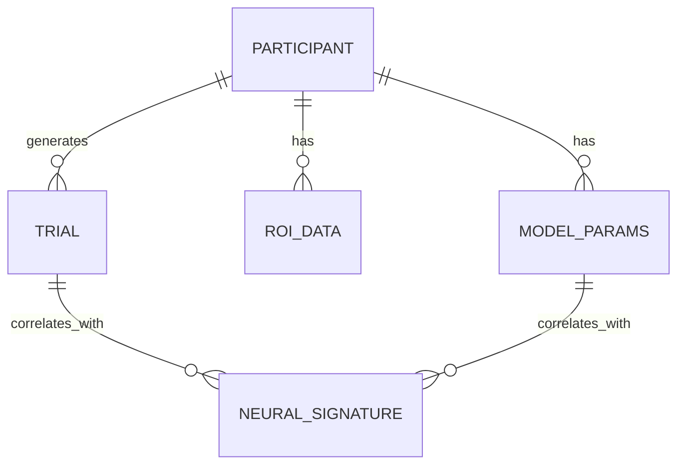

# Data Model: Neural Mechanisms Underlying Adaptive Decision-Making

## Entity Relationship Diagram (Conceptual)

## Schema Definitions

### Participant
Represents a single subject in the study.
- `participant_id` (string): Unique identifier.
- `age` (integer): Age in years.
- `sex` (string): Biological sex (M/F/Other).
- `exclusion_reason` (string | null): Reason for exclusion (e.g., "Motion > 3mm", "Data Missing").
- `data_hash` (string): SHA256 hash of raw data files (for versioning).

### Trial
Represents a single decision event.
- `trial_id` (string): Unique ID.
- `participant_id` (string): FK to Participant.
- `private_belief` (float): Initial belief rating (0-1).
- `social_feedback` (float): Social feedback rating (0-1).
- `choice` (integer): 0 (Private) or 1 (Social).
- `discrepancy` (float): Calculated as `abs(private_belief - social_feedback)`.
- `timestamp` (datetime): Event time.

### ROI_Data
Extracted BOLD signals or Beta-maps for specific regions.
- `participant_id` (string): FK to Participant.
- `region` (string): "dlPFC", "ventral_striatum", "ACC".
- `beta_discrepancy` (float): Pre-processed beta weight for discrepancy (if available).
- `time_series` (array[float]): BOLD signal values over time (if beta-map unavailable).
- `motion_params` (array[float]): 6 motion parameters (tx, ty, tz, rx, ry, rz) from logs.
- `is_valid` (boolean): True if motion < 3mm threshold.

### Model_Params
Computational model estimates.
- `participant_id` (string): FK to Participant.
- `alpha` (float): Belief updating rate.
- `alpha_hdi_lower` (float): [deferred] HDI lower bound.
- `alpha_hdi_upper` (float): [deferred] HDI upper bound.
- `converged` (boolean): True if MCMC/VI converged.
- `log_likelihood` (float): Model fit metric.
- `backend` (string): "numpyro" (fixed).

### Neural_Signature
Statistical results from GLM/Correlation.
- `participant_id` (string): FK to Participant.
- `region` (string): "dlPFC", "ventral_striatum", "ACC".
- `beta_discrepancy` (float): GLM beta for feedback discrepancy.
- `p_value` (float): Uncorrected p-value.
- `fdr_q_value` (float): FDR corrected q-value (across 3 ROIs).
- `correlation_alpha` (float): Partial correlation with alpha (LOSO).

## Data Flow

1. **Raw Ingestion**: `raw/` (OpenNeuro NIfTI/Parquet) -> `preprocessing/` -> `processed/roi_data.parquet` (with checksums)
2. **Modeling**: `processed/roi_data.parquet` + `processed/behavior.parquet` -> `models/params.parquet`
3. **Analysis**: `models/params.parquet` + `processed/roi_data.parquet` -> `results/neural_signatures.parquet`
4. **Aggregation**: `results/neural_signatures.parquet` -> `paper/stats.json`

## Versioning Discipline
- Every file in `data/` is checksummed with `sha256sum`.
- Checksums are stored in `state/artifact_hashes.yaml`.
- `data_hash` in `Participant` entity links to the specific version of the raw data used.