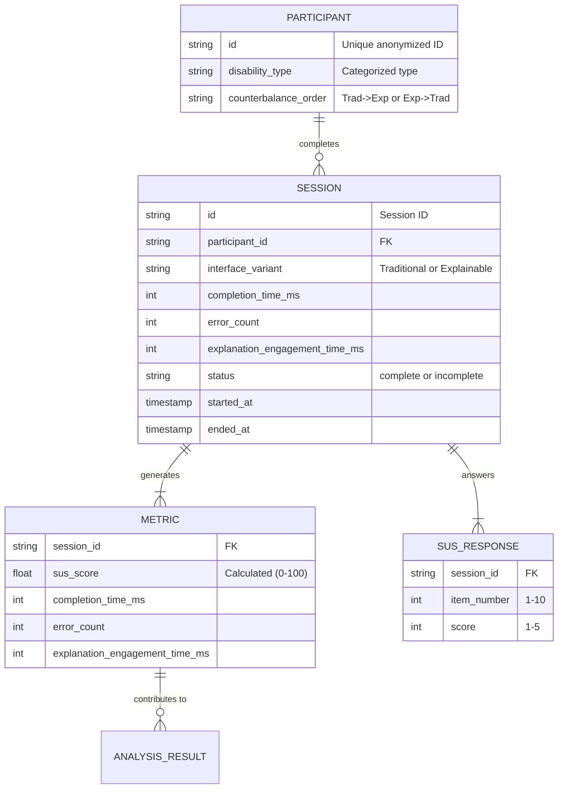

# Data Model: Improving Accessibility and Usability of Complex Computer Systems for People with Disabilities

## 1. Overview
This document defines the data structures used for collecting, validating, and analyzing interaction data in the accessibility study. The data flow is: `Raw Session Data` -> `Validation` -> `Processed Metrics` -> `Statistical Output`.

## 2. Entity Relationship Diagram (Conceptual)

## 3. Data Specifications

### 3.1. Participant Data
- **ID**: Anonymized UUID (e.g., `P-001`). No PII stored in `data/`.
- **Disability Type**: Categorical (e.g., `Visual`, `Motor`, `Cognitive`, `Multiple`).
- **Counterbalance Order**: Binary (`T-E` or `E-T`).

### 3.2. Session Data (Raw)
- **Source**: `code/app.py` (Streamlit).
- **Format**: JSONL or CSV.
- **Fields**:
  - `session_id`: Unique string.
  - `participant_id`: Reference to participant.
  - `interface_variant`: Enum (`Traditional`, `Explainable`).
  - `task_start`: ISO8601 timestamp.
  - `task_end`: ISO8601 timestamp.
  - `errors`: List of error objects (or count).
  - `explanation_engagement_time_ms`: Integer (time spent on XAI overlays).
  - `sus_responses`: List of 10 integers (1-5).
  - `status`: `complete` or `incomplete`.

### 3.3. Processed Metrics (Derived)
- **Source**: `code/analysis.py`.
- **Format**: CSV (`data/processed/metrics_summary.csv`).
- **Fields**:
  - `participant_id`: String.
  - `interface_variant`: String.
  - `completion_time_sec`: Float (derived from timestamps).
  - `error_count`: Integer.
  - `explanation_engagement_time_sec`: Float.
  - `sus_score`: Float (0-100, calculated via standard SUS formula).
  - `exclusion_reason`: String (e.g., "missing_sus_item", "incomplete_session").

### 3.4. Statistical Output
- **Source**: `code/analysis.py`.
- **Format**: JSON/Markdown.
- **Content**:
  - ANOVA/Friedman F-statistic/Chi-sq, p-value, effect size.
  - Holm-Bonferroni adjusted p-values.
  - Power analysis results (Observed power, N=30 check).

## 4. Data Flow Logic

1.  **Collection**: User interacts with Streamlit app. Data is saved to `data/raw/session_<id>.json`.
2.  **Validation**: `validator.py` loads raw JSON.
    - Checks schema (missing fields, valid ranges).
    - Checks SUS completeness: **If ANY SUS item is missing, mark session 'incomplete'**.
    - If valid: `status='complete'`.
    - If invalid: `status='incomplete'`, logged to `data/raw/invalid_sessions.json`.
3.  **Processing**: `analysis.py` aggregates valid sessions.
    - Calculates SUS score (standard formula: `(Q_odd - 1) * 4 + (5 - Q_even) * 4`).
    - Converts timestamps to seconds.
    - Writes `metrics_summary.csv`.
4.  **Analysis**: `analysis.py` runs ANOVA (or Friedman) and Holm-Bonferroni on `metrics_summary.csv`.
5.  **Visualization**: `visualizer.py` reads `metrics_summary.csv` and generates PNGs.

## 5. Data Integrity & Hygiene (Constitution III)

- **Immutability**: Files in `data/raw` are never overwritten. New sessions are appended or written as new files.
- **Checksums**: Every file in `data/` is checksummed (SHA-256) and recorded in `state/...yaml`.
- **PII**: No names, emails, or specific disability details (beyond broad categories) are stored.
- **Derivation**: `metrics_summary.csv` is strictly derived from `data/raw`. No manual edits.

## 6. Visualization Contract

The `seaborn` library is explicitly used to generate the following figures, which must match the `figures/` directory structure:
- **Boxplots**: `completion_time.png`, `error_count.png`, `sus_score.png`, `explanation_engagement.png`.
- **Violin Plots**: Optional overlay for distribution density.
- **Contract**: All figures must include error bars (confidence intervals) and be saved as PNG with 300 DPI resolution.