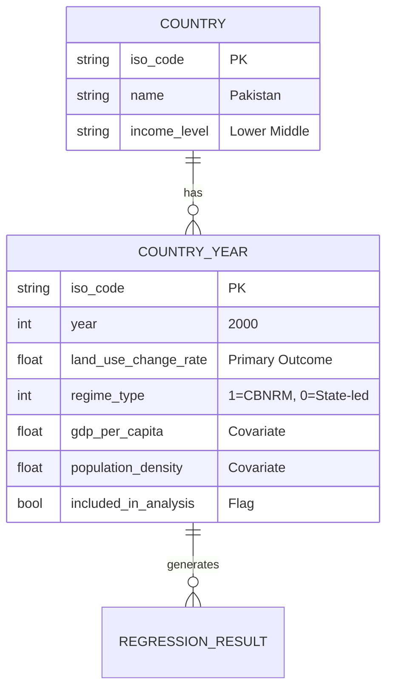

# Data Model: Evaluating CBNRM vs State-Led Management

## 1. Entity Relationship Overview

The data model is a **Country-Year Panel**. The primary entity is a record representing a specific country in a specific year.

## 2. Schema Definitions

### 2.1 Raw Data Entities

| Entity | Source | Key Fields | Transformation |
|--------|--------|------------|----------------|
| `raw_fao_landuse` | FAO FRA | `country_code`, `year`, `forest_area_change` | Standardize year to int; map metric to `land_use_change_rate`. |
| `raw_wb_gdp` | World Bank | `country_code`, `year`, `gdp_per_capita` | Standardize year to int. |
| `raw_wb_pop` | World Bank | `country_code`, `year`, `pop_density` | Standardize year to int. |
| `raw_cbnrm_proxy` | World Bank/FAO | `country_code`, `year`, `community_forest_share` | Binary classification logic (threshold-based). |

### 2.2 Processed Data Entity: `panel_data`

**File**: `data/processed/panel_data_v1.csv`
**Format**: CSV (UTF-8)

| Column | Type | Description | Constraints |
|--------|------|-------------|-------------|
| `iso_code` | string | ISO 3166-1 alpha-3 code | PK, KE, etc. |
| `year` | integer | Calendar year | Range: 2000–2020 |
| `land_use_change_rate` | float | Annual % change in land cover | Not Null (if included). Excluded if missing. |
| `regime_type` | integer | 1 = CBNRM, 0 = State-led | Binary (0 or 1). Excluded if missing. |
| `gdp_per_capita` | float | GDP per capita (USD) | Not Null (if included). Graceful degrade if missing. |
| `population_density` | float | Persons per sq km | Not Null (if included). Graceful degrade if missing. |
| `income_group` | string | World Bank classification | "Low", "Lower Middle", "Upper Middle" |
| `included` | boolean | Flag for inclusion in final analysis | True/False |

### 2.3 Derived Entities

| Entity | Description |
|--------|-------------|
| `regression_results` | DataFrame containing coefficients, p-values, R-squared, and F-statistics. |
| `robustness_results` | DataFrame containing results from non-linear/alternative model checks. |
| `plots` | PNG files: `residuals.png`, `coefficients.png`. |

## 3. Data Cleaning Rules

1.  **Year Standardization**: All year columns converted to `int`.
2.  **Merge Logic**: Inner join on `iso_code` + `year`.
3.  **Missing Value Policy**:
    *   **Primary Variables** (`land_use_change_rate`, `regime_type`): If missing, **exclude the row** and log "Primary Variable Missing". If a country has >20% missing primary data, **exclude the country**.
    *   **Secondary Variables** (`gdp_per_capita`, `population_density`): If missing, **exclude only the affected row** and log the specific variable (FR-007). Do not halt unless all rows are excluded.
4.  **Country Filtering**: Exclude countries where >20% of years are missing primary data.
5.  **Time-Invariance Check**: Before regression, check if `regime_type` is constant for any country. If constant, **exclude that country** from the Fixed-Effects model (log exclusion). If constant for all, switch model type.

## 4. Variable Derivation Logic

### 4.1 Regime Type (`regime_type`)

Derived from the verified CBNRM proxy (e.g., Community Forest Area Share):
1.  **Primary**: If `community_forest_share` > 30% (validated threshold), set `regime_type` = 1 (CBNRM).
2.  **Secondary**: Otherwise, set `regime_type` = 0 (State-led).
3.  **Note**: This is distinct from general governance indices and based on a specific land-management metric.

### 4.2 Land Use Change Rate

*   **Source**: Derived from FAO FRA land cover metrics.
*   **Calculation**: `(ForestArea_t - ForestArea_t-1) / ForestArea_t-1 * 100`.
*   **Note**: If the source data lacks time-series, the row is excluded.