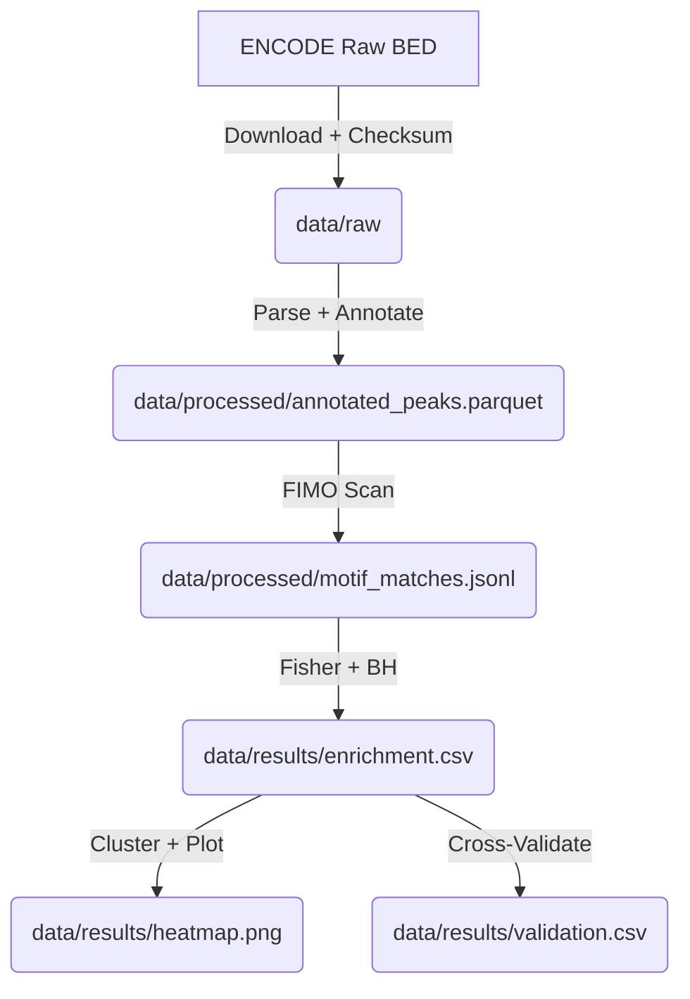

# Data Model: Exploring the Mechanisms of Gene Regulation Across Different Cell Types

## Overview

This document defines the data structures, file formats, and schemas used throughout the pipeline. All data is stored in `data/` with checksums. Intermediate files are in `TMP_DIR` and deleted after processing.

## File Formats

### 1. Raw Peak Files (Input)
*   **Format**: BED (Browser Extensible Data) or narrowPeak.
*   **Columns**: `chrom`, `start`, `end`, `name` (optional), `score` (optional), `strand` (optional).
*   **Source**: ENCODE.
*   **Constraint**: Must be parsed into a unified internal representation.

### 2. Annotated Peaks (Intermediate)
*   **Format**: Parquet or JSONL.
*   **Schema**:
    *   `chrom`: string
    *   `start`: int
    *   `end`: int
    *   `cell_type`: string (enum: GM12878, K562, HepG2, H1-hESC, IMR90)
    *   `gene_symbol`: string (mapped from hg38)
    *   `peak_id`: string (original ID)

### 3. Motif Matches (Intermediate)
*   **Format**: JSONL.
*   **Schema**:
    *   `peak_id`: string
    *   `cell_type`: string
    *   `motif_id`: string (JASPAR ID)
    *   `p_value`: float
    *   `strand`: string (+/-)

### 4. Enrichment Results (Output)
*   **Format**: CSV/Parquet.
*   **Schema**:
    *   `motif_id`: string
    *   `cell_type`: string
    *   `odds_ratio`: float
    *   `p_value`: float
    *   `q_value`: float (BH corrected)
    *   `is_significant`: bool

### 5. Validation Results (Output)
*   **Format**: CSV/Parquet.
*   **Schema**:
    *   `motif_id`: string
    *   `cell_type`: string
    *   `overlap_percentage`: float
    *   `chips_peak_count`: int
    *   `predicted_peak_count`: int

## Data Flow Diagram

## Assumptions & Constraints

*   **hg38 Reference**: All coordinates are assumed to be in hg38.
*   **Gene Mapping**: Gene symbols are mapped using a standard GTF (e.g., GENCODE v44).
*   **Memory**: All intermediate JSONL/Parquet files fit within 7GB RAM when loaded in chunks.
*   **Disk**: Total disk usage for `data/` and `TMP_DIR` never exceeds 14GB.
