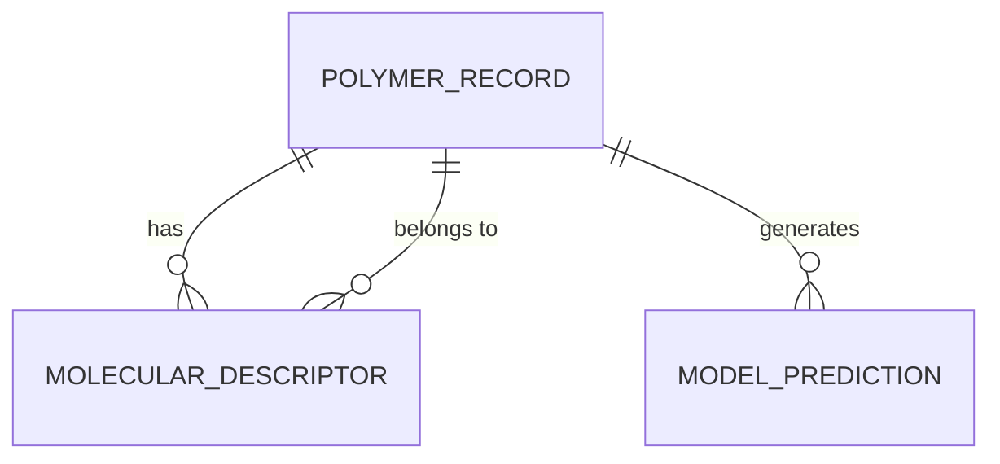

# Data Model: Developing New Methods to Synthesize High-Performance Membranes using Sustainable Materials

## 1. Overview

This document defines the data entities, relationships, and schemas for the project. The data flow follows: `Raw Literature` → `Standardized Records` → `Feature Matrix` → `Predictions`.

## 2. Entity Relationship Diagram (Conceptual)

## 3. Data Entities

### 3.1 PolymerRecord
Represents a single experimental entry from literature.
- **Attributes**:
  - `id`: Unique identifier (UUID).
  - `smiles`: SMILES string of the polymer.
  - `synthesis_method`: Categorical (e.g., "Phase Inversion", "Electrospinning").
  - `permeability_barrer`: Float (Standardized to Barrer).
  - `selectivity`: Float (Dimensionless ratio).
  - `source_citation`: String (DOI or arXiv ID).
  - `is_benchmark`: Boolean (True if petrochemical).
  - `flags`: List of strings (e.g., "high_variance", "imputed").

### 3.2 MolecularDescriptor
Represents a calculated feature for a polymer.
- **Attributes**:
  - `polymer_id`: FK to PolymerRecord.
  - `descriptor_name`: String (e.g., "VdW_Volume", "H_Bond_Donors").
  - `value`: Float.
  - `calculation_method`: String (e.g., "RDKit-2023.9").

### 3.3 ModelPrediction
Represents the output of the screening process.
- **Attributes**:
  - `candidate_smiles`: String.
  - `predicted_permeability`: Float.
  - `predicted_selectivity`: Float.
  - `confidence_interval_lower`: Float.
  - `confidence_interval_upper`: Float.
  - `rank`: Integer.

## 4. Data Flow & Transformations

1. **Ingestion**:
   - Input: Raw CSV/Parquet (Mixed units).
   - Transform: Unit conversion (GPU → Barrer), missing value flagging.
   - Output: `data/processed/standardized_polymers.csv`.
   - **Validation**: Check for ≥30 valid records. Check for ≥10 high-performance bio-membranes.

2. **Feature Engineering**:
   - Input: `standardized_polymers.csv`.
   - Transform: RDKit descriptor calculation, **RFE (Feature Selection)**.
   - Output: `data/processed/feature_matrix.csv` (Reduced feature set).

3. **Modeling**:
   - Input: `feature_matrix.csv`.
   - Transform: Training, Cross-Validation.
   - Output: `artifacts/model.pkl`, `artifacts/cv_results.json`.

4. **Screening**:
   - Input: `model.pkl`, Virtual Library SMILES.
   - Transform: Prediction (Bio & Petro), Ranking, Mann-Whitney U test.
   - Output: `data/reports/screening_results.json`.

## 5. Data Quality Rules

- **Unit Consistency**: All permeability MUST be in Barrer.
- **Completeness**: Records with missing `permeability_barrer` or `smiles` are dropped.
- **Imputation**: Critical variables missing 5-20% trigger imputation + `clarification_flag.json`; >20% triggers halt.
- **Checksums**: All files in `data/raw` and `data/processed` must have recorded SHA-256 checksums.
- **Validation**: `validate_citations.py` must pass before any artifact is finalized.