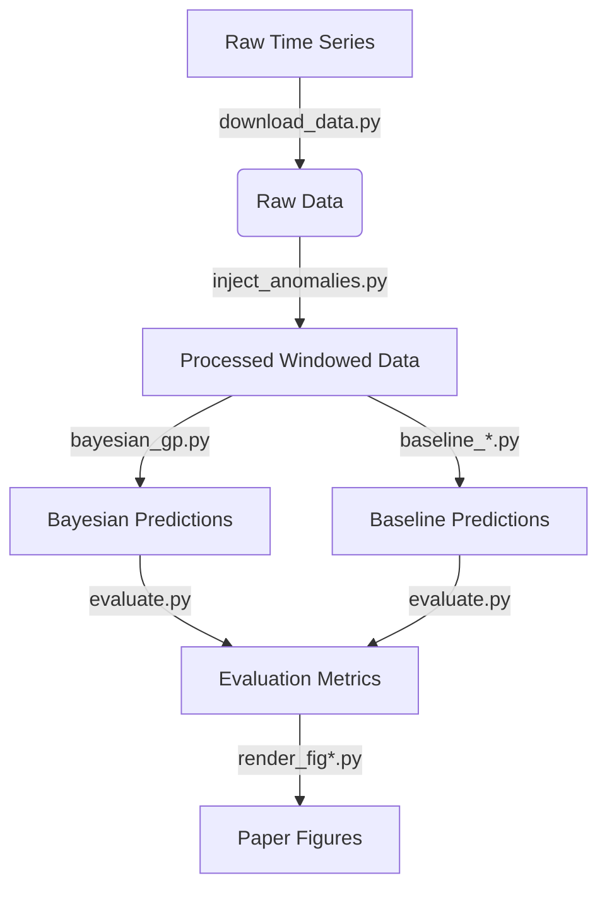

# Data Model: Bayesian Nonparametrics for Anomaly Detection

## 1. Entity-Relationship Overview

The data model consists of three primary stages: **Raw Input**, **Processed/Injected**, and **Results**. All data flows are unidirectional.

## 2. Data Schemas

### 2.1 Raw Time Series (Input)
*Source*: UCR/UCI archives.
*Format*: CSV or Parquet.

| Column | Type | Description |
|--------|------|-------------|
| `timestamp` | float64 | Time index (normalized or raw). |
| `value` | float64 | Observed value. |
| `series_id` | string | Identifier for the source series. |

### 2.2 Processed Windowed Data
*Source*: `inject_anomalies.py`.
*Format*: CSV.

| Column | Type | Description |
|--------|------|-------------|
| `window_id` | string | Unique ID for the window. |
| `time_idx` | int | Index within the window (0 to N-1). |
| `value` | float64 | Normalized value (Z-scored using clean segment parameters). |
| `is_anomaly` | bool | Ground truth label (1 if injected anomaly, 0 otherwise). |
| `anomaly_type` | string | "mean_shift", "variance_spike", "drift", or "normal". |
| `shift_magnitude` | float64 | Magnitude of the injected shift (if applicable). |
| `is_training_segment` | bool | Flag indicating if this point belongs to the "clean" training segment used for model fitting. |

### 2.3 Model Predictions
*Source*: `bayesian_gp.py`, `baseline_*.py`.
*Format*: CSV.

| Column | Type | Description |
|--------|------|-------------|
| `window_id` | string | Matches processed data. |
| `time_idx` | int | Matches processed data. |
| `score` | float64 | Anomaly score (probability or reconstruction error). |
| `model_name` | string | "bayesian_gp", "shewhart", "cusum", "vae". |
| `threshold_applied` | float64 | The fixed threshold used for binary classification (if applicable). |

### 2.4 Evaluation Metrics
*Source*: `evaluate.py`.
*Format*: JSON.

| Field | Type | Description |
|-------|------|-------------|
| `model_name` | string | Name of the model. |
| `window_id` | string | Window identifier. |
| `precision` | float64 | Precision score. |
| `recall` | float64 | Recall score. |
| `f1_score` | float64 | F1-score. |
| `auc_roc` | float64 | Area Under ROC Curve. |
| `threshold` | float64 | Decision threshold used (fixed strategy). |

### 2.5 Aggregated Results
*Source*: `sensitivity_analysis.py`.
*Format*: JSON.

| Field | Type | Description |
|-------|------|-------------|
| `comparison_type` | string | "bayesian_vs_shewhart", etc. |
| `ci_lower` | float64 | Lower bound of 95% Bootstrap CI for F1 difference. |
| `ci_upper` | float64 | Upper bound of 95% Bootstrap CI for F1 difference. |
| `is_significant` | bool | True if CI does not include 0. |
| `correlation_coeff` | float64 | Correlation between magnitude and F1. |
| `correction_method` | string | "benjamini_hochberg". |

## 3. Data Lineage & Hygiene

-   **Immutability**: Raw data files in `data/raw/` are never modified. All transformations create new files in `data/processed/`.
-   **Provenance**: `data/PROVENANCE.md` records the SHA-256 checksum of every raw file and the exact command used to generate derived files.
-   **Versioning**: Each run generates a unique `run_id` prefix for output files to prevent overwriting.