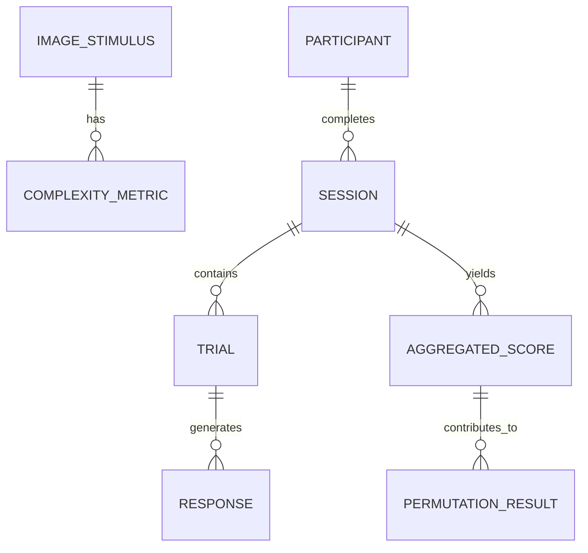

# Data Model: The Influence of Visual Complexity on Implicit Bias

## Overview

This document defines the data structures, schemas, and relationships required for the project. All data is stored in local files (CSV/JSON) under the `data/` directory. The model supports the quantification of stimuli, aggregation of IAT responses, and statistical analysis.

## Entity-Relationship Diagram (Conceptual)



## Core Entities

### 1. Image Stimulus
Represents a single background image used in the IAT.
- **Attributes**:
  - `image_id`: Unique identifier (string).
  - `file_path`: Relative path to the image file. (For synthetic data: dummy string e.g., "synthetic_img_001.png").
  - `condition_label`: "low", "medium", or "high" (assigned after metric computation).
  - `valid`: Boolean (True if image is loadable and not corrupted). (For synthetic data: always True).

### 2. Complexity Metric
Derived metrics for each Image Stimulus.
- **Attributes**:
  - `image_id`: Foreign key to Image Stimulus.
  - `edge_density`: Float (0.0 - 1.0).
  - `entropy`: Float (Shannon entropy).
  - `fractal_dimension`: Float (Box-counting dimension).
  - `composite_score`: Float (Optional weighted average or primary metric used for splitting).
  - `pc1_variance`: Float (Variance explained by PC1, used for dimensionality check).

### 3. Participant
Represents a single subject in the study.
- **Attributes**:
  - `participant_id`: Unique identifier (string).
  - `order`: Counterbalance order (1 = Low first, 2 = High first).

### 4. Session
Represents one IAT administration (Low or High complexity) for a participant.
- **Attributes**:
  - `session_id`: Unique identifier.
  - `participant_id`: Foreign key to Participant.
  - `complexity_condition`: "low" or "high".
  - `order_position`: 1 (first session) or 2 (second session).

### 5. Trial
Raw response data for a single IAT trial.
- **Attributes**:
  - `trial_id`: Unique identifier.
  - `session_id`: Foreign key to Session.
  - `reaction_time_ms`: Integer (latency).
  - `correct`: Boolean.
  - `block_type`: "practice" or "test".
  - `stimulus_id`: Foreign key to Image Stimulus (if applicable).

### 6. Aggregated Score
Derived D-score for a participant's session.
- **Attributes**:
  - `score_id`: Unique identifier.
  - `participant_id`: Foreign key.
  - `session_id`: Foreign key.
  - `d_score`: Float (Greenwald D2).
  - `n_valid_trials`: Integer.
  - `excluded`: Boolean (True if `n_valid_trials` < 10).

### 7. Analysis Result
Output of the statistical tests.
- **Attributes**:
  - `result_id`: Unique identifier.
  - `test_type`: "permutation" or "sensitivity" or "loio".
  - `p_value`: Float.
  - `cohen_d`: Float.
  - `threshold_shift`: Float (for sensitivity analysis).
  - `valid_sweep`: Boolean.
  - `removed_image_id`: String (for LOIO analysis).
  - `dimensionality_method`: String ("PC1" or "Multivariate").

## File Formats

### `data/processed/complexity_scores.csv`
| image_id | file_path | edge_density | entropy | fractal_dimension | condition_label | pc1_variance |
|---|---|---|---|---|---|---|
| img_001 | raw/stimuli/img_001.png | 0.12 | 4.5 | 1.2 | low | 0.75 |

### `data/processed/aggregated_d_scores.csv`
| participant_id | session_id | complexity_condition | d_score | n_valid_trials | excluded |
|---|---|---|---|---|---|
| p001 | s001 | low | 0.45 | 45 | False |
| p001 | s002 | high | 0.21 | 42 | False |

### `data/results/permutation_results.json`
```json
{
  "p_value": 0.023,
  "cohen_d": 0.35,
  "n_participants": 60,
  "dimensionality_method": "PC1",
  "pc1_variance": 0.75
}
```

### `data/results/sensitivity_results.json`
```json
[
  {
    "threshold_shift": 0.0,
    "p_value": 0.023,
    "valid_sweep": true,
    "method": "threshold_sweep"
  },
  {
    "threshold_shift": 0.05,
    "p_value": 0.031,
    "valid_sweep": true,
    "method": "threshold_sweep"
  },
  {
    "removed_image_id": "img_045",
    "p_value": 0.025,
    "valid_sweep": true,
    "method": "loio"
  },
  {
    "threshold_shift": 0.15,
    "p_value": null,
    "valid_sweep": false,
    "reason": "n < 15 per condition",
    "method": "threshold_sweep"
  }
]
```

## Synthetic Data Schema

The `code/data/load.py` module generates synthetic data that strictly conforms to the above schemas:
- `file_path`: Generated as a dummy string (e.g., "synthetic_img_001.png") to satisfy the schema.
- `valid`: Set to `True` for all synthetic images.
- `pc1_variance`: Set to a realistic value (e.g., 0.75) for testing the PCA logic.
- `d_score`: Generated based on the `--null-effect` flag (0.0) or a hypothesized effect size (for testing detection logic only).
- **Entity Mapping**: The `SyntheticDataGenerator` is a logical entity that produces instances of `Participant`, `Session`, `Trial`, and `Aggregated Score` conforming exactly to the definitions in this section.
