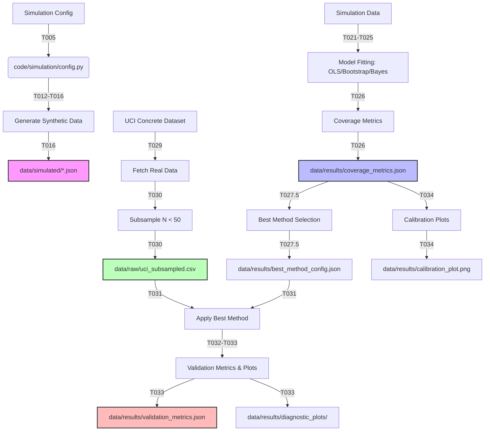

# Quantifying Uncertainty in Small Sample Regression Models

This project implements a pipeline to quantify uncertainty in regression models specifically for small sample sizes ($N < 50$). It compares Ordinary Least Squares (OLS), Non-parametric Bootstrap (BCa), and Bayesian Regression methods to evaluate their coverage probabilities and interval widths.

## Installation

### Prerequisites
- Python 3.11 or higher
- pip

### Setup
1. Clone the repository:
 ```bash
 git clone <repository-url>
 cd PROJ-034-quantifying-uncertainty-in-small-sample
 ```

2. Create a virtual environment and install dependencies:
 ```bash
 python -m venv venv
 source venv/bin/activate # On Windows: venv\Scripts\activate
 pip install -r requirements.txt
 ```

## Usage

### 1. Simulation Engine (User Story 1)
Generate synthetic datasets with controlled correlation structures and sample sizes.

```bash
python -m code.scripts.run_simulation_with_logging --N 40 --rho 0.5 --seeds 100
```
*Outputs*: `data/simulated/*.json`, `data/results/simulation.log`

### 2. Comparative Analysis (User Story 2)
Run OLS, Bootstrap, and Bayesian models on simulated data to calculate coverage metrics.

```bash
python -m code.main --replications 200 --output data/results/coverage_metrics.json
```
*Outputs*: `data/results/coverage_metrics.json`, `data/results/filtered_metrics.json`

### 3. Best Method Selection
Identify the best-performing method based on coverage proximity and interval width.

```bash
python -m code.scripts.select_best_method --input data/results/coverage_metrics.json
```
*Outputs*: `data/results/best_method_config.json`

### 4. Real-World Validation (User Story 3)
Validate the best method on the UCI Concrete Compressive Strength dataset.

```bash
python -m code.validation.uci_runner --subsample-size 40 --seed 42
```
*Outputs*: `data/raw/uci_subsampled.csv`, `data/results/validation_metrics.json`, `data/results/diagnostic_plots/`

### 5. Visualization
Generate calibration plots comparing interval width vs. coverage.

```bash
python -m code.plots.calibration --input data/results/coverage_metrics.json
```
*Outputs*: `data/results/calibration_plot.png`

### Full Pipeline
Run the entire simulation and validation pipeline:
```bash
bash code/scripts/run_full_simulation.sh
```

## Data Flow

The following diagram illustrates the data flow through the pipeline:



## Project Structure

```text
.
├── code/
│ ├── simulation/ # Data generation engine
│ ├── models/ # OLS, Bootstrap, Bayesian implementations
│ ├── metrics/ # Coverage calculation logic
│ ├── validation/ # Real-world data validation
│ ├── plots/ # Visualization utilities
│ ├── scripts/ # CLI entry points
│ └── main.py # Orchestration
├── data/
│ ├── raw/ # External datasets (e.g., UCI)
│ ├── simulated/ # Generated synthetic datasets
│ └── results/ # Metrics, logs, and plots
├── tests/
│ ├── unit/ # Unit tests
│ └── integration/ # Integration tests
├── docs/
│ └── paper/ # Research documentation
├── requirements.txt
├── README.md
└── pyproject.toml
```

## Requirements

- numpy
- pandas
- scipy
- scikit-learn
- cmdstanpy
- matplotlib
- seaborn
- pyyaml
- pytest
- ucimlrepo (for UCI dataset)

## License

MIT License