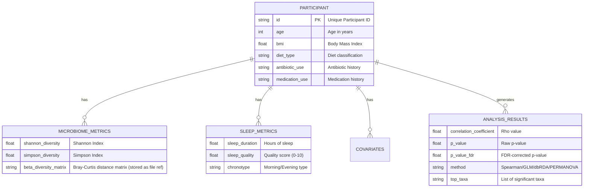

# Data Model: Investigating the Correlation Between Gut Microbiome Composition and Circadian Rhythm Disruption

## Overview

This document defines the data structures used throughout the pipeline. It ensures that the ingestion, analysis, and reporting modules operate on consistent schemas. The model is designed to handle the merging of microbiome data (high-dimensional) and sleep metadata (low-dimensional) while preserving the necessary covariates for confounder adjustment.

## Entity-Relationship Diagram (Conceptual)

## Data Specifications

### 1. Raw Data Inputs

- **AGP Microbiome Data**: OTU/ASV table (BIOM or TSV) + Metadata (TSV/CSV).
- **Open Humans Sleep Data**: Survey responses (JSON/CSV).

### 2. Merged Cohort (Intermediate)

**File**: `data/processed/merged_cohort.csv`

| Column Name | Type | Description | Source |
| :--- | :--- | :--- | :--- |
| `participant_id` | String | Unique identifier (primary key) | Merge Key |
| `age` | Integer | Age in years | AGP Metadata |
| `bmi` | Float | Body Mass Index | AGP Metadata |
| `diet_type` | String | Categorical diet classification | AGP Metadata |
| `antibiotic_use` | Boolean | Yes/No history of antibiotic use | AGP Metadata |
| `medication_use` | Boolean | Yes/No current medication use | AGP Metadata |
| `sleep_duration` | Float | Hours of sleep per night | Open Humans |
| `sleep_quality` | Float | Self-reported quality score (0-10) | Open Humans |
| `chronotype` | String | "Morning", "Evening", "Intermediate" | Open Humans |
| `shannon_diversity` | Float | Shannon index value | Calculated |
| `simpson_diversity` | Float | Simpson index value | Calculated |

**Constraints**:
- `participant_id`: Unique, non-null. *Critical*: Must match exactly between AGP and Open Humans. If IDs do not match, the merge fails and N=0.
- `age`: > 0, < 120.
- `bmi`: > 10, < 60.
- `sleep_duration`: 0 < x < 24 (capped at 1st/99th percentile).
- `shannon_diversity`, `simpson_diversity`: >= 0.

**Note on Diet Timing**: The spec (FR-004) lists "diet timing" as a confounder. This variable is **not available** in the AGP metadata. The model uses `diet_type` instead. The plan flags this as a specification error.

### 3. Analysis Results (Output)

**File**: `data/outputs/correlation_results.csv`

| Column Name | Type | Description |
| :--- | :--- | :--- |
| `variable_pair` | String | e.g., "shannon_diversity vs sleep_duration" |
| `correlation_method` | String | "Spearman", "Pearson", "GLM", "PERMANOVA", "dbRDA" |
| `rho` | Float | Correlation coefficient (or effect size) |
| `p_value_raw` | Float | Raw p-value |
| `p_value_fdr` | Float | Benjamini-Hochberg corrected p-value |
| `ci_lower` | Float | 95% CI lower bound (from bootstrap) |
| `ci_upper` | Float | 95% CI upper bound (from bootstrap) |
| `significant` | Boolean | True if `p_value_fdr` < 0.05 |

### 4. Visualization Data

- **Heatmap Data**: Matrix of taxa (rows) vs. sleep variables (columns) with correlation coefficients.
- **PCoA Data**: Coordinates (PC1, PC2) for each participant, colored by sleep quality.

## Data Flow

1.  **Ingestion**: Raw AGP + Open Humans → `merged_cohort.csv` (filtered, imputed). *Critical*: Verify ID match. If N=0, halt.
2.  **Diversity Calculation**: `merged_cohort.csv` + OTU Table → `merged_cohort.csv` (updated with diversity metrics).
3.  **Analysis**: `merged_cohort.csv` → `correlation_results.csv` + `bootstrap_results.json`.
4.  **Reporting**: `correlation_results.csv` + `bootstrap_results.json` → Final PDF/HTML Report.