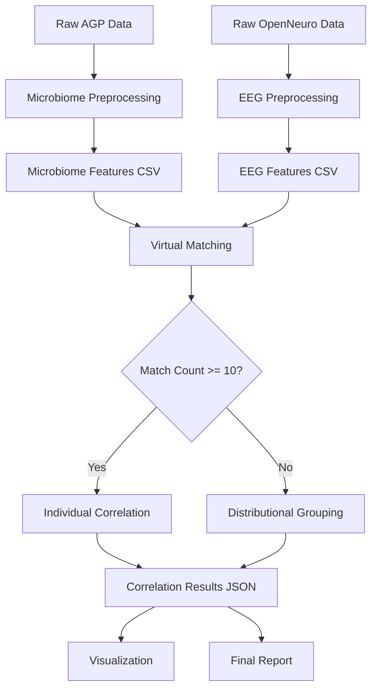

# Data Model: Investigating the Relationship Between Gut Microbiome Composition and Resting-State EEG Alpha Power (Virtual Cohort & Distributional Analysis)

## Overview

This document defines the data model for the Virtual Cohort Matching and Distributional Comparison pipeline. It describes the structure of input data, intermediate artifacts (matched pairs, distribution groups), and output results, ensuring consistency across preprocessing, matching, and statistical analysis phases.

## Entity Definitions

### Subject

Individual participant with linked microbiome or EEG measurements.

| Attribute | Type | Description | Source |
|-----------|------|-------------|--------|
| `subject_id` | String | Unique identifier for the subject | AGP/OpenNeuro |
| `age` | Integer | Age in years | AGP/OpenNeuro |
| `sex` | String | Biological sex (e.g., "M", "F") | AGP/OpenNeuro |
| `bmi` | Float | Body Mass Index (kg/m²) | AGP (may be imputed) |
| `diet_category` | String | Diet category (e.g., "vegetarian", "omnivore") | AGP (used only for grouping, not matching) |
| `microbiome_data` | Boolean | Whether subject has microbiome data | AGP |
| `eeg_data` | Boolean | Whether subject has EEG data | OpenNeuro |
| `alpha_power` | Float | Mean alpha power (μV²/Hz) | Derived (EEG) |
| `clr_abundances` | Dict | CLR-transformed abundances | Derived (Microbiome) |

### Matched Pair

A pair of subjects (one AGP, one OpenNeuro) matched on demographics.

| Attribute | Type | Description | Source |
|-----------|------|-------------|--------|
| `pair_id` | String | Unique identifier for the pair | Derived |
| `agp_subject_id` | String | AGP subject ID | Derived |
| `eeg_subject_id` | String | EEG subject ID | Derived |
| `age_diff` | Float | Absolute difference in age | Derived |
| `bmi_diff` | Float | Absolute difference in BMI | Derived |
| `alpha_power` | Float | EEG subject's alpha power | Aggregated |
| `taxa_abundances` | Dict | AGP subject's CLR abundances | Aggregated |

### Distribution Group

A group of subjects defined by abundance levels for distributional tests.

| Attribute | Type | Description | Source |
|-----------|------|-------------|--------|
| `group_id` | String | Unique identifier (e.g., "High_Bacteroides") | Derived |
| `taxon_name` | String | Taxon used for grouping | Derived |
| `abundance_level` | String | "High" or "Low" (median split) | Derived |
| `subjects` | List | List of subject IDs in this group | Aggregated |
| `alpha_powers` | List | List of alpha power values | Aggregated |

### Taxon

Bacterial genus-level classification.

| Attribute | Type | Description | Source |
|-----------|------|-------------|--------|
| `genus_name` | String | Genus name (e.g., "Bacteroides") | AGP |
| `mean_abundance` | Float | Mean relative abundance across all samples | Aggregated |
| `clr_abundance` | Float | CLR-transformed abundance per subject | Derived |
| `correlation_rho` | Float | Spearman's rho with alpha power (if Path A) | Derived |
| `p_value` | Float | Uncorrected p-value | Derived |
| `q_value` | Float | FDR-corrected q-value | Derived |
| `is_significant` | Boolean | Whether q<0.1 | Derived |

### Alpha Power

Neural oscillatory measure per subject.

| Attribute | Type | Description | Source |
|-----------|------|-------------|--------|
| `subject_id` | String | Subject identifier | Derived |
| `mean_power` | Float | Mean alpha power (μV²/Hz) | Derived |
| `frequency_band` | String | Frequency band (8–12 Hz) | Fixed |
| `method` | String | Computation method (Welch's) | Fixed |

### Correlation Result

Statistical association output per taxon or group comparison.

| Attribute | Type | Description | Source |
|-----------|------|-------------|--------|
| `analysis_type` | String | "Individual_Correlation" or "Distributional_Test" | Derived |
| `taxon_name` | String | Genus name (if applicable) | Derived |
| `statistic` | Float | Spearman's rho or U-statistic | Derived |
| `p_value` | Float | Uncorrected p-value | Derived |
| `q_value` | Float | FDR-corrected q-value | Derived |
| `is_significant` | Boolean | Whether q<0.1 | Derived |
| `perm_test_passed` | Boolean | Whether observed statistic exceeds 95th percentile of null | Derived |

## Data Flow

## File Specifications

### Input Files

| File | Format | Description |
|------|--------|-------------|
| `data/raw/agp_microbiome/*.csv` | CSV | Raw AGP 16S rRNA data |
| `data/raw/openneuro_eeg/*.tsv` | TSV | Raw OpenNeuro ds000246 EEG data |

### Processed Files

| File | Format | Description |
|------|--------|-------------|
| `data/processed/microbiome_features.csv` | CSV | Genus-level abundances + demographics (≥100 rows) |
| `data/processed/eeg_features.csv` | CSV | Alpha power + demographics (≥50 subjects) |
| `data/processed/matched_pairs.csv` | CSV | Matched individual pairs (if ≥10 found) |
| `data/processed/distribution_groups.csv` | CSV | Grouped data for distributional tests (if <10 pairs) |

### Output Files

| File | Format | Description |
|------|--------|-------------|
| `artifacts/analysis_results.json` | JSON | Correlation results, permutation test flags |
| `artifacts/visualization/scatter_*.png` | PNG | Scatter plots for matched pairs (Path A) |
| `artifacts/visualization/distribution_*.png` | PNG | Boxplots for distributional tests (Path B) |
| `docs/report.md` | Markdown | Final research report with associational disclaimer |

## Data Quality Constraints

| Constraint | Description | Enforcement |
|------------|-------------|-------------|
| **Microbiome Rows** | ≥100 rows in `microbiome_features.csv` | Test: `len(df) >= 100` |
| **EEG Subjects** | ≥50 subjects in `eeg_features.csv` | Test: `len(df) >= 50` |
| **Matched Pairs** | ≥10 pairs for Path A; else Path B | Test: `len(pairs) >= 10` |
| **Distribution Groups** | ≥25 subjects per group for Path B | Test: `len(group) >= 25` |
| **Alpha Power Validity** | ≥80% valid epochs per subject | Filter invalid epochs |
| **CLR Transformation** | Pseudocount=0.5 applied to zeros | Test: `np.log(x + 0.5)` |
| **FDR Correction** | Benjamini-Hochberg applied to all tests | Test: `len(q_values) == n_tests` |
| **Permutation Iterations** | A sufficient number of iterations for null distribution | Test: `len(null_dist) == 1000` |

## Assumptions & Limitations

1. **Demographic Matching**: Assumes AGP and OpenNeuro ds000246 share comparable demographic variables (Age, Sex, BMI). Diet is excluded from matching.
2. **Sample Size**: Assumes ≥100 microbiome samples and ≥50 EEG subjects to enable ≥10 matched pairs OR sufficient group sizes.
3. **Zero Handling**: Pseudocount=0.5 is appropriate for CLR transformation of sparse microbiome data.
4. **Correlation Direction**: Spearman correlation captures monotonic relationships; non-monotonic patterns may be missed.
5. **Distributional Validity**: Distributional tests assume independent samples; potential confounding remains.

## Versioning

- **Data Model Version**: 1.0.0
- **Last Updated**: 2024-01-15
- **Hash**: [Content hash to be recorded in `state/...yaml` upon artifact change]