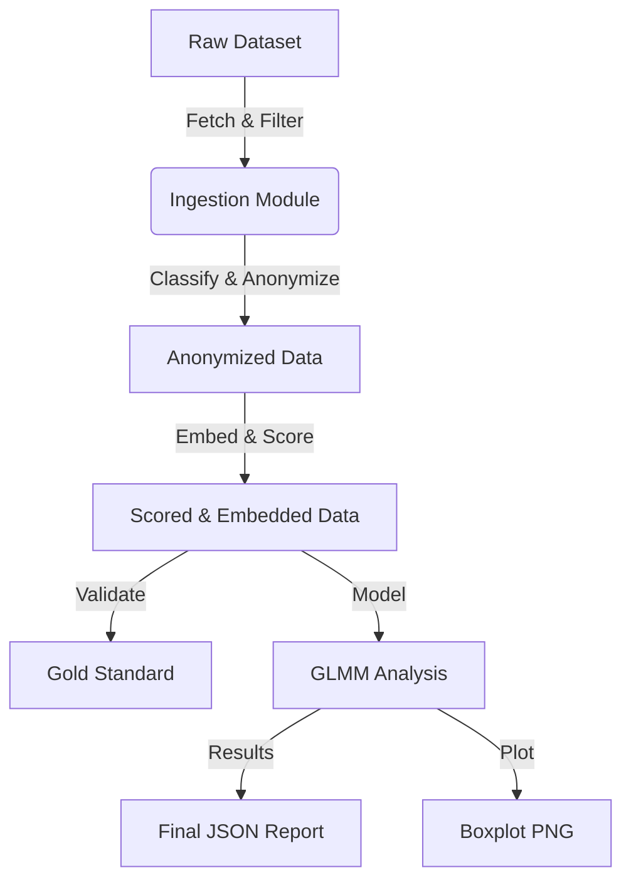

# Data Model: The Effect of Priming on Prosocial Behavior in Online Communities

## Overview
This document defines the data structures, schemas, and relationships for the project. All data artifacts must adhere to these schemas to ensure reproducibility and contract compliance.

## Entities

### 1. Raw Comment (Pre-processing)
*Source*: External Dataset (Parquet/JSONL)
*Note*: This entity exists only transiently in memory or as a raw file before anonymization.

| Field | Type | Description |
| :--- | :--- | :--- |
| `comment_id` | string | Unique identifier (original). |
| `thread_id` | string | Unique identifier for the thread. |
| `author` | string | Plaintext username (PII). |
| `title` | string | Thread title. |
| `body` | string | Comment text. |
| `subreddit` | string | Subreddit name. |
| `created_utc` | int | Unix timestamp. |

### 2. Anonymized & Classified Comment
*Source*: `code/processing/anonymize.py` & `code/ingestion/classify.py`
*Output*: `data/processed/cleaned_data.parquet`

| Field | Type | Constraints | Description |
| :--- | :--- | :--- | :--- |
| `comment_id` | string | PK | Unique ID. |
| `thread_id` | string | FK | Thread ID. |
| `user_id` | string | Hashed | SHA-256 hash of original `author`. |
| `thread_type` | enum | ["Prime", "Control"] | Classification based on title keywords. |
| `subreddit` | string | | Subreddit name. |
| `thread_age` | float | ≥ 0 | Days since creation (calculated before stripping). |
| `body` | string | | Comment text. |
| `prosocial_action_count` | int | ≥ 0 | Count of action verbs. |
| `neg_score` | float | [0, 1] | VADER `neg` component. |
| `compound` | float | [-1, 1] | VADER compound score. |
| `pos` | float | [0, 1] | VADER positive score. |
| `neu` | float | [0, 1] | VADER neutral score. |
| `topic_pc1` | float | | 1st Principal Component of title embedding. |
| `topic_pc2` | float | | 2nd Principal Component of title embedding. |
| `topic_pc3` | float | | 3rd Principal Component of title embedding. |

### 3. Gold Standard (Validation)
*Source*: `data/validation/gold_standard.csv`
*Constraints*: Must have ≥ 3 distinct `rater_id`s.

| Field | Type | Description |
| :--- | :--- | :--- |
| `comment_id` | string | FK to `Anonymized & Classified Comment`. |
| `rater_id` | string | Unique identifier for the human rater. |
| `label_prosocial` | int | 0 or 1 (Binary label for prosocial action). |
| `label_neg` | int | 0 or 1 (Binary label for negative sentiment). |

### 4. Analysis Results
*Source*: `code/analysis/glmm.py`
*Output*: `output/results.json`

| Field | Type | Description |
| :--- | :--- | :--- |
| `model_formula` | string | The GLMM formula used. |
| `prime_coefficient` | float | Effect size of Prime group. |
| `prime_p_value` | float | P-value for Prime effect. |
| `prime_ci_lower` | float | Lower bound 95% CI. |
| `prime_ci_upper` | float | Upper bound 95% CI. |
| `control_vars` | dict | Coefficients for `thread_age`, `comment_count`, `topic_pc1-3`. |
| `random_effects` | dict | Variance components for `thread_id`, `user_id`. |
| `sensitivity_results` | list | List of p-values from bootstrap/variants. |
| `power_analysis` | dict | Power, effect size, sample size. |
| `model_family` | string | "Negative Binomial" (GLMM). |
| `topic_control_method` | string | Description of embedding/PCA method used. |

## Data Flow Diagram

## Data Hygiene Rules
1. **Immutability**: Raw data files in `data/raw/` are never modified.
2. **Checksums**: Every file in `data/` must have a corresponding SHA-256 checksum recorded in the project state.
3. **PII**: No plaintext usernames or timestamps in `data/processed/` or `output/`.
4. **Versioning**: All derived files include a `derived_from` field pointing to the source file hash.