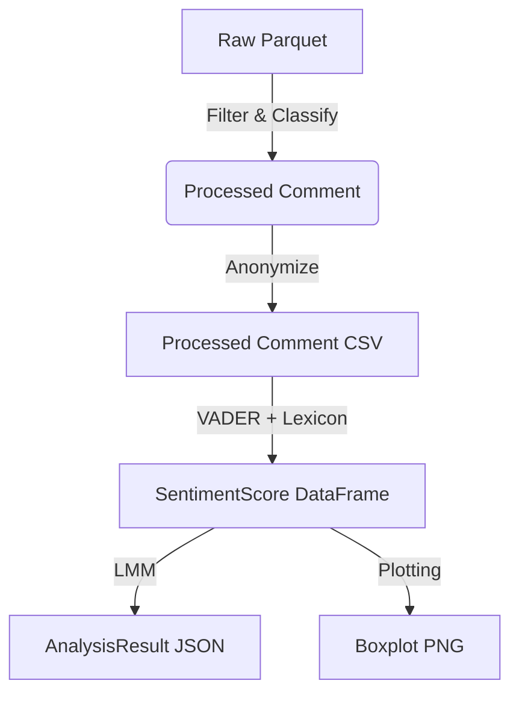

# Data Model: The Effect of Priming on Prosocial Behavior in Online Communities

## Overview
This document defines the data structures used throughout the pipeline, from raw ingestion to final analysis outputs. All data is stored in `data/` and processed in `code/`.

## Entity Definitions

### 1. Raw Thread/Comment (from HuggingFace)
- **Source**: HuggingFace Parquet file (pushshift/reddit).
- **Fields**:
  - `id`: Unique identifier (string).
  - `title`: Thread title (string) - *Retrieved via join or parent ID*.
  - `subreddit`: Subreddit name (string).
  - `author`: Username (string) - *Anonymized downstream*.
  - `created_utc`: Timestamp (float) - *Stripped downstream*.
  - `body`: Comment text (string).
  - `parent_id`: Parent comment/thread ID (string).
  - `num_comments`: Comment count (int).

### 2. Processed Comment (Anonymized)
- **Source**: Derived from Raw Thread + Comments.
- **Fields**:
  - `comment_id`: Unique hash (string, SHA-256 of original ID).
  - `thread_id`: Unique hash (string, SHA-256 of original thread ID).
  - `author_hash`: SHA-256 hash of username (string).
  - `subreddit`: Subreddit name (string).
  - `thread_type`: "Prime" or "Control" (string).
  - `text`: Comment body (string).
  - `negation_excluded`: Boolean (True if title had negation).
  - `hour_of_day`: Integer (0-23) derived from timestamp (used for controls, not stored in final anonymized set if not needed).

### 3. SentimentScore (Derived)
- **Source**: Processed Comment + VADER + Lexicon.
- **Fields**:
  - `comment_id`: Link to Processed Comment.
  - `thread_type`: "Prime" or "Control".
  - `compound`: VADER compound score (float, -1 to 1).
  - `pos`: VADER positive score (float).
  - `neu`: VADER neutral score (float).
  - `neg`: VADER negative score (float) - *Defined as general negative sentiment (sadness, anger, fear), NOT aggression*.
  - `neg_score`: Alias for `neg` (float).
  - `prosocial_action_count`: Integer count of action verbs (int) - *Excludes prime keywords*.

### 4. AnalysisResult (Final Output)
- **Source**: Linear Mixed-Effects Model.
- **Fields**:
  - `test_type`: "LMM" or "sensitivity".
  - `fixed_effects`: Dictionary of fixed effect coefficients.
  - `random_intercepts`: Variance of thread-level intercepts.
  - `p_value`: P-value for the `thread_type` fixed effect.
  - `confidence_interval`: Tuple (float, float).
  - `significance`: Boolean (True if p < 0.05).

## Data Flow Diagram

## Storage Locations
- `data/raw/`: Original Parquet files (checksummed).
- `data/processed/`: Anonymized CSVs and scored DataFrames.
- `results/`: Final JSON reports and PNG plots.