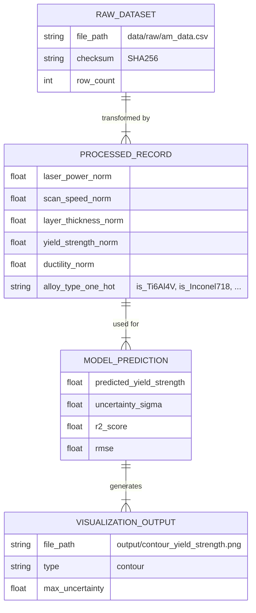

# Data Model: Unveiling Hidden Correlations Between Processing Parameters and Mechanical Properties in Additively Manufactured Alloys

## Overview

This document defines the data structures, schemas, and transformation rules for the project. It ensures that data flows from raw ingestion to processed modeling artifacts with full traceability and compliance with the project constitution (Data Hygiene, Single Source of Truth).

## Entity Relationship Diagram (Conceptual)

## Data Schemas

### 1. Raw Dataset Schema
The input CSV must contain the following columns. Missing columns will cause a validation error.
**Note**: Derived features (e.g., `energy_density`) are explicitly excluded to prevent multicollinearity.

| Column Name | Type | Description | Required |
| :--- | :--- | :--- | :--- |
| `laser_power` | float | Laser power in Watts (W) | Yes |
| `scan_speed` | float | Scan speed in mm/s | Yes |
| `layer_thickness` | float | Layer thickness in mm | Yes |
| `yield_strength` | float | Yield strength in MPa | Yes |
| `ductility` | float | Ductility in % elongation | Yes |
| `alloy_type` | string | Alloy name (e.g., "Ti-6Al-4V") | No (optional) |

### 2. Processed Dataset Schema (Output of `preprocess.py`)
All numeric columns are normalized to [0, 1] **using parameters fit on the training set**. Categorical columns are one-hot encoded. Missing values are imputed with the median.

| Column Name | Type | Description | Normalization |
| :--- | :--- | :--- | :--- |
| `laser_power_norm` | float | Normalized laser power | Min-Max [0, 1] (Train Fit) |
| `scan_speed_norm` | float | Normalized scan speed | Min-Max [0, 1] (Train Fit) |
| `layer_thickness_norm` | float | Normalized layer thickness | Min-Max [0, 1] (Train Fit) |
| `yield_strength_norm` | float | Normalized yield strength | Min-Max [0, 1] (Train Fit) |
| `ductility_norm` | float | Normalized ductility | Min-Max [0, 1] (Train Fit) |
| `is_<AlloyName>` | int (0/1) | One-hot encoded alloy type | Binary |
| `row_id` | int | Original row index for traceability | N/A |

### 3. Model Output Schema (JSON)
Generated by `models/gpr_trainer.py`.

| Field | Type | Description |
| :--- | :--- | :--- |
| `r2_score` | float | Coefficient of determination |
| `rmse` | float | Root Mean Square Error (in normalized units) |
| `rmse_percent_range` | float | RMSE as a percentage of the observed range |
| `mae` | float | Mean Absolute Error |
| `n_samples` | int | Number of training samples |
| `hyperparameters` | object | Optimized kernel parameters (length_scale, noise_level) |
| `timestamp` | string | ISO 8601 timestamp of training |
| `total_runtime_seconds` | float | Total pipeline runtime (SC-005) |

### 4. Visualization Output Schema (PNG Metadata)
Images are saved with metadata in a sidecar JSON or embedded in the file name.

| Field | Description |
| :--- | :--- |
| `file_name` | e.g., `contour_yield_strength.png` |
| `x_axis` | Feature name (e.g., `laser_power_norm`) |
| `y_axis` | Feature name (e.g., `scan_speed_norm`) |
| `z_axis` | Target (e.g., `yield_strength_norm`) |
| `uncertainty_flag` | Boolean: True if max(σ) > 2 * median(σ) |
| `physical_bounds` | Object: `{ "laser_power": [min, max], ... }` |

### 5. Importance Baseline Schema (User Input)
Optional JSON file for SC-004 validation.

| Field | Type | Description |
| :--- | :--- | :--- |
| `expected_ranking` | array | List of feature names in expected order of importance |
| `source` | string | Citation or description of the baseline (e.g., "Literature X") |

## Data Flow & Transformation Rules

1. **Ingestion**:
   - Read raw CSV.
   - Validate columns against `RAW_DATASET` schema.
   - Calculate and store SHA256 checksum in `state/...yaml`.
   - Log: "Downloaded/Loaded [file] with [N] rows."

2. **Preprocessing**:
   - **Imputation**: Replace `NaN` in numeric columns with column median. Log count of imputed values.
   - **Encoding**: Convert `alloy_type` to binary columns (e.g., `is_Ti-6Al-4V`). Drop original column.
   - **Normalization**: **Split data first (80/20).** Fit MinMaxScaler on **TRAIN** set only. Transform **TRAIN** and **TEST** sets. Clamp values to [0, 1].
   - **Zero Variance Check**: Detect columns with `std == 0`. Log warning and drop.
   - **Sample Count Check**: If `N < 50`, halt with error.
   - **Bounds Recording**: Save `min` and `max` of the **TRAIN** set to `data/processed/normalization_bounds.json`.

3. **Modeling**:
   - Train GPR with 5-fold CV on training set.
   - Train Linear Regression baseline on training set.
   - Predict on test set.
   - Calculate metrics.

4. **Visualization**:
   - Generate meshgrid for 2D parameters.
   - Predict mean and variance.
   - Plot contour (mean) and heatmap (variance).
   - Annotate plots with **physical bounds** from `normalization_bounds.json`.
   - Flag regions where `σ > 2 * median(σ)`.

## Traceability & Hygiene

- **Raw Data**: Never modified. Stored in `data/raw/`.
- **Processed Data**: New file in `data/processed/` with timestamp suffix.
- **Checkpoints**: Every transformation step logs to `logs/preprocess.log`.
- **Single Source of Truth**: All metrics in `paper.md` are extracted from `results/metrics.json`.