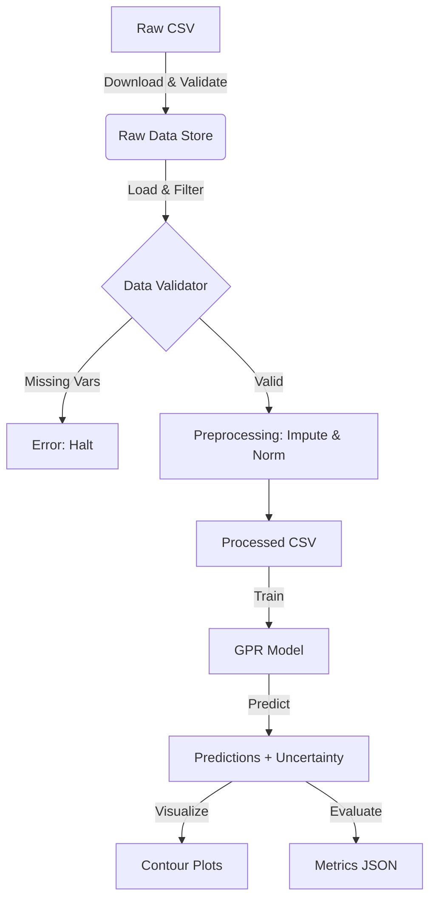

# Data Model: Unveiling Hidden Correlations Between Processing Parameters and Mechanical Properties in Additively Manufactured Alloys

## 1. Conceptual Model

The data model revolves around the **Experimental Observation**, which links a specific set of **Process Parameters** to a resulting **Mechanical Property**.

### Key Entities

1.  **Dataset Record**: A single row in the input CSV representing one experimental run.
    *   *Attributes*: `laser_power` (float), `scan_speed` (float), `layer_thickness` (float), `alloy_type` (string), `yield_strength` (float), `ductility` (float).
2.  **Processed Record**: The normalized, imputed version of the Dataset Record.
    *   *Attributes*: `laser_power_norm`, `scan_speed_norm`, `layer_thickness_norm`, `is_Ti-6Al-4V` (bool), `is_Inconel_718` (bool), `yield_strength_norm`, `ductility_norm`.
3.  **Model Artifact**: The serialized GPR model.
    *   *Attributes*: `kernel_params`, `training_X`, `training_y`, `hyperparameters`, `metrics`.
4.  **Uncertainty Map**: A 2D grid of predicted values and variances.
    *   *Attributes*: `grid_X`, `grid_Y`, `predicted_mean`, `predicted_std`.

## 2. Logical Data Flow

```mermaid
graph TD
    A[Raw CSV] -->|Download & Validate| B(Raw Data Store)
    B -->|Load & Filter| C{Data Validator}
    C -->|Missing Vars| D[Error: Halt]
    C -->|Valid| E[Preprocessing: Impute & Norm]
    E --> F[Processed CSV]
    F -->|Train| G[GPR Model]
    G -->|Predict| H[Predictions + Uncertainty]
    H -->|Visualize| I[Contour Plots]
    H -->|Evaluate| J[Metrics JSON]
```

## 3. Schema Definitions

### Input Schema (Raw)
*   `laser_power`: float (Watts)
*   `scan_speed`: float (mm/s)
*   `layer_thickness`: float (µm)
*   `alloy_type`: string (Categorical)
*   `yield_strength`: float (MPa)
*   `ductility`: float (%)

### Output Schema (Processed)
*   `laser_power_norm`: float [0.0, 1.0]
*   `scan_speed_norm`: float [0.0, 1.0]
*   `layer_thickness_norm`: float [0.0, 1.0]
*   `is_<ALLOY>`: integer (0 or 1) for each unique alloy type.
*   `yield_strength_norm`: float [0.0, 1.0]
*   `ductility_norm`: float [0.0, 1.0]

### Artifact Schema (Model Output)
*   `r2_score`: float
*   `rmse`: float
*   `mae`: float
*   `hyperparameters`: object (length, sigma)
*   `high_uncertainty_ratio`: float (percentage of test set with σ > 2× median)

## 4. Data Constraints

*   **Non-Negative**: All mechanical properties must be > 0.
*   **Normalization**: All numeric features must be in [0, 1].
*   **Completeness**: No missing values allowed in processed data.
*   **Variance**: Features with zero variance must be dropped (logged).
*   **Sample Count**: Minimum 50 samples required for GPR training.
