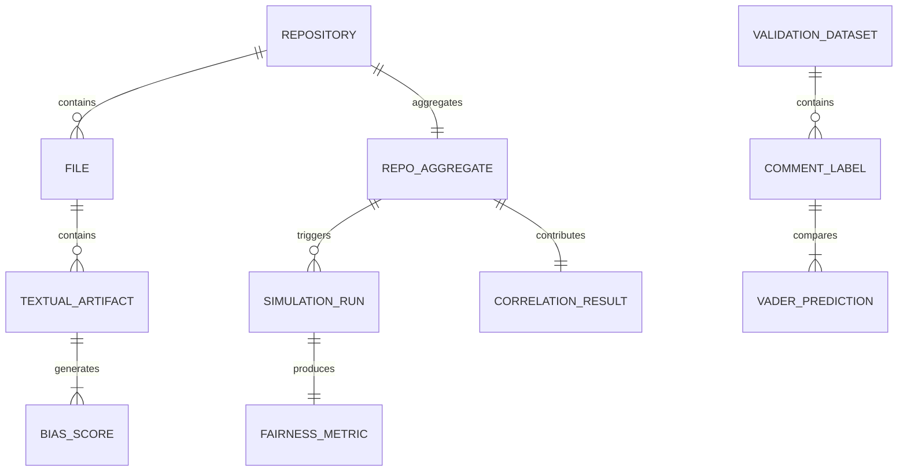

# Data Model: Automated Detection of Algorithmic Bias in Public Code Repositories

## 1. Entity Relationship Diagram (Conceptual)

## 2. Data Schemas

### 2.1. Repository Metadata
**Source**: GitHub API / Local Clone  
**Path**: `data/raw/repos_metadata.json`

| Field | Type | Description |
| :--- | :--- | :--- |
| `repo_id` | string | Unique identifier (e.g., `owner/repo`) |
| `clone_path` | string | Local path to the cloned repository |
| `file_count` | integer | Total number of `.py` files found |
| `total_lines` | integer | Total lines of code |
| `download_status` | string | `success`, `failed`, `rate_limited` |
| `download_hash` | string | SHA256 of the zip/tarball |

### 2.2. File-Level Analysis
**Source**: `static_analysis.py`  
**Path**: `data/derived/file_scores.csv`

| Field | Type | Description |
| :--- | :--- | :--- |
| `file_path` | string | Relative path in repo |
| `repo_id` | string | Parent repository ID |
| `token_count` | integer | Total normalized tokens |
| `demographic_match_count` | integer | Count of lexicon matches |
| `bias_score_raw` | float | Raw frequency of bias terms |
| `vader_compound` | float | VADER sentiment score (-1 to 1) |
| `vader_negative` | float | VADER negative sentiment score |
| `vader_positive` | float | VADER positive sentiment score |

### 2.3. Repository Aggregation
**Source**: `static_analysis.py` (Aggregation Step)  
**Path**: `data/derived/repo_scores.csv`

| Field | Type | Description |
| :--- | :--- | :--- |
| `repo_id` | string | Repository ID |
| `mean_bias_score` | float | Arithmetic mean of file `bias_score_raw` |
| `mean_vader_compound` | float | Arithmetic mean of file `vader_compound` |
| `total_files_processed` | integer | Number of files analyzed |
| `skipped_files` | integer | Files with 0 tokens or syntax errors |

### 2.4. Simulation Results
**Source**: `simulation.py`  
**Path**: `data/derived/simulation_results.csv`

| Field | Type | Description |
| :--- | :--- | :--- |
| `repo_id` | string | Repository ID |
| `injected_skew_magnitude` | float | Controlled bias parameter used |
| `demographic_parity_diff` | float | Difference in positive rates between groups |
| `equalized_odds_diff` | float | Difference in TPR/FPR between groups |
| `sample_size` | integer | N of synthetic samples (e.g., 1000) |
| `generation_seed` | integer | Random seed used for reproducibility |
| `hash_check_passed` | boolean | True if no token overlap with source code |

### 2.5. Correlation Results
**Source**: `correlation.py`  
**Path**: `data/derived/correlation_results.csv`

| Field | Type | Description |
| :--- | :--- | :--- |
| `test_id` | string | Unique test identifier |
| `predictor` | string | e.g., `mean_bias_score`, `mean_vader_compound` |
| `outcome` | string | e.g., `demographic_parity_diff` |
| `spearman_rho` | float | Correlation coefficient |
| `p_value_raw` | float | Raw p-value |
| `p_value_bonferroni` | float | Bonferroni-corrected p-value |
| `n_samples` | integer | Number of repositories |
| `significance_flag` | string | `High Risk` if p < alpha, else `Low Risk` |

### 2.6. Validation Metrics
**Source**: `validation.py`  
**Path**: `data/derived/validation_metrics.json`

| Field | Type | Description |
| :--- | :--- | :--- |
| `metric_name` | string | e.g., `cohen_kappa` |
| `value` | float | Computed score (e.g., 0.65) |
| `threshold` | float | Required threshold (0.6) |
| `status` | string | `PASS`, `FAIL` |
| `comments` | string | Notes on threshold adjustment if failed |

## 3. Data Flow

1.  **Ingest**: `data_ingestion.py` clones repos -> `data/raw/`.
2.  **Extract**: `static_analysis.py` parses -> `data/derived/file_scores.csv`.
3.  **Aggregate**: `static_analysis.py` aggregates -> `data/derived/repo_scores.csv`.
4.  **Validate**: `validation.py` checks VADER -> `data/derived/validation_metrics.json`.
5.  **Simulate**: `simulation.py` generates data -> `data/derived/simulation_results.csv`.
6.  **Correlate**: `correlation.py` computes stats -> `data/derived/correlation_results.csv`.
7.  **Report**: `main.py` assembles final report.
