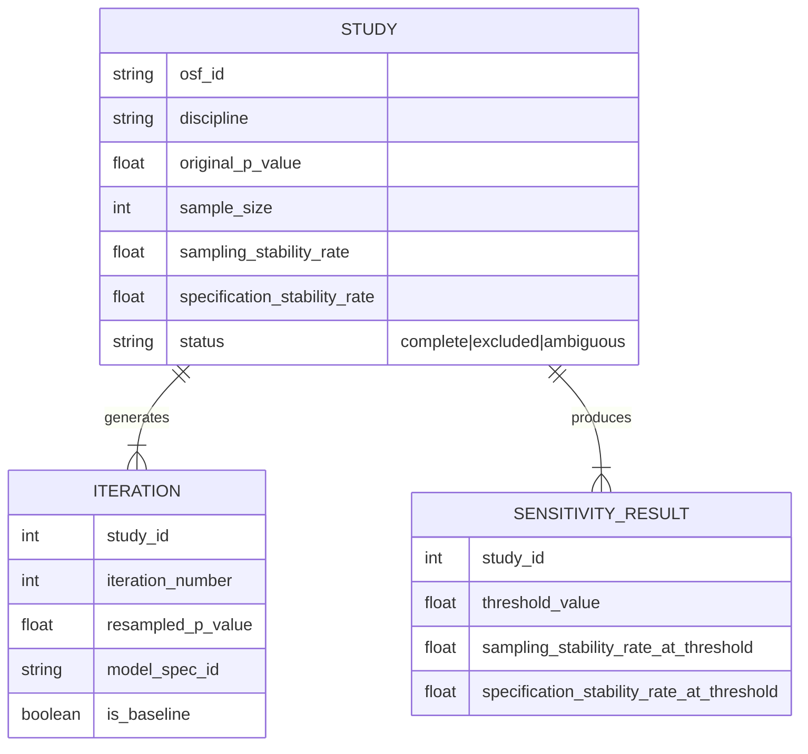

# Data Model: Assessing the Generalizability of Statistical Significance in Pre-Registered Studies

## Entity Relationship Diagram (Conceptual)

## Data Schema Definitions

### 1. Raw Study Metadata
*Source: OSF API / HuggingFace datasets*
- `osf_id`: Unique identifier for the study.
- `discipline`: One of ["psychology", "economics", "biology"].
- `original_p_value`: Reported p-value from the pre-registration.
- `sample_size`: Original N.
- `variables`: List of required variable names (outcome, predictor, covariates).

### 2. Bootstrap Iteration Results
*Output of `bootstrap_engine.py`*
- `study_id`: Foreign key to Study.
- `iteration_number`: Integer (1 to 1000 for baseline, 1 to N for alternatives).
- `resampled_p_value`: Calculated p-value for the resample.
- `model_spec_id`: Identifier for the model specification (e.g., "baseline", "log_transform", "robust").
- `is_baseline`: Boolean.

### 3. Aggregated Stability Metrics
*Output of `meta_analysis.py`*
- `study_id`: Foreign key.
- `sampling_stability_rate`: Proportion of baseline iterations with p < 0.05.
- `specification_stability_rate`: Proportion of alternative iterations with p < 0.05.
- `fragility_index`: (Optional) Derived metric if applicable.
- `threshold_sensitivity`: JSON object mapping thresholds to stability rates.

## File Formats

- **Input**: CSV (from HuggingFace), Parquet (from HuggingFace).
- **Intermediate**: CSV (one row per iteration).
- **Final Output**:
  - `baseline_metrics.csv`: Aggregated study-level metrics.
  - `summary_report.pdf`: Visualizations (Forest plot, histograms).
  - `meta_analysis_stats.json`: I² statistic, mean stability rates.
