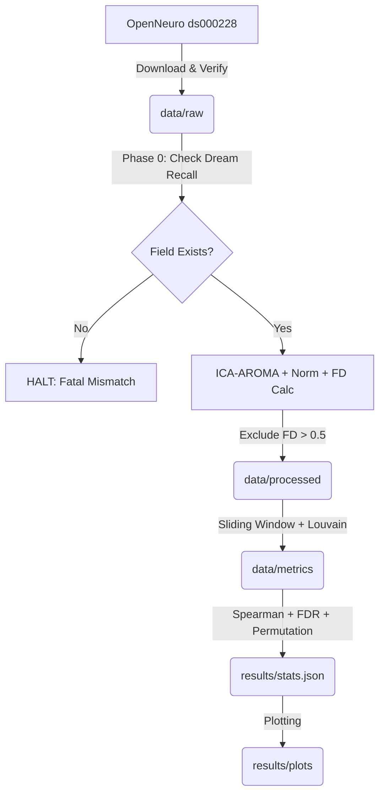

# Data Model: Exploring the Relationship Between Brain Network Dynamics and Individual Differences in Dream Recall Frequency

## Overview

This document defines the data structures, file formats, and schemas used throughout the project. All data flows from `data/raw` → `data/processed` → `data/metrics` → `results`.

## Entity Definitions

### 1. Subject
- **ID**: Unique identifier from OpenNeuro (e.g., `sub-001`).
- **Dream Recall Frequency**: Self-reported score (continuous or ordinal).
- **Metadata**: Demographic info (age, sex) if available.
- **FD Score**: Framewise Displacement value (float). Excluded if > 0.5.

### 2. Preprocessed fMRI
- **Format**: NIfTI (`.nii.gz`).
- **Dimensions**: (X, Y, Z, Timepoints).
- **Space**: MNI standard.
- **Denoised**: Yes (ICA-AROMA).

### 3. Dynamic Connectivity Metrics
- **Format**: CSV.
- **Fields**: `subject_id`, `network`, `metric_type`, `value`, `window_size_sec`, `step_size_sec`.
- **Networks**: DMN, Salience, Hippocampal-Memory.
- **Metrics**: Flexibility, Stability (Mean Dwell Time).
- **Atlas**: Schaefer-100.

### 4. Statistical Results
- **Format**: JSON.
- **Fields**: `correlation_coefficient`, `p_value_uncorrected`, `p_value_fdr`, `p_value_permutation`, `n_subjects`, `power_analysis_mde`.
- **Schema**: Validated against `contracts/results_schema.yaml`.

## File Structure

```text
data/
├── raw/
│   ├── ds000228/                # Original OpenNeuro download
│   │   ├── sub-XXX/
│   │   │   └── func/
│   │   │       └── sub-XXX_task-rest_space-MNI_desc-preproc_bold.nii.gz
│   │   └── dataset_description.json (Metadata)
├── processed/
│   └── sub-XXX_desc-clean_bold.nii.gz
├── metrics/
│   └── subject_metrics.csv       # Aggregated flexibility/stability per subject
└── checksums.json                # SHA256 hashes of raw/processed files
```

## Contracts

- **Subject Metrics**: Validated against `contracts/subject_metrics.schema.yaml`.
- **Results**: Validated against `contracts/results_schema.yaml`.

## Data Flow Diagram



## Assumptions & Constraints

- **Metadata Availability**: Dream recall frequency is assumed to be present (or substituted) in the active dataset.
- **Memory Limit**: All intermediate files must be managed to keep peak RAM <7GB.
- **No PII**: No personally identifiable information will be stored in `data/`.