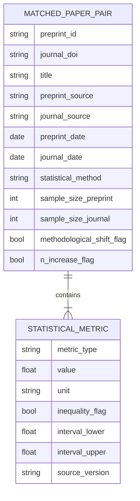

# Data Model: Statistical Bias in Pre-Print Server Publication Trends

## 1. Entity Relationship Overview

The data model is centered around the `MatchedPaperPair` entity, which links a pre-print artifact to a journal artifact. All statistical metrics are extracted into a child structure.

## 2. Detailed Schema Definitions

### 2.1. MatchedPaperPair (Primary Dataset)
*Table: `matched_pairs.csv`*

| Field | Type | Description | Constraints |
|-------|------|-------------|-------------|
| `preprint_id` | String | Unique ID for the pre-print (e.g., `arXiv:2301.12345`) | Not Null |
| `journal_doi` | String | DOI of the peer-reviewed version | Not Null |
| `title` | String | Paper title (normalized) | Not Null |
| `preprint_source` | String | Source server (`arXiv`, `bioRxiv`) | Enum |
| `journal_source` | String | Journal publisher | String |
| `preprint_date` | Date | Publication date of pre-print | ISO 8601 |
| `journal_date` | Date | Publication date of journal | ISO 8601 |
| `statistical_method` | String | Primary method used (e.g., `t-test`, `ANOVA`) | Enum |
| `sample_size_preprint` | Integer | N in pre-print | > 0 |
| `sample_size_journal` | Integer | N in journal | > 0 |
| `methodological_shift_flag` | Boolean | True if method changed between versions | Default: False |
| `n_increase_flag` | Boolean | True if N increased > 20% | Default: False |
| `exclusion_reason` | String | Reason for exclusion (if any) | Nullable |

### 2.2. StatisticalMetric (Extracted Values)
*Table: `metrics.csv` (or embedded in `matched_pairs.csv` as JSON)*

| Field | Type | Description | Constraints |
|-------|------|-------------|-------------|
| `pair_id` | String | Foreign key to `MatchedPaperPair` | Not Null |
| `metric_type` | String | `p-value` or `effect-size` | Enum |
| `value` | Float | Numeric value (or midpoint for inequalities) | Nullable |
| `unit` | String | Unit (e.g., `Cohen's d`, `OR`) | Nullable |
| `inequality_flag` | Boolean | True if reported as inequality (e.g., `<`) | Default: False |
| `interval_lower` | Float | Lower bound of interval (0 for `<`) | Nullable |
| `interval_upper` | Float | Upper bound of interval (0.05 for `<0.05`) | Nullable |
| `source_version` | String | `preprint` or `journal` | Enum |

**Contract Note**: The `statistical_metric.schema.yaml` contract file validates the structure of `data/processed/metrics.csv` (or the JSON array within `matched_pairs.csv`), ensuring consistency with this entity definition.

## 3. Data Flow & Derivation

1.  **Raw Input**: OpenAlex Parquet files (verified URLs) + arXiv/bioRxiv API responses.
2.  **Step 1 (Matching)**: `01_fetch_and_match.py` produces `raw_matches.parquet`.
3.  **Step 2 (Extraction)**: `02_extract_stats.py` parses PDFs and produces `raw_metrics.json`.
4.  **Step 3 (Cleaning)**: `03_analysis.py` filters for methodological shifts and N-increases, producing `matched_pairs.csv` (cleaned) and `metrics.csv`.
5.  **Step 4 (Analysis)**: `03_analysis.py` computes statistics and produces `analysis_results.json`.

## 4. Data Hygiene & Versioning

-   **Checksums**: All files in `data/raw/` and `data/processed/` are checksummed (SHA-256) and recorded in `state/.../artifact_hashes.yaml`.
-   **Immutability**: Raw data is never modified. Derivations are written to new files with timestamps (e.g., `matched_pairs_20260813.csv`).
-   **PII**: No personally identifiable information is extracted. Only aggregate statistical metrics are stored.