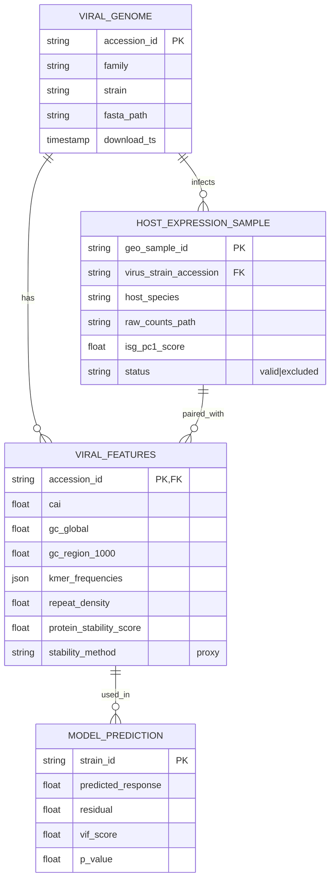

# Data Model: Predictive Modeling of Host Immune Response from Viral Sequence Features

## Entity Relationship Diagram (Conceptual)

## Data Dictionary

### 1. `ViralGenome` (Raw/Intermediate)
-   `accession_id`: (String) NCBI Accession (e.g., `NC_000001`). Primary Key.
-   `family`: (String) Virus family (e.g., `Coronaviridae`).
-   `strain`: (String) Strain name.
-   `fasta_path`: (String) Relative path to downloaded FASTA file.
-   `download_ts`: (Timestamp) ISO8601 timestamp of download.

### 2. `HostExpressionSample` (Raw/Processed)
-   `geo_sample_id`: (String) GEO Sample ID (e.g., `GSM123456`). Primary Key.
-   `virus_strain_accession`: (String) FK to `ViralGenome.accession_id`.
-   `host_species`: (String) `Homo sapiens` or `Mus musculus`.
-   `raw_counts_path`: (String) Path to raw count matrix subset.
-   `isg_pc1_score`: (Float) First PC of ISG genes.
-   `status`: (Enum) `valid` (used in model), `excluded` (missing link/ISG).

### 3. `FeatureMatrix` (Processed/Model Input)
-   `strain_id`: (String) Unique strain identifier (PK).
-   `cai`: (Float) Codon Adaptation Index.
-   `gc_global`: (Float) Global GC content (0.0 - 1.0).
-   `gc_region_1000`: (Float) Mean GC content in 1kb windows.
-   `kmer_counts`: (JSON) Dictionary of k-mer frequencies (keys: "AAA", "AAC"...). **Note**: Only k=3 and k=4 are present.
-   `repeat_density`: (Float) Percentage (0.0 - 100.0).
-   `protein_stability`: (Float) Stability score (Uniform Proxy).
-   `stability_method`: (String) **Fixed value**: "proxy". (ESM-1b is not used).

### 4. `ModelOutput` (Final)
-   `strain_id`: (String) FK to `FeatureMatrix`.
-   `actual_response`: (Float) ISG-PC1.
-   `predicted_response`: (Float) Model prediction.
-   `residual`: (Float) Actual - Predicted.
-   `vif`: (Float) Variance Inflation Factor.
-   `p_value`: (Float) Debiased Lasso p-value.
-   `fdr_p_value`: (Float) BH-corrected p-value.

## Data Flow

1.  **Ingestion**: `download.py` fetches FASTA and GEO matrices.
2.  **Preprocessing**: `preprocess.py` normalizes counts, maps orthologs (if needed), computes ISG-PC1.
3.  **Feature Extraction**: `preprocess.py` calculates CAI, k-mers (k=3,4), stability (Proxy).
4.  **Aggregation**: `merge.py` averages ISG-PC1 per strain (FR-016).
5.  **Splitting**: `merge.py` splits into Train/Test (Strain-level).
6.  **Modeling**: `train.py` and `evaluate.py` produce `ModelOutput`.
7.  **Storage**: All intermediate and final data stored in `data/processed` and `data/artifacts`.