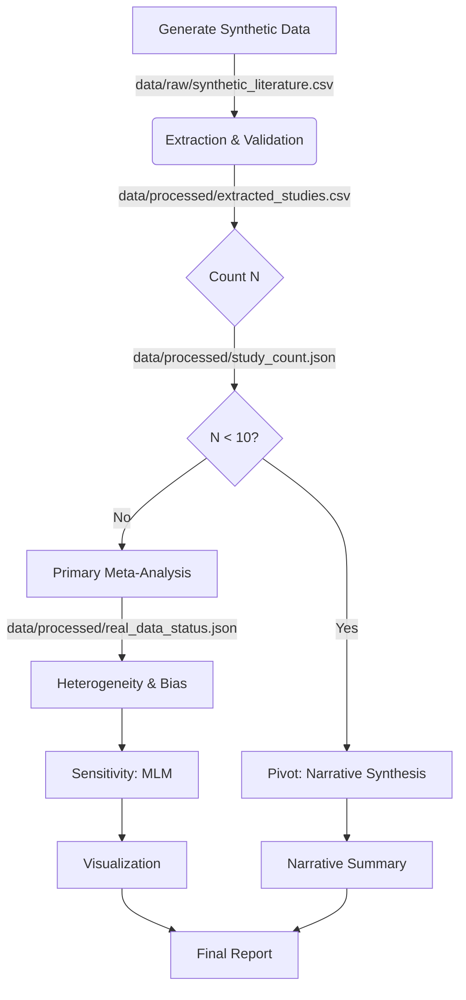

# Data Model: Investigating the Correlation Between Structural Brain Connectivity and Individual Music Preferences

## Overview

This document defines the data structures used throughout the pipeline. The data flows from **Raw/Synthetic** input to **Processed** intermediate files, and finally to **Derived** output artifacts.

## Entity Definitions

### 1. StudyRecord (Input/Intermediate)
Represents a single entry from the literature (or synthetic generator).

| Field | Type | Description | Constraints |
|-------|------|-------------|-------------|
| `author` | string | First author's last name | Required |
| `year` | integer | Publication year | Required |
| `tract_name` | string | Name of the white matter tract (e.g., "Arcuate Fasciculus") | Required |
| `metric` | string | dMRI metric used (e.g., "FA", "MD") | Enum: ["FA", "MD", "RD", "AD"] |
| `r` | float | Correlation coefficient | Range: [-1.0, 1.0] |
| `n` | integer | Sample size | Must be > 0 |
| `p_value` | float | P-value (optional, for conversion) | Range: [0.0, 1.0] |
| `notes` | string | Qualitative notes | Optional |

### 2. MetaAnalysisResult (Derived)
Aggregated results from the meta-analysis.

| Field | Type | Description |
|-------|------|-------------|
| `pooled_r` | float | Weighted mean effect size |
| `ci_lower` | float | Lower bound of 95% CI |
| `ci_upper` | float | Upper bound of 95% CI |
| `i_squared` | float | Heterogeneity statistic ($I^2$) |
| `q_statistic` | float | Cochran's Q statistic |
| `k` | integer | Number of studies included |
| `method` | string | Model used ("RandomEffects", "FixedEffects", "MLM") |
| `status` | string | "Success", "ConvergenceWarning", "Fallback" |

### 3. BiasAssessment (Derived)
Results from publication bias tests.

| Field | Type | Description |
|-------|------|-------------|
| `egger_intercept` | float | Intercept of Egger's regression |
| `egger_p_value` | float | P-value of Egger's test |
| `test_skipped` | boolean | True if N < 10 |
| `skip_reason` | string | Reason for skipping (e.g., "Insufficient studies") |
| `low_power_warning` | boolean | True if 10 <= N < 20 |
| `funnel_plot_path` | string | Path to generated PNG |

### 4. NarrativeSummary (Derived)
Output of the fallback protocol.

| Field | Type | Description |
|-------|------|-------------|
| `study_count` | integer | Total eligible studies |
| `themes` | list[string] | Extracted qualitative themes |
| `summary_text` | string | Narrative description |
| `pivot_reason` | string | "N < 10" |

### 5. RealDataStatus (Derived)
Output of the `real_data_validator.py` script.

| Field | Type | Description |
|-------|------|-------------|
| `total_studies` | integer | Total number of studies found |
| `valid_pairs` | integer | Number of studies with valid (r, n) |
| `status` | string | "Sufficient", "Insufficient", "PivotRequired" |
| `message` | string | Human-readable status message |

## File Paths

| File Path | Purpose | Format |
|-----------|---------|--------|
| `data/raw/synthetic_literature.csv` | Generated input data | CSV |
| `data/processed/extracted_studies.csv` | Cleaned, validated data | CSV |
| `data/processed/study_count.json` | Count of eligible studies | JSON |
| `data/processed/real_data_status.json` | Status of data availability | JSON |
| `data/config/tract_lexicon.yaml` | Tract names and definitions | YAML |
| `output/meta_analysis_results.json` | Aggregated statistics | JSON |
| `output/bias_assessment.json` | Bias test results | JSON |
| `output/mlm_results.json` | Multilevel model results | JSON |
| `output/forest_plot.png` | Forest plot visualization | PNG |
| `output/funnel_plot.png` | Funnel plot visualization | PNG |
| `output/narrative_summary.md` | Narrative report | Markdown |

## Data Flow Diagram

## Script Definitions

### `code/pivot/pivot_narrative.py`
- **Input**: `data/processed/extracted_studies.csv`, `data/processed/study_count.json`
- **Output**: `output/narrative_summary.md`
- **Logic**: If `study_count.json` indicates N < 10, this script generates a structured narrative summary based on the qualitative descriptors in the input data.

### `tests/integration/test_pivot.py`
- **Input**: Synthetic data with N < 10.
- **Output**: Verification that `output/narrative_summary.md` is generated and contains expected fields.
- **Logic**: Ensures the pivot logic is triggered correctly and the narrative summary is valid.