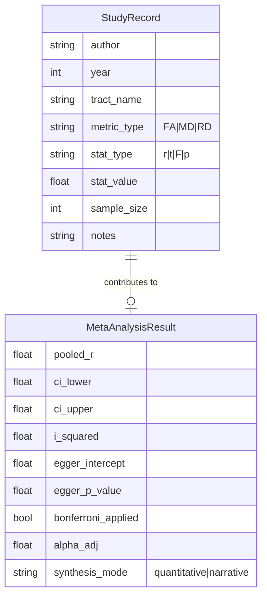

# Data Model: Investigating the Correlation Between Structural Brain Connectivity and Individual Music Preferences

## Overview

This document defines the data structures used for input, processing, and output in the meta-analysis pipeline. All data is stored in `data/` (raw, processed, derived) and validated against the schemas in `contracts/`.

## Entity-Relationship Diagram (Conceptual)

## Data Schemas

### 1. Input: StudyRecord (`data/raw/studies.csv`)

**Source**: User-provided CSV or generated mock data.
**Format**: CSV (Comma Separated Values).

| Column | Type | Required | Description |
| :--- | :--- | :--- | :--- |
| `author` | string | Yes | Primary author surname. |
| `year` | int | Yes | Publication year. |
| `tract_name` | string | Yes | Name of the white matter tract (e.g., "Arcuate Fasciculus"). |
| `metric_type` | string | Yes | dMRI metric: "FA", "MD", "RD", "AD". |
| `stat_type` | string | Yes | Statistic type: "r", "t", "F", "p". |
| `stat_value` | float | Yes | The reported value. |
| `sample_size` | int | Yes | Total N for the study. |
| `notes` | string | No | Any additional context or conversion notes. |

### 2. Intermediate: StudyCount (`data/processed/study_count.json`)

**Source**: `code/data/real_data_validator.py`
**Purpose**: Gate logic for quantitative vs. narrative synthesis.

| Key | Type | Description |
| :--- | :--- | :--- |
| `unique_studies` | int | Count of unique (Author, Year) pairs. |
| `total_comparisons` | int | Total number of rows (tracts) in input. |
| `status` | string | "quantitative" (if ≥10) or "narrative" (if <10). |

### 3. Output: MetaAnalysisResult (`data/processed/meta_results.json`)

**Source**: `code/analysis/meta_analysis.py`
**Purpose**: Final statistical results.

| Key | Type | Description |
| :--- | :--- | :--- |
| `synthesis_mode` | string | "quantitative" or "narrative". |
| `pooled_r` | float | Pooled correlation coefficient (if quantitative). |
| `ci_lower` | float | Lower bound of 95% CI. |
| `ci_upper` | float | Upper bound of 95% CI. |
| `i_squared` | float | Heterogeneity statistic ($I^2$). |
| `egger_intercept` | float | Egger's test intercept (if N≥10). |
| `egger_p_value` | float | Egger's test p-value (if N≥10). |
| `bonferroni_adjusted` | bool | Whether Bonferroni was applied. |
| `alpha_adj` | float | Adjusted alpha threshold. |
| `narrative_summary` | string | Text summary (if narrative mode). |

## Data Flow

1.  **Load**: `studies.csv` (Raw) → `StudyRecord` objects.
2.  **Validate**: Count unique studies → `study_count.json` (Processed).
3.  **Branch**:
    *   If `status == "quantitative"`: Run Meta-Analysis → `meta_results.json`.
    *   If `status == "narrative"`: Run Narrative Synthesis → `meta_results.json` (with `narrative_summary`).
4.  **Visualize**: `meta_results.json` + `StudyRecord` → PNG plots (Derived).
