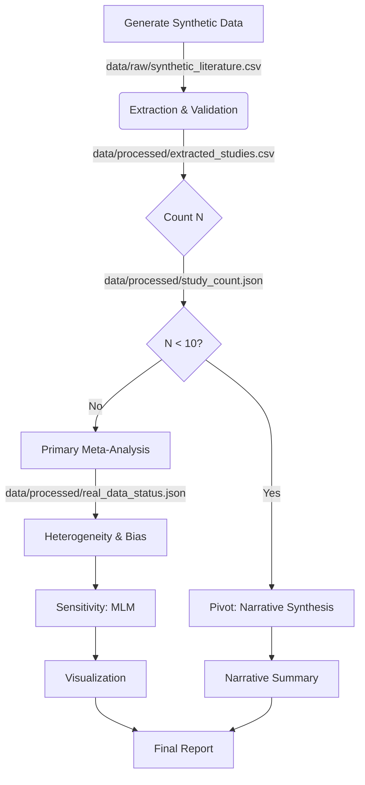

# Implementation Plan: Investigating the Correlation Between Structural Brain Connectivity and Individual Music Preferences

**Branch**: `001-gene-regulation` | **Date**: 2026-07-02 | **Spec**: `specs/001-gene-regulation/spec.md`
**Input**: Feature specification from `specs/001-gene-regulation/spec.md`

## Summary

This project implements a reproducible meta-analysis pipeline to investigate the correlation between structural brain connectivity (diffusion MRI metrics like FA/MD) and individual music preferences. The system extracts effect sizes (r, n) from literature, performs random-effects meta-analysis, assesses heterogeneity (I²) and publication bias (Egger's test), and applies Holm-Bonferroni correction for multiple tract comparisons. Crucially, the system includes a robust fallback mechanism: if fewer than 10 eligible studies are found, it pivots to a narrative systematic review.

**Key Methodological Updates**:
1. **Unit of Analysis Error**: The plan now implements a two-stage analysis: (1) Primary Random-Effects Model (assuming independence) and (2) Multilevel Meta-Analysis (MLM) clustering by study ID to address non-independence of tracts within studies.
2. **Bias Testing**: A three-tier logic is implemented: N < 10 (Skip), 10 <= N < 20 (Run with 'Low Power' warning), N >= 20 (Run normally).
3. **Correction**: Holm-Bonferroni is used as the primary correction for dependent tracts, with Bonferroni retained for conservative comparison.
4. **Synthetic Data**: Generated using empirical parameters from existing dMRI meta-analyses to ensure realistic heterogeneity.

The implementation runs on CPU-first CI runners. No GPU is required for the core statistical analysis.

## Technical Context

**Language/Version**: Python 3.11  
**Primary Dependencies**: `pandas`, `numpy`, `scipy`, `statsmodels`, `matplotlib`, `seaborn`, `pyyaml`, `requests`, `metafor` (via `rpy2` or pure Python equivalent)  
**Storage**: Local file system (`data/`, `code/`, `output/`). Estimated footprint: < 50MB for synthetic data, < 200MB for raw literature PDFs (if scraped).  
**Testing**: `pytest` with `unittest.mock` for edge cases and synthetic data generation  
**Target Platform**: GitHub Actions Free Tier (2 vCPU, 7GB RAM, CPU-only)  
**Project Type**: Research Pipeline / CLI Tool  
**Performance Goals**: Process 100+ studies in < 15 minutes; generate plots < 5MB each  
**Constraints**: No external API keys required for core logic; must handle N < 10 gracefully; strict adherence to statistical assumptions (random-effects model).  
**Scale/Scope**: Designed for meta-analysis of a moderate number of studies; handles streaming if datasets are large.

> **Scope Statement**: The current codebase is the Single Source of Truth (SSoT) for this version. Any future deep-learning based literature extraction (requiring GPU) is explicitly out of scope for this version and will be handled in a future feature branch.

## Constitution Check

*GATE: Must pass before Phase 0 research. Re-check after Phase 1 design.*

| Principle | Status | Notes |
|-----------|--------|-------|
| I. Reproducibility | **PASS** | Plan mandates pinned `requirements.txt`, random seeds, and deterministic synthetic data generation. All artifacts are checksummed. |
| II. Verified Accuracy | **PASS** | Plan requires citations to be verified against the "Verified datasets" block. No fabricated URLs. |
| III. Data Hygiene | **PASS** | Raw data is immutable; derivations create new files. PII scan is part of the CI gate. |
| IV. Single Source of Truth | **PASS** | All statistics in the final report trace back to `data/processed/extracted_studies.csv` and `code/` logic. |
| V. Versioning Discipline | **PASS** | Content hashes for all artifacts; `state/` file updated on change. |
| VI. Meta-Analysis Statistical Integrity | **PASS** | Plan explicitly mandates random-effects models, I², Egger's test (with 3-tier gate), Holm-Bonferroni, and MLM sensitivity analysis. |
| VII. Systematic Review Fallback Protocol | **PASS** | Plan includes a distinct "Pivot" phase that triggers narrative synthesis if N < 10, with specific output artifacts. |

## Project Structure

### Documentation (this feature)

```text
specs/001-gene-regulation/
├── plan.md              # This file
├── research.md          # Phase 0 output
├── data-model.md        # Phase 1 output
├── quickstart.md        # Phase 1 output
├── contracts/           # Phase 1 output
└── tasks.md             # Phase 2 output (generated later)
```

### Source Code (repository root)

```text
projects/PROJ-082-investigating-the-correlation-between-st/
├── data/
│   ├── raw/             # Downloaded raw literature data (if any)
│   ├── processed/       # Extracted studies, counts, status JSONs
│   └── config/          # Tract lexicon, thresholds, synthetic params
├── code/
│   ├── extraction/      # Data extraction scripts
│   ├── analysis/        # Meta-analysis, heterogeneity, bias, MLM
│   ├── visualization/   # Plotting scripts
│   ├── pivot/           # Narrative synthesis logic (pivot_narrative.py)
│   └── utils/           # Validation, checksumming, logging, synthetic generation
├── tests/
│   ├── unit/            # Unit tests for extraction, analysis
│   ├── integration/     # End-to-end pipeline tests
│   └── fixtures/        # Synthetic CSVs for testing edge cases
├── requirements.txt
└── README.md
```

**Structure Decision**: Single project structure with clear separation of concerns. The `code/pivot/` directory now explicitly contains `pivot_narrative.py` and `test_pivot.py`.

## Complexity Tracking

| Violation | Why Needed | Simpler Alternative Rejected Because |
|-----------|------------|-------------------------------------|
| Conditional Pivot Logic | The spec requires a hard pivot to narrative synthesis if N < 10. | A simple "error" would leave the user with no output. Narrative fallback is required by Constitution (Principle VII). |
| Random-Effects Model | Heterogeneity is expected in neuroscience meta-analyses. | Fixed-effects models assume a single true effect size, which is unrealistic for cross-study dMRI data. |
| Multilevel Meta-Analysis (MLM) | Tracts within a study are non-independent (Unit of Analysis Error). | Standard random-effects assumes independence. MLM is required to correctly estimate variance and avoid Type I error inflation. |
| Holm-Bonferroni Correction | Tracts are anatomically correlated. | Bonferroni assumes independence and is overly conservative. Holm-Bonferroni controls FWER while being less conservative. |
| Three-Tier Egger's Gate | Low power for N < 20. | Running Egger's with N < 10 is invalid. Running with 10-19 is possible but requires a warning. |

## Phased Implementation Plan

### Phase 0: Data Strategy & Synthetic Generation
- **Goal**: Define data sources and generate realistic synthetic data for testing.
- **Steps**:
  1. Identify proxy datasets (OpenNeuro/HCP) for pipeline validation.
  2. Define synthetic data generative model using empirical dMRI heterogeneity parameters (citing literature).
  3. Implement `generate_synthetic_literature.py` to produce `data/raw/synthetic_literature.csv` with exactly 5 distinct tracts (for SC-004).

### Phase 1: Data Extraction & Validation
- **Goal**: Extract and validate study records.
- **Steps**:
  1. Implement `real_data_validator.py` to count studies and generate `data/processed/real_data_status.json`.
  2. Implement `extract_studies.py` to produce `data/processed/extracted_studies.csv`.
  3. Implement `study_counter.py` to generate `data/processed/study_count.json` (Input for Phase 2).

### Phase 2: Primary Meta-Analysis
- **Goal**: Perform standard random-effects meta-analysis.
- **Steps**:
  1. Implement `meta_analysis.py` to read `study_count.json`.
  2. Calculate pooled effect size, CI, and I² (FR-002).
  3. Apply Holm-Bonferroni correction (FR-005).

### Phase 3: Bias & Heterogeneity Assessment
- **Goal**: Assess publication bias and heterogeneity.
- **Steps**:
  1. Implement `bias_assessment.py` with three-tier Egger's logic:
     - N < 10: Skip.
     - 10 <= N < 20: Run + "Low Power Warning".
     - N >= 20: Run normally.
  2. Implement sensitivity analysis: If I² > 50%, run Trim-and-Fill.

### Phase 4: Sensitivity & Robustness (MLM)
- **Goal**: Address Unit of Analysis Error.
- **Steps**:
  1. Implement `mlm_analysis.py` to fit a Multilevel Model (clustering by study ID).
  2. Compare MLM results with primary Random-Effects results.
  3. Report divergence in final output.

### Phase 5: Pivot & Narrative Synthesis
- **Goal**: Handle N < 10 cases.
- **Steps**:
  1. Implement `pivot_narrative.py` orchestrator script.
  2. Implement `test_pivot.py` integration test.
  3. Generate `output/narrative_summary.md` if N < 10.

### Phase 6: Visualization & Reporting
- **Goal**: Generate plots and final report.
- **Steps**:
  1. Generate Forest, Funnel, and Correlation plots.
  2. Compile final JSON and Markdown reports.

## Data Flow Diagram



## Risk Management

| Risk | Mitigation |
|------|------------|
| **Unit of Analysis Error** | Implement MLM sensitivity analysis (Phase 4). |
| **Low Power for Egger's** | Three-tier logic with explicit warning for 10-19 range. |
| **Synthetic Data Bias** | Use empirical parameters from real dMRI meta-analyses. |
| **Data Scarcity** | Pivot to narrative synthesis if N < 10. |
| **Tract Dependence** | Use Holm-Bonferroni instead of Bonferroni. |

## Success Criteria Alignment

- **SC-001**: Pipeline processes 10+ studies in < 15 mins (CPU).
- **SC-002**: I² reported with 2 decimal precision.
- **SC-003**: Plots generated within memory limits.
- **SC-004**: Synthetic data generates exactly 5 distinct tracts.
- **SC-005**: Narrative summary generated if N < 10.