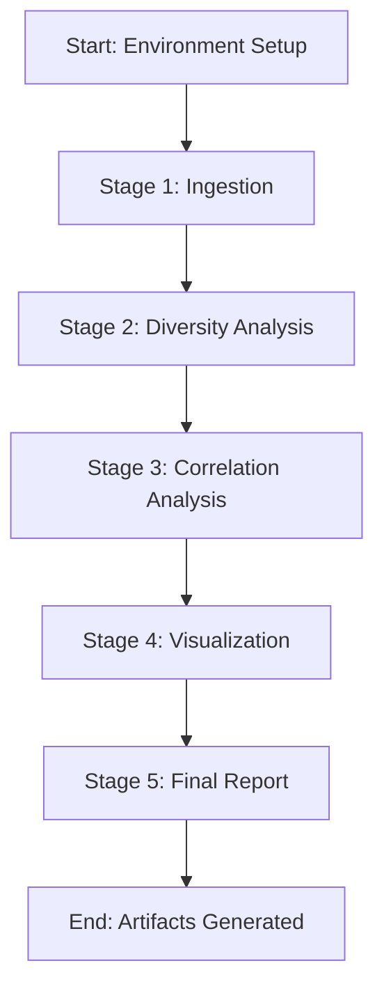

# Pipeline Flow Documentation

This document describes the data flow and dependencies between the modules in the Gut Microbiome and Sleep Quality research pipeline.

## Overview

The pipeline consists of five main stages, executed sequentially to ensure data integrity and reproducibility.

## Stage 1: Ingestion (`src/ingestion.py`)

**Input**:
- Raw data source defined by `DATA_URL` environment variable.

**Process**:
1. **Verification**: Checks for the existence of the data source and validates the schema (columns: `antibiotic_use_last_3m`, `sleep_efficiency`, `sleep_duration_hours`).
2. **Download**: Fetches data with exponential backoff.
3. **Filtering**:
 - Excludes samples with `antibiotic_use_last_3m == True`.
 - Excludes samples with missing `sleep_efficiency` or `sleep_duration_hours`.
4. **Merging**: Combines OTU tables with sleep metadata.
5. **Logging**: Records exclusion rates.

**Output**:
- `data/processed/cleaned_microbiome_sleep.csv`
- `data/processed/ingestion_report.json`

**Dependencies**: None (except external data source).

## Stage 2: Diversity Analysis (`src/diversity.py`)

**Input**:
- `data/processed/cleaned_microbiome_sleep.csv`

**Process**:
1. **Rarefaction**: Subsamples OTU tables to a fixed sequencing depth to normalize sequencing effort.
2. **Alpha-Diversity Calculation**: Computes Shannon, Simpson, and Observed OTUs indices.

**Output**:
- `data/processed/alpha_diversity_metrics.csv`

**Dependencies**: Stage 1 (Ingestion).

## Stage 3: Correlation Analysis (`src/correlation.py`)

**Input**:
- `data/processed/alpha_diversity_metrics.csv`

**Process**:
1. **Spearman Correlation**: Computes rank correlation between diversity indices and sleep metrics.
2. **FDR Correction**: Applies Benjamini-Hochberg correction to p-values.
3. **Flagging**: Marks correlations as `is_moderate` (|r| > 0.3) and `is_meaningful` (q < 0.05 AND |r| > 0.3).

**Output**:
- `data/processed/correlation_results.csv`

**Dependencies**: Stage 2 (Diversity Analysis).

## Stage 4: Visualization (`src/viz.py`)

**Input**:
- `data/processed/correlation_results.csv`
- `data/processed/alpha_diversity_metrics.csv`

**Process**:
1. **Scatterplots**: Generates regression plots for significant correlations.
2. **Boxplots**: Generates boxplots of diversity metrics grouped by sleep quartiles.

**Output**:
- `data/processed/plots/*.png`

**Dependencies**: Stage 3 (Correlation Analysis).

## Stage 5: Final Report (`src/report_final.py`)

**Input**:
- `data/processed/correlation_results.csv`
- `data/processed/ingestion_report.json`
- `data/processed/plots/*.png`

**Process**:
1. **Compilation**: Aggregates all findings, statistics, and visualizations.
2. **Generation**: Produces an HTML (and optionally PDF) report.

**Output**:
- `data/processed/final_report.html`

**Dependencies**: Stage 3 & 4 (Correlation & Visualization).

## Error Handling

- **Data Source Missing**: The pipeline halts at Stage 1 with a clear `FileNotFoundError`.
- **Schema Mismatch**: The pipeline halts at Stage 1 if required columns are missing.
- **No Significant Associations**: Handled gracefully in Stage 3 and reflected in the final report.

## Reproducibility

The pipeline is designed for reproducibility:
- Random seeds are fixed via `RANDOM_SEED`.
- All processing steps are deterministic.
- SHA-256 hashes of outputs are verified in `tests/integration/test_reproducibility.py`.
