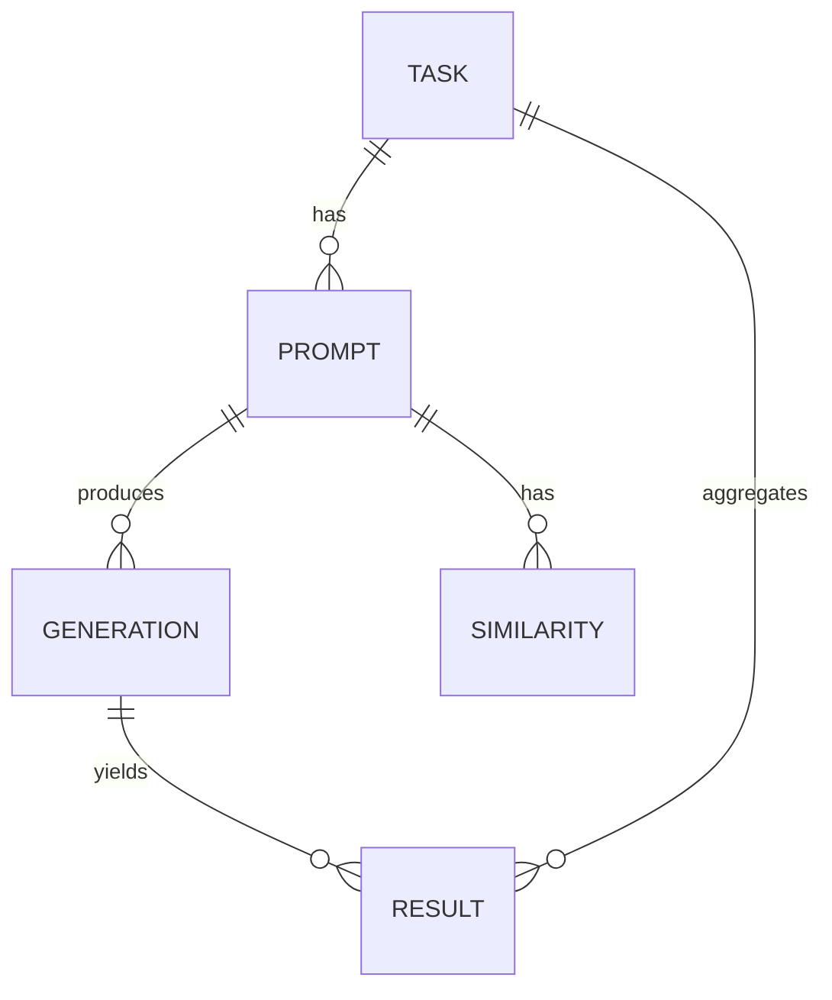

# Data Model: Evaluating the Robustness of LLM-Generated Code to Input Perturbations

## Overview

This document defines the data model for the robustness evaluation pipeline. It includes schemas for raw dataset ingestion, perturbed prompt generation, inference results, and statistical analysis outputs. All data files are stored under `data/` with checksums recorded in `state/`.

## Entity Relationships

## Core Entities

### Task
- **task_id**: Unique identifier from HumanEval (e.g., `HumanEval/0`)
- **prompt**: Original problem description (string)
- **canonical_solution**: Reference solution (string, optional for analysis)
- **test_code**: Unit tests to validate generated code (string)

### Prompt
- **prompt_id**: Unique identifier (e.g., `HumanEval/0_synonym_1`)
- **task_id**: Foreign key to Task
- **perturbation_type**: One of `synonym`, `typo`, `rephrase`, `original`
- **prompt_text**: Actual text sent to model (string)
- **similarity_score**: Cosine similarity to original (float, 0.0-1.0)
- **is_primary**: Boolean (True if similarity > 0.95)

### Generation
- **generation_id**: Unique identifier
- **prompt_id**: Foreign key to Prompt
- **model_name**: StarCoder2-3B (string)
- **generated_code**: Code output (string)
- **generation_time_ms**: Time taken (integer)
- **timeout**: Boolean (True if 30s exceeded)
- **oom**: Boolean (True if OOM error)

### Result
- **result_id**: Unique identifier
- **generation_id**: Foreign key to Generation
- **pass**: Boolean (True if all tests passed)
- **error_type**: One of `syntax`, `logic`, `hallucination`, `timeout`, `OOM`
- **test_output**: Raw test output (string)
- **execution_time_ms**: Time taken (integer)

### Analysis Output
- **analysis_id**: Unique identifier
- **metric_name**: e.g., `pass@1_original`, `pass@1_synonym`
- **value**: Numeric result (float)
- **p_value**: Statistical p-value (float, if applicable)
- **corrected_p_value**: Bonferroni-corrected p-value (float)
- **threshold**: Semantic similarity threshold used (float)

## File Formats

### Raw Data
- **Format**: Parquet
- **Location**: `data/raw/humaneval.parquet`
- **Checksum**: SHA-256 recorded in `state/`

### Processed Data
- **Format**: CSV
- **Location**: `data/processed/perturbed_prompts.csv`, `data/processed/inference_results.csv`
- **Encoding**: UTF-8

### Results
- **Format**: CSV/JSON
- **Location**: `data/results/analysis_results.csv`, `data/results/sensitivity_report.json`

## Data Flow

1. **Ingestion**: Download HumanEval parquet → `data/raw/`
2. **Perturbation**: Generate variants → `data/processed/perturbed_prompts.csv`
3. **Inference**: Run model → `data/processed/inference_results.csv`
4. **Execution**: Run tests → `data/processed/results.csv`
5. **Analysis**: Compute statistics → `data/results/analysis_results.csv`
