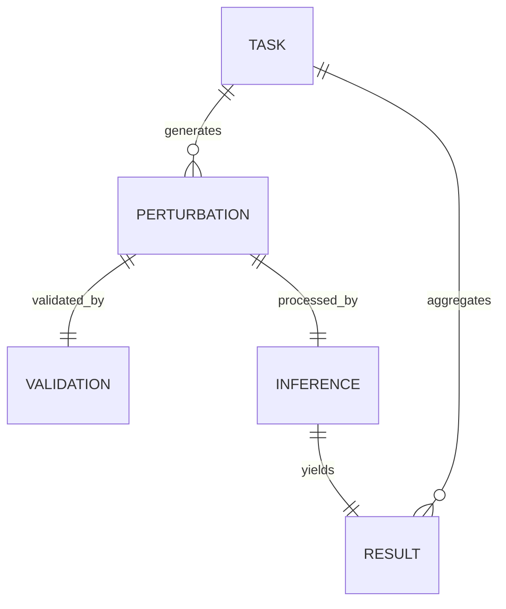

# Data Model: Evaluating the Robustness of LLM-Generated Code to Input Perturbations

## Overview

This document defines the data structures, schemas, and relationships used throughout the research pipeline. All data is stored in JSON/Parquet formats to ensure reproducibility and ease of analysis.

## Raw Data Sources

### HumanEval Tasks
- **Source**: `openai/openai_humaneval`
- **Format**: Parquet (converted to JSON for processing)
- **Key Fields**: `task_id`, `prompt`, `canonical_solution`, `test`, `entry_point`

## Processed Data Structures

### 1. Perturbation Candidates (Raw)
Contains all generated perturbation attempts before semantic filtering.
- **File**: `data/processed/perturbation_candidates_raw.json`
- **Schema**: `contracts/perturbation_schema.yaml`
- **Content**: All generated variants with their raw similarity scores.

### 2. Perturbation Candidates (Validated)
Subset of raw candidates with `similarity_score > 0.95`.
- **File**: `data/processed/perturbation_candidates_validated.json`
- **Schema**: `contracts/perturbation_schema.yaml` (with `is_valid: true`)
- **Content**: High-fidelity perturbations used for primary analysis.

### 3. Inference Logs
Results of code generation and execution.
- **File**: `data/processed/inference_logs.json`
- **Schema**: `contracts/execution_result.schema.yaml`
- **Content**: Pass/fail outcomes, error types, execution times, and model configurations.

### 4. Calibration Report
Final statistical results and sensitivity analysis.
- **File**: `data/processed/calibration_report.json`
- **Schema**: `contracts/calibration_schema.yaml`
- **Content**: Aggregated pass rates, statistical test results (CMH, Mixed-Effects), sensitivity analysis, and metadata. This is the **primary deliverable** of the analysis phase.

### 5. Halt Report
Runtime logs and error reports.
- **File**: `data/logs/halt_report.json`
- **Content**: Summary of runtime errors (OOM, timeouts), fallback triggers, and resource usage logs.

## Entity Relationships

```mermaid
erDiagram
    TASK ||--o{ PERTURBATION : generates
    PERTURBATION ||--|| VALIDATION : validated_by
    PERTURBATION ||--|| INFERENCE : processed_by
    INFERENCE ||--|| RESULT : yields
    TASK ||--o{ RESULT : aggregates
```

- **TASK**: The base programming problem (a set of instances).
- **PERTURBATION**: A modified version of a task prompt (up to 3 per task).
- **VALIDATION**: The semantic similarity check (score, pass/fail).
- **INFERENCE**: The LLM generation and sandbox execution event.
- **RESULT**: The pass/fail outcome and error classification.

## Data Flow

1.  **Download**: `data/raw/humaneval.parquet` → `code/data/download.py`
2.  **Perturb**: `TASK` → `code/data/perturbation.py` → `PERTURBATION` (Raw)
    -   *Write Step*: `perturbation.py` writes `data/processed/perturbation_candidates_raw.json`.
    -   *Filter Step*: `perturbation.py` applies similarity threshold.
    -   *Write Step*: `perturbation.py` writes `data/processed/perturbation_candidates_validated.json`.
    -   *Halt Step*: `perturbation.py` logs any critical failures or resource exhaustion to `data/logs/halt_report.json`.
3.  **Infer**: `PERTURBATION` (Validated) → `code/model/inference.py` → `INFERENCE`
    -   *Logic*: `inference.py` attempts StarCoder2-3B-4bit. If OOM, falls back to `starcoder2-1b`.
    -   *Logic*: Enforces a configurable timeout per generation and execution.
    -   *Write Step*: `inference.py` writes `data/processed/inference_logs.json`.
4.  **Analyze**: `INFERENCE` → `code/analysis/statistics.py` → `RESULT` (Calibration Report)
    -   *Logic*: `statistics.py` calculates pass@1, runs CMH, Mixed-Effects, and sensitivity analysis.
    -   *Write Step*: `statistics.py` writes `data/processed/calibration_report.json`.

## Integrity Constraints

-   **Uniqueness**: `task_id` + `perturbation_id` must be unique in `inference_logs.json`.
-   **Completeness**: All 164 original tasks must appear in `inference_logs.json`.
-   **Consistency**: `similarity_score` must be between 0.0 and 1.0.
-   **Immutability**: Raw data files are never modified; derivations create new files.
-   **Deliverable**: `data/processed/calibration_report.json` must exist and be valid JSON upon pipeline completion.