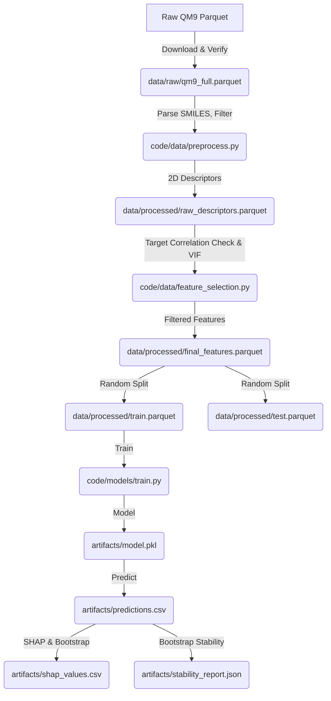

# Data Model: Predicting Molecular Polarity from SMILES Strings with Machine Learning

## Overview

This document defines the data structures, schemas, and transformation logic for the molecular polarity prediction pipeline. It ensures that the data flow from raw SMILES to model output is consistent, validated, and reproducible.

## Data Flow Diagram

## Entity Definitions

### 1. Molecule (Raw)
- **Source**: QM9 dataset.
- **Attributes**:
  - `smiles` (string): Canonical SMILES representation.
  - `dipole_moment` (float): Target variable in Debye. May be a scalar or vector magnitude.
  - `mu_x`, `mu_y`, `mu_z` (float): Vector components (optional, for derivation).
  - `id` (string): Unique molecule identifier.

### 2. Descriptor Vector (Processed)
- **Source**: Derived from `Molecule` via RDKit.
- **Attributes**:
  - `smiles` (string): Input SMILES (kept for traceability).
  - `dipole_moment` (float): Target.
  - `desc_01` ... `desc_N` (float): 2D topological descriptors (e.g., `NumAtoms`, `WienerIndex`).
  - **Excluded**: `TPSA`, any 3D-dependent descriptors, direct polar group flags.
  - `is_valid` (boolean): Flag indicating if all descriptors were calculated successfully.

### 3. Filtered Feature Set
- **Source**: Output of `code/data/feature_selection.py`.
- **Attributes**:
  - Subset of `Descriptor Vector` columns.
  - Features removed if:
    1. $|r(\text{feature}, \text{target})| > 0.90$ (Target Leakage).
    2. VIF > 5.0 (Multi-collinearity).

### 4. Model Output
- **Source**: LightGBM inference.
- **Attributes**:
  - `smiles` (string): Input SMILES.
  - `true_dipole` (float): Actual dipole moment.
  - `pred_dipole` (float): Predicted dipole moment.
  - `error` (float): `true_dipole - pred_dipole`.
  - `abs_error` (float): Absolute error.

### 5. Stability Report
- **Source**: Bootstrap analysis.
- **Attributes**:
  - `feature_name`: Name of the descriptor.
  - `selection_frequency`: Percentage of bootstrap iterations where the feature was in the top 10 SHAP contributors.
  - `mean_abs_shap`: Average SHAP magnitude across iterations.

## Transformation Logic

### Preprocessing (SMILES -> Descriptors)
1. **Parse**: Use `rdkit.Chem.MolFromSmiles`. If `None`, log error and skip.
2. **Compute**:
   - Loop over a predefined list of 200+ descriptor names (e.g., `CalcNumAtoms`, `CalcWienerIndex`).
   - **Constraint**: Do NOT call `EmbedMolecule`.
   - **Runtime Assertion**: If any 3D-dependent function is called, raise `RuntimeError`.
3. **Imputation**: If a descriptor returns `NaN`, replace with the median of the training set (calculated after splitting).
4. **Filtering**: Remove molecules where `dipole_moment` is missing.

### Feature Selection (FR-007)
**Module**: `code/data/feature_selection.py`
1. **Target Correlation Check**:
   - Calculate Pearson correlation between each descriptor and `dipole_moment`.
   - Exclude any feature with $|r| > 0.90$.
2. **VIF Iteration**:
   - Calculate VIF for remaining features.
   - While max(VIF) > 5.0:
     - Remove feature with highest VIF.
     - Recalculate VIF.
3. **Output**: Save filtered feature matrix to `data/processed/final_features.parquet`.

### Splitting
- **Method**: **Random Split** (No Stratification).
- **Ratio**: [deferred] Train, [deferred] Test.
- **Seed**: Fixed random seed (e.g., 42) for reproducibility.
- **Rationale**: Stratification by binning continuous targets introduces bias; random sampling ensures representativeness.

## Storage Format

- **Raw Data**: Parquet (compressed).
- **Processed Data**: Parquet (compressed).
- **Model**: Pickle (`.pkl`) or Joblib (`.joblib`).
- **Metrics**: JSON.

## Error Handling

- **Invalid SMILES**: Logged to `logs/errors.log` with the SMILES string. Record skipped.
- **NaN Descriptors**: Logged. Imputed with median.
- **Memory Overflow**: If `process` step exceeds 5GB, trigger a fallback to process in smaller batches (e.g., 5k molecules at a time) and append to disk.
- **3D Violation**: If `test_no_3d_conformers.py` fails or runtime assertion triggers, the pipeline halts immediately with a `RuntimeError`.