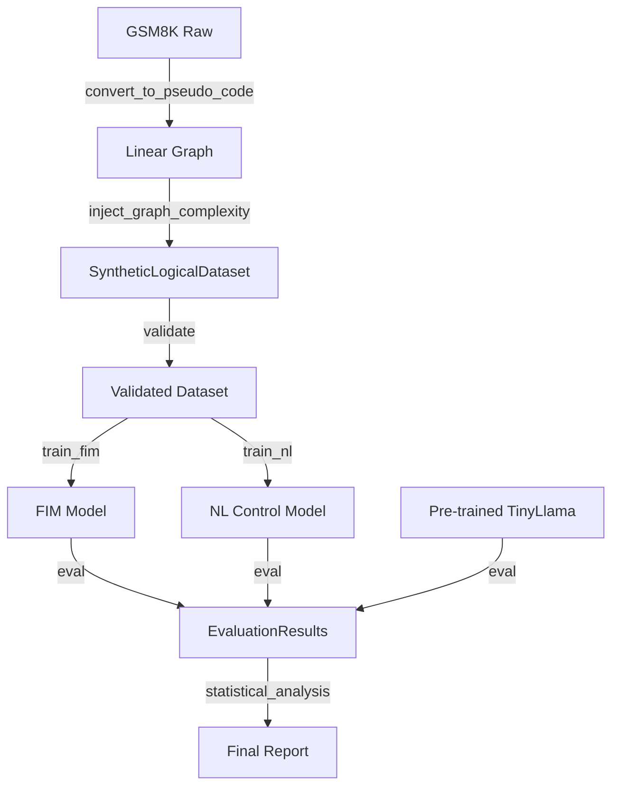

# Data Model: Function-Aware FIM for Non-Code Domains

## Overview

This document defines the data schemas for the synthetic logical dataset, the masking artifacts, and the evaluation results. All data flows are unidirectional: Raw Data → Synthetic Dataset → Training Artifacts → Evaluation Results.

## Entities

### 1. Raw Input Data
- **GSM8K**: Standard math word problems (Question, Answer, Reasoning Steps).
- **LogiQA**: Logical reasoning questions (Question, Options, Answer).

### 2. SyntheticLogicalDataset
The core training artifact. A JSONL file where each line represents a single math problem converted into a pseudo-code function block sequence.
**Key Feature**: Supports **non-linear dependency graphs** (branching/merging) to test structural resolution.

**Schema**:
- `problem_id`: Unique identifier (string).
- `original_question`: The raw GSM8K question text.
- `steps`: List of step objects.
  - `step_id`: Integer index (0, 1, ...).
  - `code`: The pseudo-code string (e.g., `def step_0(): return 5`).
  - `dependencies`: List of `step_id`s this step depends on (can be >1 for non-linear graphs).
- `graph_type`: String ("linear", "branching", "merging") indicating the complexity injected.
- `answer`: The final derived fact (string).
- `depth`: Integer, the length of the longest dependency chain.

### 3. MaskingMap
Generated during training preparation. Maps function IDs to token spans for FIM masking.
**Key Feature**: Supports `missing_step` mask type to force inference of entire logical steps.

**Schema**:
- `problem_id`: String.
- `masking_targets`: List of objects.
  - `function_id`: Integer.
  - `start_token`: Integer.
  - `end_token`: Integer.
  - `mask_type`: String (e.g., "body", "args", "missing_step").

### 4. EvaluationResults
Aggregated results from the LogiQA benchmark.

**Schema**:
- `model_variant`: String ("fim", "nl_control", "baseline").
- `seed`: Integer.
- `accuracy`: Float (0.0 - 1.0).
- `logiqa_samples_processed`: Integer.
- `convergence_status`: String ("converged", "underfit", "timeout") indicating if the model learned the signal.

## Data Flow Diagram

## Constraints & Validation Rules

1.  **Acyclic Dependency**: The `steps` list in `SyntheticLogicalDataset` must form a Directed Acyclic Graph (DAG). Topological sort length must equal `len(steps)`.
2.  **Non-Linear Requirement**: At least 20% of samples must have non-linear dependencies (branching or merging) to ensure the task tests structural resolution.
3.  **No Leakage**: `problem_id` in training must not exist in `LogiQA` test set (checked for both raw and synthetic).
4.  **Tokenization**: All pseudo-code must be tokenized using the same tokenizer as the base model (TinyLlama).
5.  **Convergence**: Evaluation results must include a `convergence_status` field to flag underfitting.

## File Formats

- **Input**: Parquet (GSM8K, LogiQA).
- **Intermediate**: JSONL (Synthetic dataset), JSON (Masking maps).
- **Output**: JSON (Evaluation results), CSV (Statistical report).