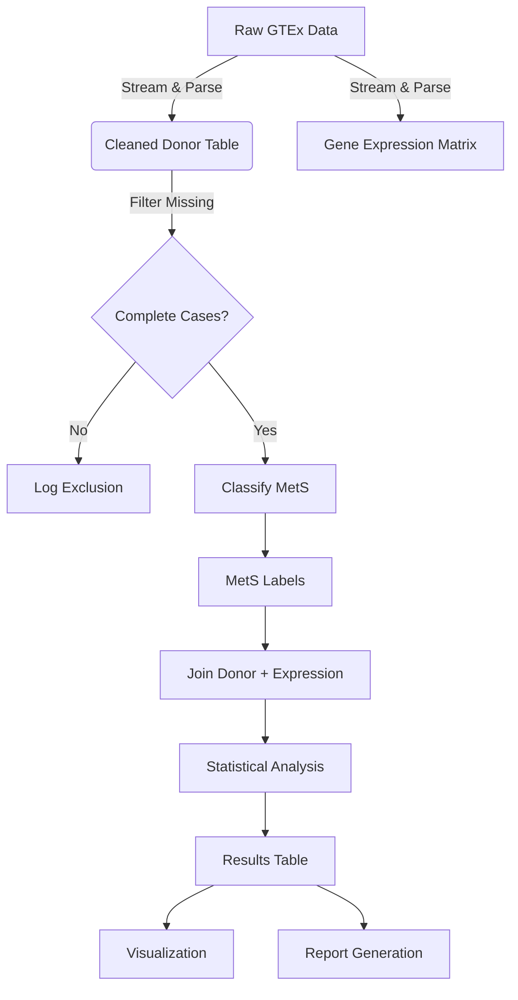

# Data Model: Investigating the Correlation Between Circadian Gene Expression and Metabolic Syndrome Risk

## Overview

This document defines the data entities, relationships, and schemas used in the project. It ensures that all data transformations are traceable and that the data flow adheres to the project constitution (Principle III: Data Hygiene, Principle IV: Single Source of Truth).

## Entities

### 1. Donor
Represents a human subject from the GTEx dataset.
- **Attributes**:
  - `donor_id` (str): Unique identifier.
  - `age` (int): Age at death.
  - `sex` (str): 'M' or 'F'.
  - `tissue` (str): Tissue source (e.g., 'Liver', 'Adipose').
  - `bmi` (float): Body Mass Index.
  - `fasting_glucose` (float): mg/dL.
  - `triglycerides` (float): mg/dL.
  - `hdl` (float): mg/dL.
  - `systolic_bp` (float): mmHg.
  - `diastolic_bp` (float): mmHg.
  - `pmi` (float): Post-Mortem Interval (hours).
  - `time_of_death` (str): Time of death (HH:MM).
  - `metabolic_status` (str): 'MetS' or 'Control' (derived).
  - `criteria_count` (int): 0-5 (number of ATP-III criteria met).
  - `exclusion_reason` (str): If excluded, reason (e.g., 'missing_glucose').

### 2. GeneExpression
Represents transcript abundance for a specific gene in a donor's tissue.
- **Attributes**:
  - `donor_id` (str): FK to Donor.
  - `gene_symbol` (str): e.g., 'PER1', 'BMAL1'.
  - `tissue` (str): FK to Donor.tissue.
  - `tpm` (float): Transcripts Per Million.
  - `log_tpm` (float): log2(TPM + 1) (derived).

### 3. AnalysisResult
Stores the output of statistical tests.
- **Attributes**:
  - `gene_symbol` (str).
  - `tissue` (str).
  - `test_type` (str): 'wilcoxon', 'logistic_regression', 'correlation'.
  - `statistic` (float): Test statistic (e.g., W, Z, beta).
  - `p_value` (float): Raw p-value.
  - `adj_p_value` (float): FDR-adjusted p-value.
  - `effect_size` (float): e.g., Odds Ratio, Correlation coefficient.
  - `significant` (bool): True if adj_p_value < 0.05.

## Data Flow

## File Structure

| File Path | Purpose | Schema |
| :--- | :--- | :--- |
| `data/raw/gtex_raw.parquet` | Raw downloaded data (immutable) | `contracts/dataset.schema.yaml` |
| `data/processed/donors_clean.csv` | Cleaned donor data with classifications | `contracts/dataset.schema.yaml` |
| `data/processed/baseline_labels.csv` | Binary MetS labels and criteria counts | `contracts/output.schema.yaml` |
| `data/processed/gene_expression.csv` | Log-transformed expression matrix | `contracts/dataset.schema.yaml` |
| `data/processed/statistical_results.csv` | P-values, FDR, Odds Ratios | `contracts/output.schema.yaml` |
| `data/processed/model_metrics.json` | AUC, CV scores | `contracts/output.schema.yaml` |

## Constraints

- **Immutability**: Raw data files are never modified.
- **Checksums**: All files in `data/` are checksummed (SHA-256) and recorded in `state/`.
- **PII**: No personally identifying information is stored. `donor_id` is an anonymized GTEx ID.
- **Missing Data**: Samples with missing clinical variables are excluded, not imputed.
