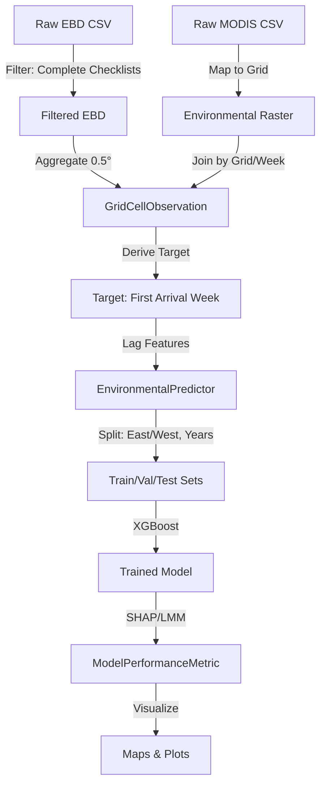

# Data Model: Predicting Avian Migration Patterns

## Overview

This document defines the data structures, schemas, and relationships used throughout the `001-predicting-avian-migration` project. The data flow is strictly unidirectional: Raw Data → Processed Grids → Model Inputs → Predictions → Metrics.

## Entity Definitions

### 1. Raw Checklist (EBD)
The raw unit of observation from the eBird dataset.
*   **Fields**: `checklist_id`, `species_code`, `species_common_name`, `latitude`, `longitude`, `date`, `duration_min`, `num_observers`, `distance_km`, `complete_checklist` (bool).
*   **Constraints**: Only records where `complete_checklist` is true and `distance_km` ≤ 10 are retained.

### 2. GridCellObservation (Aggregated)
The fundamental unit for analysis: a 0.5° grid cell at a specific week and year.
*   **Fields**:
    *   `grid_cell_id`: Unique identifier (e.g., "lat_40.5_lon_-75.5").
    *   `year`: Integer (2015-2023).
    *   `week`: Integer (1-52).
    *   `observation_count`: Integer (Total *Setophaga ruticilla* sightings in this cell/week).
    *   `cumulative_count`: Integer (Running sum of observations from the start of the year).
    *   `first_arrival_week`: Integer (Week where `cumulative_count` ≥ threshold).
    *   `is_valid`: Boolean (True if total annual count ≥ 10).

### 3. EnvironmentalPredictor
Lagged environmental features associated with a `GridCellObservation`.
*   **Fields**:
    *   `grid_cell_id`: Foreign key to `GridCellObservation`.
    *   `temp_lag_1` to `temp_lag_4`: Float (Mean Land Surface Temperature 1-4 weeks prior).
    *   `ndvi_lag_1` to `ndvi_lag_4`: Float (Mean NDVI 1-4 weeks prior).
    *   `temp_current`: Float (Mean temperature of the target week).
    *   `ndvi_current`: Float (Mean NDVI of the target week).

### 4. ModelPerformanceMetric
Aggregated results from the modeling phase.
*   **Fields**:
    *   `model_type`: String (e.g., "TempOnly", "NDVIOnly", "Combined").
    *   `split`: String (Train, Val, Test).
    *   `rmse`: Float.
    *   `pearson_r`: Float.
    *   `p_value`: Float (From LMM comparison).
    *   `feature_importance`: Dict (JSON string of SHAP/Permutation scores).

## Data Flow Diagram

## Data Quality Rules

1.  **Completeness**: Rows with missing `latitude` or `longitude` are dropped.
2.  **Threshold Validity**: `first_arrival_week` is only calculated if `total_annual_count` ≥ 10. Otherwise, marked as `null`.
3.  **Lag Integrity**: If environmental data is missing for a lag week, the row is either imputed (temporal interpolation) or dropped (depending on missingness rate).
4.  **Temporal Separation**: No data from 2021 (Val) or 2022 (Test) is used in training. No data from the Western US is used in training.
