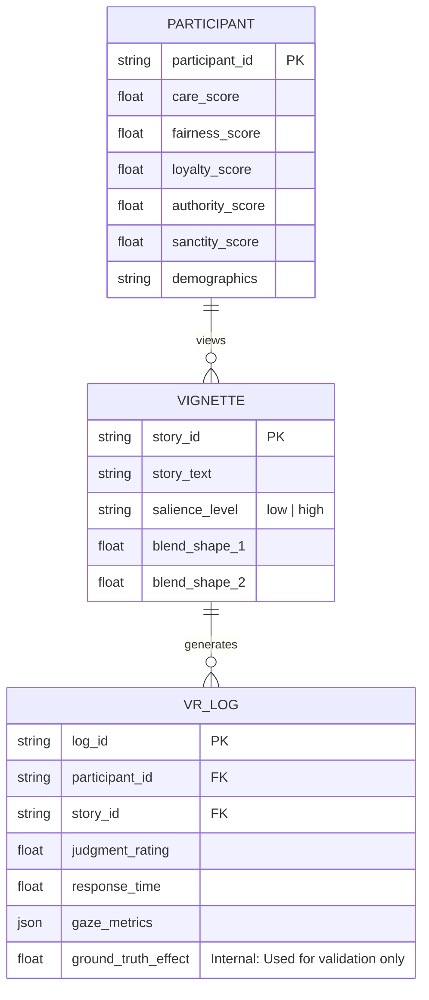

# Data Model: The Cognitive Mechanisms Underlying Intuitive Moral Judgments in Virtual Environments

## 1. Entity Relationship Diagram (Conceptual)

## 2. Data Dictionary

### 2.1. Participant (Synthetic, based on Gervais et al.)
| Field | Type | Description | Source |
| :--- | :--- | :--- | :--- |
| `participant_id` | string | Unique identifier. | Synthetic |
| `care_score` | float | Score on Care foundation (0-5). | Synthetic (Norms-based) |
| `fairness_score` | float | Score on Fairness foundation (0-5). | Synthetic (Norms-based) |
| `loyalty_score` | float | Score on Loyalty foundation (0-5). | Synthetic (Norms-based) |
| `authority_score` | float | Score on Authority foundation (0-5). | Synthetic (Norms-based) |
| `sanctity_score` | float | Score on Sanctity foundation (0-5). | Synthetic (Norms-based) |
| `demographics` | string | JSON string of age, gender, etc. | Synthetic |

### 2.2. Vignette (Synthetic)
| Field | Type | Description | Source |
| :--- | :--- | :--- | :--- |
| `story_id` | string | Unique identifier. | Synthetic |
| `story_text` | string | Text of the moral story. | Synthetic |
| `salience_level` | string | Experimental condition: "low" or "high". | Synthetic |
| `blend_shape_1` | float | Parameter for avatar expression (0.0 for low, 1.0 for high). | Synthetic |
| `blend_shape_2` | float | Secondary parameter. | Synthetic |

### 2.3. VR Interaction Log (Synthetic with Ground Truth)
| Field | Type | Description | Source |
| :--- | :--- | :--- | :--- |
| `log_id` | string | Unique identifier. | Synthetic |
| `participant_id` | string | Foreign key. | Synthetic |
| `story_id` | string | Foreign key. | Synthetic |
| `judgment_rating` | float | Moral judgment rating (1-7). | Synthetic (Generated with `ground_truth_effect`) |
| `response_time` | float | Time taken to respond (ms). | Synthetic |
| `gaze_metrics` | json | JSON object with gaze coordinates. | Synthetic |
| `ground_truth_effect` | float | The known effect size used to generate `judgment_rating`. | Internal (Validation) |

## 3. Data Flow

1.  **Ingestion**: `data/ingest.py` generates synthetic MFQ data using `utils/norms.py`.
2.  **Synthesis**: `data/simulation.py` generates `Vignette` and `VR_Log` data, assigning `salience_level` and `blend_shape` parameters. **Crucially**, it sets a `ground_truth_effect` (e.g., 0.5) and generates `judgment_rating` based on this effect.
3.  **Validation**: `utils/norms.py` validates synthetic MFQ against Gervais et al. (2011).
4.  **Merging**: `data/preprocess.py` joins datasets.
5.  **Hashing**: `utils/hashing.py` calculates checksums and updates `state/...yaml`.
6.  **Output**: Final unified CSV written to `data/processed/final_analysis.csv`.

## 4. Assumptions & Constraints

*   **Synthetic Data**: The "Moral Stories" dataset and VR logs are simulated.
*   **Ground Truth**: The simulation includes a known `ground_truth_effect` to validate the model's ability to recover parameters.
*   **Psychometric Validity**: Synthetic MFQ data is generated to match Gervais et al. norms.
*   **No Real Data**: The current phase does not use real participant data.