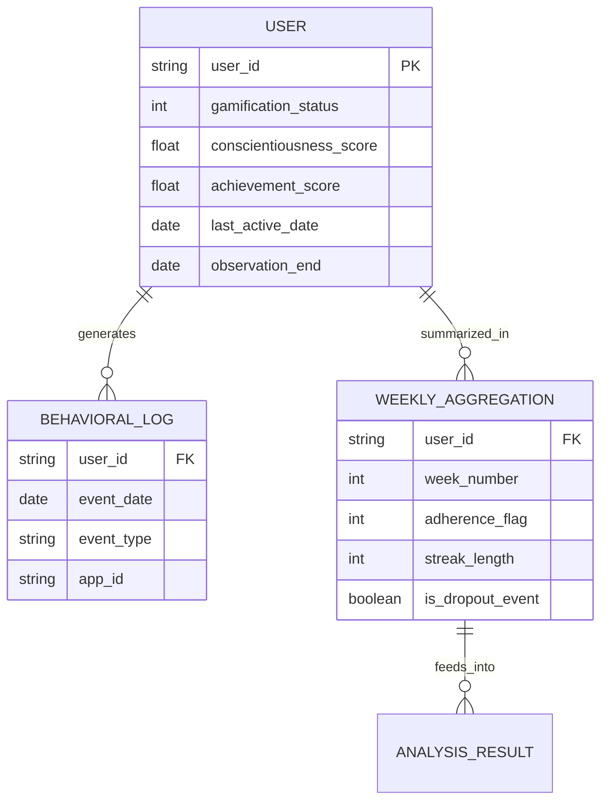

# Data Model: The Effects of Gamified Habit Tracking on Long-Term Behavioral Change

## Overview
This document defines the data structures used throughout the pipeline, from raw ingestion to final analysis results. All data transformations are deterministic and versioned.

## Entity Relationship Diagram (Conceptual)

## Data Schema Definitions

### 1. Raw Input Schema (Behavioral Log)
*Source: API or CSV dump*
- `user_id`: Unique identifier (string).
- `date`: ISO 8601 date string (YYYY-MM-DD).
- `event_type`: String (e.g., "habit_complete", "task_done").
- `app_id`: String (used to derive `gamification_status`).

### 2. Aggregated Schema (Weekly)
*Derived from Raw Input*
- `user_id`: Foreign key.
- `week_number`: Integer (1, 2, 3...).
- `weekly_adherence_flag`: Binary (0 or 1). 1 if `count(events) >= 1` in the week.
- `streak_length`: Integer (consecutive weeks of adherence).
- `is_dropout_event`: Binary (1 if this week marks the start of a 3-week non-adherence period with no resumption).

### 3. Analysis Schema (Final Dataset)
*Merged for Modeling*
- `user_id`: Primary Key.
- `gamification_status`: Binary (0/1).
- `conscientiousness_score`: Float (0-100 or standardized).
- `achievement_score`: Float (optional).
- `last_active_date`: Date of the last recorded activity (used for censoring).
- `observation_end`: Date the study ended (for censoring).
- `dropout_time`: Integer (weeks until dropout event or censoring).
- `dropout_event`: Binary (1 if dropout occurred, 0 if censored).
- `weekly_data`: Nested structure or long-form rows for mixed-effects model.

## Data Validation Rules

1. **Completeness**: No null values in `user_id`, `gamification_status`, or `weekly_adherence_flag` for included records.
2. **Range Checks**: `conscientiousness_score` must be within valid range (e.g., 1-5 or 0-100).
3. **Temporal Logic**: `week_number` must be sequential and positive. `dropout_time` must be ≥ 0. `last_active_date` must be ≤ `observation_end`.
4. **Consistency**: `gamification_status` must be derived consistently from `app_id` tags or source metadata.
5. **Group Balance**: `non-gamified` count must be ≥ 30.
6. **Event Count**: `dropout_event` count must be ≥ 10 per group for survival analysis.

## Data Flow

1. **Ingestion**: `code/data/ingestion.py` reads raw logs → validates schema → saves to `data/raw/`.
2. **Aggregation**: `code/data/aggregation.py` groups by `user_id` and `week` → calculates flags → saves to `data/processed/weekly_agg.csv`.
3. **Validation**: `code/data/validation.py` merges personality traits, checks group balance, calculates Cronbach's α, and creates final analysis dataset.
4. **Analysis**: `code/analysis/` consumes the final dataset for modeling.