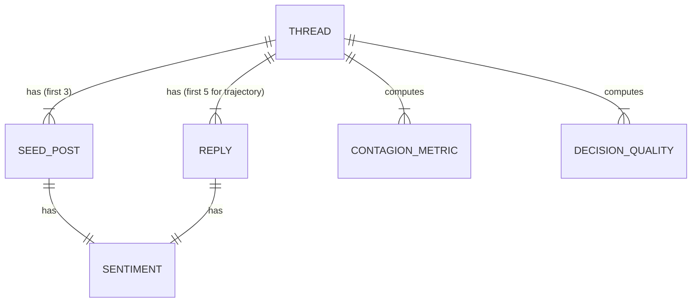

# Data Model: Emotional Contagion Analysis

## Overview

This document defines the data schema for the emotional contagion analysis pipeline. It covers the raw input formats, the processed intermediate structures, and the final output schemas used for statistical modeling and reporting.

## Entity Relationship Diagram (Conceptual)

## Core Entities

### Thread
A discussion unit containing seed posts and replies.
- `thread_id` (str): Unique identifier.
- `source` (str): "reddit" or "stackexchange".
- `subreddit/site` (str): Name of the community.
- `created_at` (timestamp): Thread start time.
- `seed_count` (int): Number of top-level posts (must be ≥3).
- `total_replies` (int): Total comments in thread.
- `has_ground_truth` (bool): Whether external validation (e.g., 'Solved' flag) is available.

### SeedPost
The first 3 top-level posts driving the initial sentiment.
- `post_id` (str): Unique ID.
- `author_id` (str): Anonymized author hash.
- `timestamp` (timestamp).
- `text` (str): Content.
- `vader_compound` (float): Sentiment score [-1.0, 1.0].

### Reply
Subsequent comments analyzed for sentiment shift.
- `reply_id` (str).
- `parent_id` (str): ID of the post it replies to.
- `timestamp` (timestamp).
- `text` (str).
- `vader_compound` (float).
- `position_in_thread` (int): 1 to 5 (for trajectory calculation).

## Computed Metrics

### ContagionMetric
- `thread_id` (str).
- `seed_sentiment_mean` (float).
- `contagion_index` (float): Pearson correlation between Seed Sentiment and **Slope of Reply Trajectory** (linear regression of sentiment vs. position).
- `n_replies_used` (int): Fixed at 5.
- `p_value` (float): Significance of correlation.

### DecisionQuality
- `thread_id` (str).
- `agreement_proportion` (float): Ratio of replies agreeing with **Seed Sentiment** direction.
- `shannon_entropy` (float): **Diversity metric**. Lower values indicate higher consensus (forced by contagion). Higher values indicate diversity/polarization.
- `external_validation_score` (float or null): 1.0 if Majority Consensus matches 'Solved' flag, 0.0 otherwise, null if no flag.
- `time_to_decision` (float): Seconds.
- `thread_length` (int).
- `fp_rate` (float or null): False Positive rate relative to ground truth (if valid).
- `fn_rate` (float or null): False Negative rate relative to ground truth (if valid).

## File Formats

### Input: `data/raw/threads.jsonl`
- Format: JSON Lines.
- Source: HuggingFace dumps.

### Output: `data/processed/thread_metrics.csv`
- CSV with headers matching `DecisionQuality` and `ContagionMetric`.
- Includes `ground_truth_percentage` (aggregate metric).
- **Interpretation Note**: In `shannon_entropy`, values closer to 0 imply high consensus (low diversity), while values closer to $\log(3)$ imply high diversity. The hypothesis predicts a negative correlation between `contagion_index` and `shannon_entropy`.