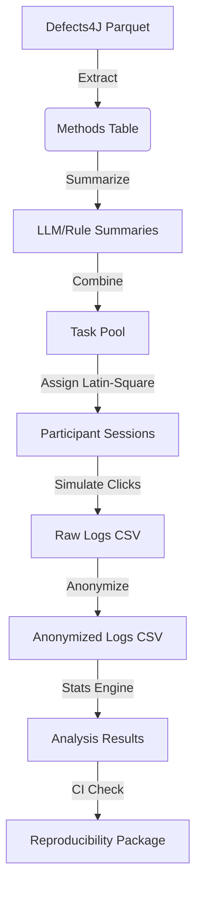

# Data Model: Evaluating the Efficacy of Code Summarization Techniques for Bug Localization

## 1. Overview

This document defines the data structures used in the project, ensuring alignment with the `spec.md` and the `contracts/` schemas. Data flows from raw Defects4J extraction → summary generation → simulated interaction logs → statistical results.

## 2. Entity Definitions

### 2.1. Defects4J Method (Source)
- **Source**: `data/raw/defects4j/defects4j.parquet`
- **Fields**:
  - `method_id` (str): Unique identifier for the buggy method.
  - `project` (str): Project name (e.g., "Chart", "Time").
  - `code` (str): Source code of the method.
  - `buggy_line` (int): 1-based line number of the bug.

### 2.2. Summary (Derived)
- **Source**: `data/processed/summaries/`
- **Fields**:
  - `summary_id` (str): UUID.
  - `method_id` (str): Foreign key to method.
  - `type` (str): Enum["none", "llm", "rule"].
  - `text` (str): The summary text (or empty string for "none").

### 2.3. Interaction Log (Simulated)
- **Source**: `data/interaction_logs/anonymized_logs.csv`
- **Fields**:
  - `participant_id` (str): Anonymized ID (e.g., "P001").
  - `task_id` (str): Unique task instance (method + condition).
  - `condition` (str): Enum["baseline", "llm", "rule"].
  - `timestamp_ms` (int): Time from task start to click.
  - `selected_line` (int): Line number clicked by participant.
  - `ground_truth_line` (int): The actual buggy line.
  - `is_correct` (bool): `selected_line == ground_truth_line`.

### 2.4. Analysis Result (Output)
- **Source**: `data/analysis_results/final_results.csv`
- **Fields**:
  - `comparison` (str): e.g., "baseline_vs_llm_accuracy".
  - `test_type` (str): "McNemar" or "LME".
  - `p_value` (float): Raw p-value.
  - `p_value_corrected` (float): Holm-Bonferroni corrected p-value.
  - `effect_size` (float): OR or Cohen's d.
  - `ci_lower` (float): 95% CI lower bound.
  - `ci_upper` (float): 95% CI upper bound.

## 3. Data Flow Diagram

## 4. Constraints & Validations

- **Anonymization**: `participant_id` in `G` must not map to real names. Original consent data is in `data/consent/` (excluded from VCS).
- **Integrity**: `ground_truth_line` in `G` must match `buggy_line` in `B` for the corresponding `method_id`.
- **Completeness**: Every `task_id` in `G` must have a corresponding `summary` in `C` (or fallback).
- **Reproducibility**: All random seeds (for simulation and bootstrapping) are stored in `code/utils/config.py`.
