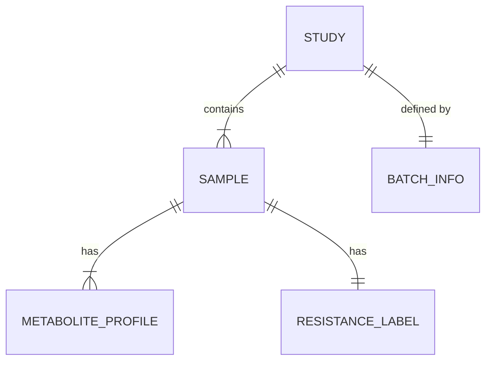

# Data Model: Predicting Plant Disease Resistance from Publicly Available Metabolomic Data

## 1. Entity Relationship Overview

The data model consists of three primary entities: `MetaboliteProfile`, `ResistanceLabel`, and `StudyMetadata`. These are derived from raw downloads and harmonized into a single `AnalysisDataset`.

## 2. Entity Definitions

### 2.1. Study (Source Level)
Represents a single study from Metabolomics Workbench.
*   `study_id`: Unique identifier (e.g., "C-12345").
*   `source_url`: Link to the study page.
*   `platform`: Instrument used (e.g., "LC-MS", "GC-MS").
*   `batch_id`: Identifier for batch correction (derived from study ID).

### 2.2. Sample (Observation Level)
Represents a single biological specimen.
*   `sample_id`: Unique ID within the study.
*   `study_id`: Foreign key to `Study`.
*   `germplasm_id`: Plant variety/line identifier.
*   `timepoint`: "Pre-challenge" or "Post-challenge" (filtered to "Pre-challenge" only).
*   `raw_intensity_table`: Path to raw data file (per sample or aggregated).

### 2.3. MetaboliteProfile (Feature Level)
*   `sample_id`: Foreign key to `Sample`.
*   `inchi_key`: Standardized identifier for the metabolite.
*   `intensity`: Raw intensity value.
*   `normalized_intensity`: Log-transformed and scaled value.
*   `missing`: Boolean (True if intensity missing).

### 2.4. ResistanceLabel (Target Level)
*   `sample_id`: Foreign key to `Sample`.
*   `raw_score`: Original phenotype score (e.g., disease severity 0-9).
*   `label_type`: "Binary" (Resistant/Susceptible) or "Ordinal" (0-3).
*   `harmonized_score`: Z-scored or stratified score ready for modeling.

## 3. Data Flow & Transformation

1.  **Raw Download**: `data/raw/study_{id}_intensity.csv`, `data/raw/study_{id}_phenotype.csv`.
2.  **Preprocessing**:
    *   Filter: Keep only `timepoint == "Pre-challenge"`.
    *   Filter: Drop metabolites with >30% missing values.
    *   Transform: `log2(intensity + 1)` for remaining values.
    *   Align: Merge on `inchi_key` across studies.
3.  **Batch Correction**: Apply ComBat to `normalized_intensity` using `batch_id`. Result: `data/processed/batch_corrected_matrix.csv`.
4.  **Label Harmonization**: Z-score `raw_score` within `study_id` or stratify by `assay_method`. Result: `data/processed/labels.csv`.
5. **Final Dataset**: Join `batch_corrected_matrix` + `labels`. Split into Train ([deferred]) and Test ([deferred]) *before* any feature selection.

## 4. Schema Constraints

*   **Missing Data**: Any sample with >50% missing metabolites after imputation (if used) is dropped.
*   **Outliers**: Winsorized at 1st/99th percentile before log transform.
*   **Class Imbalance**: If Test set has <10% of either class, stratified resampling is attempted; if impossible, flag in report.
