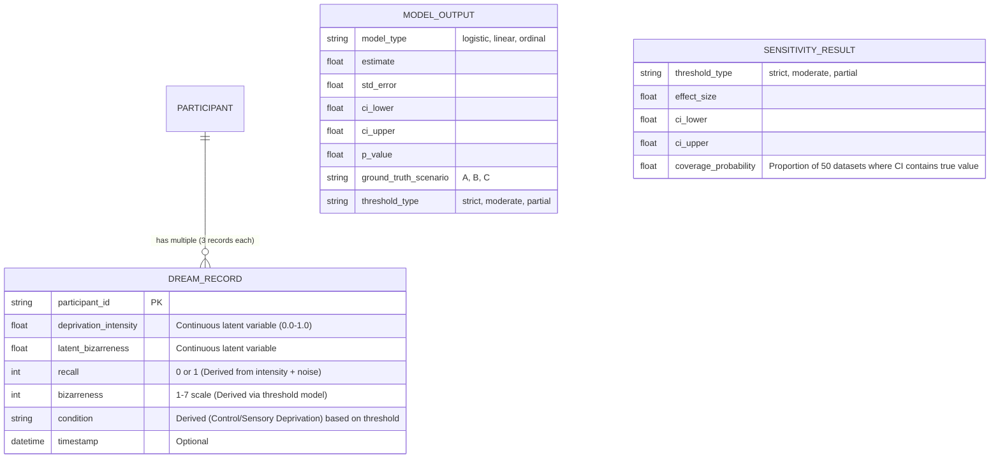

# Data Model: The Effect of Sensory Deprivation on Dream Recall and Bizarreness

## 1. Entity-Relationship Overview

## 2. Data Dictionary

### 2.1 Input Data (CSV/Parquet - Synthetic Raw)

*Note: This file contains ONLY latent variables. The `condition` column is NOT stored; it is derived at runtime.*

| Column | Type | Description | Constraints |
|--------|------|-------------|-------------|
| `participant_id` | string | Unique identifier for each participant. | Non-null, unique per participant. |
| `deprivation_intensity` | float | Continuous measure of sensory deprivation (0.0-1.0). | Non-null, 0.0-1.0. |
| `latent_bizarreness` | float | Continuous latent variable for bizarreness. | Non-null. |
| `recall` | int | Binary dream recall: 0 (No), 1 (Yes). | Non-null, 0 or 1. |
| `bizarreness` | int | Subjective bizarreness score: 1 (least) to 7 (most). | Non-null, 1-7. |
| `ground_truth_scenario` | string | Ground truth scenario for synthetic data (A, B, C). | Non-null, enum [A, B, C]. |
| `true_icc` | float | The true intra-class correlation used in generation (metadata). | Non-null. |

**Derived Column (Runtime Only)**:
- `condition`: Binary (0=Control, 1=Sensory Deprivation). Calculated by applying a threshold (e.g., `deprivation_intensity > 0.5`) to the `deprivation_intensity` column. This column is **not** stored in the raw CSV to allow dynamic thresholding.

### 2.2 Processed Data (CSV - Derived)

*Output of `ingest.py`. Contains the derived `condition` column for analysis.*

| Column | Type | Description | Constraints |
|--------|------|-------------|-------------|
| `participant_id` | string | Unique identifier. | Non-null. |
| `deprivation_intensity` | float | Continuous measure. | Non-null. |
| `latent_bizarreness` | float | Continuous latent variable. | Non-null. |
| `recall` | int | Binary recall. | Non-null. |
| `bizarreness` | int | Ordinal score. | Non-null. |
| `condition` | int | Binary condition (0/1). | Non-null, derived from intensity. |
| `threshold_applied` | float | The threshold value used (e.g., 0.5). | Non-null. |

### 2.3 Output Data (JSON/CSV)

#### Model Results
| Field | Type | Description |
|-------|------|-------------|
| `model_type` | string | "logistic", "linear", "ordinal". |
| `fixed_effect` | float | Estimated coefficient (log-odds or beta). |
| `odds_ratio` | float | Exponentiated coefficient (for logistic). |
| `std_error` | float | Standard error of the estimate. |
| `ci_lower` | float | Lower bound of 95% CI. |
| `ci_upper` | float | Upper bound of 95% CI. |
| `p_value` | float | Two-tailed p-value. |
| `ground_truth_scenario` | string | "A", "B", or "C" (for synthetic data). |
| `threshold_type` | string | "strict", "moderate", "partial". |

#### Sensitivity Analysis Results
| Field | Type | Description |
|-------|------|-------------|
| `threshold_type` | string | "strict", "moderate", "partial". |
| `effect_size` | float | Estimated effect (OR or β) for this threshold. |
| `ci_lower` | float | Lower bound of 95% CI. |
| `ci_upper` | float | Upper bound of 95% CI. |
| `coverage_probability` | float | Proportion of 50 datasets where CI contains true value. |

## 3. Data Flow

1.  **Ingestion**: `generate_data.py` reads `data/protocols/protocol.yaml` → `data/synthetic/latent_data.csv` (contains only latent variables + `true_icc`).
2.  **Processing**: `ingest.py` loads latent data → derives `condition` based on user-specified threshold → outputs `data/processed/scenario_A_threshold_X.csv` (validated against `processed-data.schema.yaml`).
3.  **Modeling**: Clean data → `code/models.py` → `results/models/`.
4.  **Sensitivity**: `sensitivity.py` generates 50 internal datasets → applies threshold per dataset → fits models → calculates coverage → `results/sensitivity/`.
5.  **Reporting**: Aggregated results → `results/reports/`.

## 4. Constraints & Validation Rules

-   **Recall**: Must be 0 or 1.
-   **Bizarreness**: Must be integer 1-7.
-   **Deprivation Intensity**: Must be float 0.0-1.0.
-   **Participant ID**: Must be unique per participant (no duplicates in random intercepts).
-   **Condition**: **NOT STORED** in raw data. Must be derived dynamically from `deprivation_intensity` using a threshold.
-   **Synthetic Data**: Must include `ground_truth_scenario` and `true_icc` metadata columns for validation.
-   **Records per Participant**: Exactly 3 records per participant in the generated dataset.