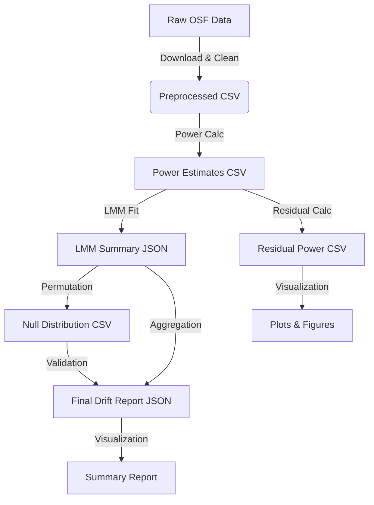

# Data Model: Detecting Statistical Power Drift in Replicated Studies

## 1. Entity Definitions

### ReplicationStudy
Represents a single replication event from the source dataset.
- `study_id`: Unique identifier (string)
- `year`: Calendar year of publication (integer)
- `field`: Discipline field (string, e.g., "Psychology", "Economics")
- `original_study_id`: ID of the original study being replicated (string)
- `effect_size`: Reported effect size (float, Cohen's *d* or log-odds)
- `sample_size`: Total sample size (integer)
- `power_estimate`: Calculated post-hoc power (float, 0.0 to 1.0)
- `missing_flag`: Boolean indicating if data was incomplete for calculation

### DriftModelOutput
Aggregated results from the trend analysis.
- `slope_year`: The estimated drift coefficient (float) - **Primary Metric**
- `se_slope`: Standard error of the slope (float)
- `p_value_parametric`: P-value from the parametric Likelihood-Ratio Test (float)
- `p_value_permutation`: Empirical p-value from permutation test (float)
- `random_effects_variance`: Variance of the random intercepts (float)
- `model_converged`: Boolean indicating if the LMM converged successfully (bool)

### SensitivityResult
Results from the alpha threshold sweep.
- `alpha_value`: The threshold used (float)
- `drift_significant`: Boolean indicating significance at this threshold (bool)
- `false_positive_rate`: Estimated FPR at this threshold (float)

### ResidualPower
Per-study residuals from the LMM.
- `study_id`: Unique identifier (string)
- `year`: Calendar year (integer)
- `residual_power`: Observed power minus predicted power from the model without `year` (float)

## 2. Data Flow Diagram

## 3. Processing Logic

1.  **Ingestion**: Load raw data from HuggingFace. Filter rows with missing `year`, `effect_size`, or `sample_size`. Log warnings for dropped rows.
2.  **Power Calculation**: Apply the non-central t-distribution formula to every valid row. Store in `data/derived/power_estimates.csv`.
3.  **Trend Modeling**:
    - Fit LMM: `power_est ~ year + effect_size + sample_size + (1|field)`.
    - Extract `year` coefficient ($\beta_1$) and perform LRT.
4.  **Residual Calculation**: Calculate residuals from the LMM (observed - predicted) for visualization.
5. **Permutation**: Shuffle `year` labels (or permute residuals) [deferred] times, re-fit the model (or re-calculate slope) for each shuffle, and build a null distribution.
6.  **Aggregation**: If multiple fields exist, apply DerSimonian-Laird weighting to combine field-specific `year` slopes.
7.  **Output**: Generate final JSON report and visualization artifacts.

## 4. Error Handling

-   **Missing Data**: Rows with missing critical fields are excluded. A summary count is written to the log.
-   **Zero Variance**: If a field has only one study, the random effect is collapsed to a fixed effect or the field is excluded from the mixed model.
-   **Outliers**: Effect sizes with infinite variance or sample sizes < 2 are capped or filtered.
-   **Permutation Timeout**: If the permutation loop exceeds a time threshold, it terminates early, flags the result as "approximate", and uses the available iterations.
-   **Convergence Failure**: If the LMM fails to converge, the model will be re-fitted with simplified random effects (e.g., removing `original_study_id` if present) or excluded.