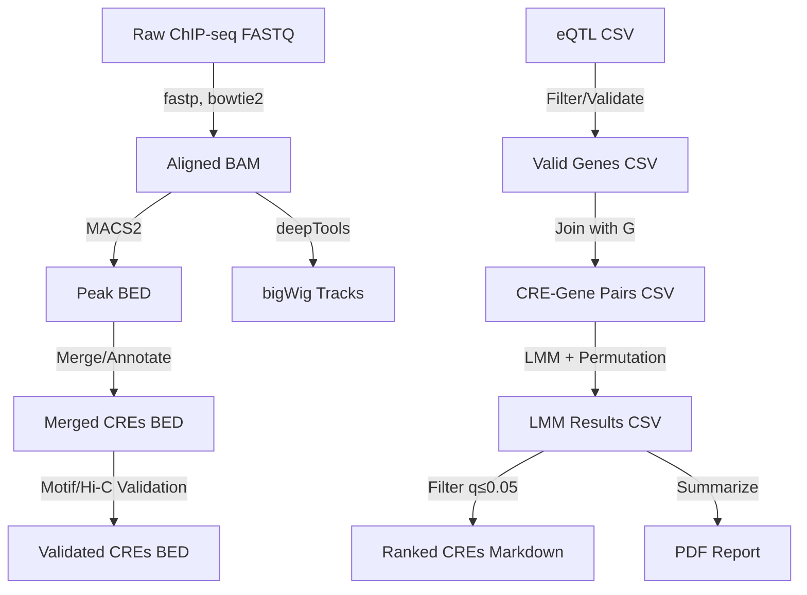

# Data Model: Decoding Regulatory Element Contributions to Phenotypic Plasticity in Yeast

## 1. Overview

This document defines the data structures, schemas, and relationships used in the pipeline. All data flows from raw inputs (ChIP-seq FASTQ, eQTL CSV) through intermediate processed files (BAM, BED, peak lists) to final outputs (ranked CRE tables, bigWig tracks, PDF reports).

## 2. Entity Definitions

### 2.1 CRE (cis-regulatory element)

A genomic interval derived from merged MACS2 peaks.

| Attribute | Type | Description | Source |
|-----------|------|-------------|--------|
| `cre_id` | String | Unique identifier (e.g., `CRE_chr1_12345_12500`) | Generated |
| `chrom` | String | Chromosome (e.g., `chrI`) | MACS2 |
| `start` | Integer | Genomic start coordinate (0-based) | MACS2 |
| `end` | Integer | Genomic end coordinate (0-based) | MACS2 |
| `tf_binding` | List[String] | Associated TFs (e.g., `["Hsf1", "Msn2"]`) | MACS2 merge |
| `context` | String | `promoter` (≤500 bp upstream) or `distal` (>500 bp) | Annotation |
| `gene_id` | String | Associated gene ORF | Nearest gene / Hi-C |
| `log2fc` | Float | Stress-specific expression fold-change | eQTL |
| `peak_signal` | Float | Normalized RPKM per condition | deepTools |
| `motif_score` | Float | PWM p-value or log-transformed score | Motif Scan |
| `beta1` | Float | Fixed effect estimate from GLS | R `nlme` |
| `p_value` | Float | Raw p-value from LRT | R `nlme` |
| `q_value` | Float | Benjamini-Hochberg adjusted p-value | R `nlme` |
| `validation_score` | Float | Motif p-value or Hi-C contact frequency | FR-014 |
| `is_collinear` | Boolean | True if VIF > 5 | FR-012 |
| `is_significant` | Boolean | True if q-value ≤ 0.05 | FR-007 |
| `weight` | Float | Observation weight = log(motif_score + 1) | FR-015 |

### 2.2 Gene

Yeast ORF with stress-specific expression data.

| Attribute | Type | Description | Source |
|-----------|------|-------------|--------|
| `gene_id` | String | ORF identifier (e.g., `YAL001C`) | eQTL |
| `nearest_cre` | String | ID of nearest CRE (≤10 kb) | Annotation |
| `fold_change_heat` | Float | Heat-shock fold-change | eQTL |
| `fold_change_osmotic` | Float | Osmotic stress fold-change | eQTL |
| `fold_change_oxidative` | Float | Oxidative stress fold-change | eQTL |
| `global_expr` | Float | Genome-wide mean expression (covariate) | eQTL aggregate |

### 2.3 TF-Binding Event

Individual TF binding at a CRE.

| Attribute | Type | Description | Source |
|-----------|------|-------------|--------|
| `tf_id` | String | TF name (e.g., `Hsf1`) | MACS2 |
| `cre_id` | String | Associated CRE ID | MACS2 merge |
| `peak_signal` | Float | Normalized RPKM | deepTools |
| `vif` | Float | Variance inflation factor | FR-012 |

## 3. Data Flow

## 4. File Formats

### 4.1 Input Files

- **FASTQ**: Raw ChIP-seq reads (Illumina format).
- **CSV/TSV**: eQTL summary statistics (gene_id, fold_change_*, effect_size_*).
- **BED**: Peak coordinates (chrom, start, end, name, score, strand).

### 4.2 Intermediate Files

- **BAM**: Aligned reads (sorted, indexed).
- **BED**: Merged peaks, annotated CREs.
- **CSV**: CRE-Gene pairs, LMM results.

### 4.3 Output Files

- **Markdown**: Ranked CRE tables (`results/CRE_ranked_<stress>.md`).
- **PDF**: Statistical summary (`results/Statistical_summary.pdf`).
- **bigWig**: Coverage tracks (`tracks/<stress>_CRE_signal.bw`).
- **TSV**: GO enrichment results (`results/GO_enrichment_results.tsv`).

## 5. Validation Rules

- **FR-001**: MD5 checksums verified for all raw FASTQ files.
- **FR-011**: eQTL data must contain stress-specific fold-changes; fatal error if missing for entire cohort.
- **FR-012**: VIF > 5 triggers "collinear" flag; excluded from independent testing.
- **FR-014**: Distal CREs require motif p-value < 1e-4 or Hi-C reads > 100; excluded if neither.
- **FR-007**: q-value ≤ 0.05 for significance; all results reported with FDR correction.
- **FR-015**: Motif scores are applied as weights during model fitting; CREs are defined by MACS2 peaks independently.
