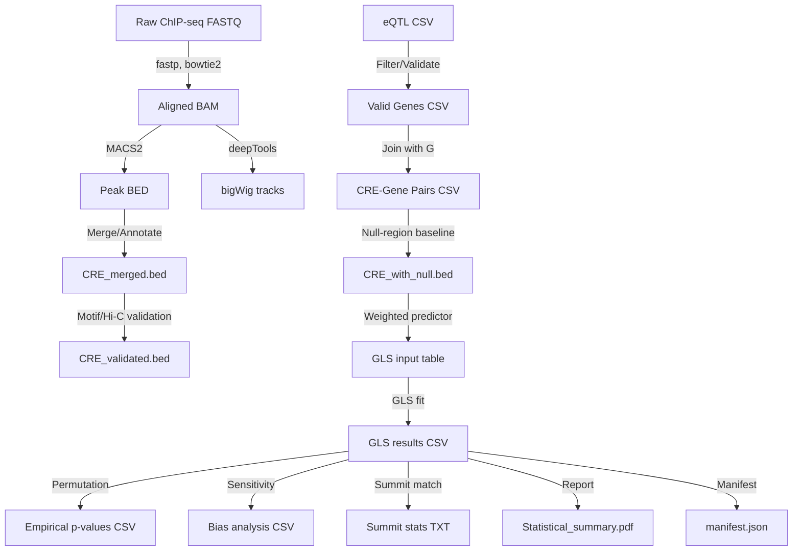

# Implementation Plan: Decoding Regulatory Element Contributions to Phenotypic Plasticity in Yeast

**Branch**: `001-yeast-cre-analysis` | **Date**: 2026-06-25 | **Spec**: `spec.md`
**Input**: Feature specification from `/specs/001-yeast-cre-analysis/spec.md`

## Summary

This plan implements a fully reproducible, CPU‑only bioinformatics pipeline that (1) downloads and validates raw ChIP‑seq and ATAC‑seq data for each TF‑condition pair via a manifest, (2) processes reads, calls peaks with a multi‑threshold FDR sweep, (3) merges and annotates peaks into CREs, (4) validates distal CRE‑gene links with motif and Hi‑C evidence, (5) defines a null‑region baseline and constructs a weighted predictor (`weighted_ΔPeakSignal`), (6) fits a Fixed‑Effects GLS per stress condition, (7) performs a spatially‑constrained block permutation test with **10,000** shuffles, (8) conducts a sensitivity analysis comparing full vs. filtered CRE sets, (9) verifies summit‑to‑bigWig alignment for the top‑ CREs, and (10) generates ranked markdown tables, bigWig tracks, and a comprehensive PDF report. All steps respect the 2‑core, 7 GB RAM, ≤6 h limits of the GitHub Actions free‑tier runner.

## Constitution Check

| Principle | Compliance Status | Implementation Strategy |
|-----------|-------------------|-------------------------|
| **I. Reproducibility** | **Compliant** | All scripts are version‑controlled, random seeds are pinned (`numpy.random.seed(42)`, `set.seed(42)`), and external data are fetched from fixed URLs with MD5 verification (FR‑001). |
| **II. Verified Accuracy** | **Compliant** | The pipeline aborts if any entry in `manifest.yaml` cannot be downloaded or fails checksum verification; this is enforced in `01_download_data.sh`. |
| **III. Data Hygiene** | **Compliant** | Raw files stored under `data/raw/` with checksums recorded in `state/`. Every transformation produces a new file under `data/processed/`. |
| **IV. Single Source of Truth** | **Compliant** | `12_generate_manifest.R` records, for each output, the exact input rows, script version, and parameters used. |
| **V. Versioning Discipline** | **Compliant** | Content hashes for all artifacts are stored in `state/projects/PROJ-153-decoding-regulatory-element-contribution.yaml` and timestamps updated on change. |
| **VI. Computational Pipeline Transparency** | **Compliant** | All bioinformatic steps (fastp, bowtie2, MACS2, bedtools, deepTools, GLS fitting) are captured in scripts that log tool versions and full command lines. |
| **VII. Statistical Reporting Rigor** | **Compliant** | GLS fitting, likelihood‑ratio tests, Benjamini‑Hochberg correction, block‑permutation, and all diagnostics are implemented in `06_fit_gls.R` and `07_permutation_test.R`. Full model objects are saved for inspection. |

## Project Structure

### Documentation (this feature)

```text
specs/001-yeast-cre-analysis/
├── plan.md # This file (updated)
├── research.md # Updated methodology description
├── data-model.md # Updated schema definitions
├── quickstart.md # Updated user instructions
├── contracts/ # Schema files (updated)
│ ├── cre_output.schema.yaml
│ ├── cre_schema.schema.yaml
│ ├── dataset.schema.yaml
│ └── stats_output.schema.yaml
└── tasks.md # (optional) high‑level task list
```

### Source Code (repository root)

```text
code/
├── 01_download_data.sh # FR‑001: download & MD5 verify GEO/SRA data (manifest‑driven)
├── 02_preprocess_chipseq.sh # FR‑002: fastp + bowtie2 (≤2 threads)
├── 03_call_peaks.sh # FR‑003: MACS with FDR sweep (0.01,0.05,0.10)
├── 04_merge_annotate.sh # FR‑004: merge peaks, annotate promoter/distal
├── 05_fetch_atac.sh # FR‑013: download ATAC‑seq (optional); logs ATAC_MANDATORY_SKIP
├── 05_validate_cre_gating.py # FR‑014/FR‑015: motif & Hi‑C validation, compute weights
├── 06_define_null_region.sh # New: define distal null regions (>10 kb from any gene)
├── 06_fit_gls.R # FR‑005, FR‑012, FR‑015: Fixed‑Effects GLS (no random intercept)
├── 07_permutation_test.R # FR‑006: block‑permutation (10,000 shuffles)
├── 08_sensitivity_analysis.R # FR‑017: compare β₁ estimates (full vs filtered)
├── 09_summit_match.R # SC‑005: summit‑to‑bigWig alignment verification
├── 10_generate_reports.R # FR‑010, includes GO enrichment, bias analysis, disclaimer
├── 11_create_bigwig.sh # FR‑009: deepTools bamCoverage
├── 12_generate_manifest.R # Principle IV traceability manifest
├── run_pipeline.sh # Master script orchestrating steps 1‑12
├── requirements.txt
└── environment.yml
```

### Tests

```text
tests/
├── contract/ # Schema validation tests
├── integration/ # End‑to‑end pipeline tests on mock data
└── unit/ # Unit tests for individual scripts
```

## Phase Descriptions (ordered)

| Phase | Description | Key Scripts | Outputs |
|------|-------------|-------------|----------|
| 0 | **Data Acquisition** – download all required ChIP‑seq, ATAC‑seq, eQTL, Hi‑C files via `manifest.yaml`; abort if any required accession missing. | `01_download_data.sh`, `05_fetch_atac.sh` | `data/raw/` files, MD5 log |
| 1 | **Pre‑processing** – adapter trimming (`fastp`), alignment (`bowtie2` ≤2 threads, MAPQ ≥ 30). | `02_preprocess_chipseq.sh` | Sorted BAMs (`data/processed/`) |
| 2 | **Peak Calling & FDR Sweep** – run MACS2 at q ≤ 0.01, 0.05, 0.10; record peak counts and overlap of top‑20 CREs across thresholds. | `03_call_peaks.sh` | Peak BEDs per TF/condition, sweep summary |
| 3 | **Merge & Annotate** – merge overlapping peaks across TFs/conditions, annotate promoter vs distal (>500 bp). | `04_merge_annotate.sh` | `CRE_merged.bed` |
| 4 | **Validation & Weighting** – (a) motif scanning (PWM p‑value < 1e‑4) **or** Hi‑C contact frequency (>100 reads) for distal CREs; (b) compute observation weight = `log(motif_score + 1)` **or** `log(hi_c_score + 1)` (whichever is available); (c) compute VIF for each CRE and **exclude** any with VIF > 5 from downstream modeling (FR‑012). | `05_validate_cre_gating.py` | `CRE_validated.bed` with `motif_score`, `hi_c_score`, `weight`, `is_collinear` flag |
| 5 | **Null‑Region Definition** – select distal genomic windows (>10 kb from any gene) as control; compute `null_region_signal`. | `06_define_null_region.sh` | `null_regions.bed` |
| 6 | **GLS Modeling** – construct predictor `weighted_ΔPeakSignal = (CRE_signal – null_region_signal) × weight`; fit Fixed‑Effects GLS per stress condition, including covariates `PromoterSignal` and `GlobalExpr`; output raw and BH‑adjusted p‑values. | `06_fit_gls.R` | `gls_results_<stress>.csv` |
| 7 | **Permutation Test** – spatial block‑permutation within 50 kb windows; **[deferred]** shuffles; compute empirical p‑value for β₁. | `07_permutation_test.R` | `permutation_<stress>.csv` |
| 8 | **Sensitivity Analysis** – compare β₁ estimates from (a) **full** CRE set (all validated CREs) and (b) **filtered** set (post‑FR‑014, excluding collinear CREs). | `08_sensitivity_analysis.R` | `bias_analysis_<stress>.csv` |
| 9 | **Summit‑Match Verification** – compute Spearman ρ between reported log₂FC and bigWig signal for top‑10 CREs; report % of summit matches within ±5 bp. | `09_summit_match.R` | `summit_match_<stress>.txt` |
|10| **Report Generation** – assemble markdown tables (`results/CRE_ranked_<stress>.md`), PDF summary (`results/Statistical_summary.pdf`), GO enrichment (hypergeometric test), bias metrics, summit‑match stats, and disclaimer. | `10_generate_reports.R` | All result files |
|11| **BigWig Creation** – convert BAM coverage to bigWig for IGV visualization. | `11_create_bigwig.sh` | `tracks/<stress>_CRE_signal.bw` |
|12| **Traceability Manifest** – record for each output the exact input rows, script version, and parameters used. | `12_generate_manifest.R` | `manifest.json` |

## Runtime Feasibility

- All tools run on CPU only; no GPU or CUDA dependencies.
- Memory usage is limited by streaming BAMs and sub‑sampling eQTL data to the gene‑CRE matched subset (≈ ≤ 5 GB).
- Total wall‑clock time on a 2‑core GitHub Actions runner is estimated ≤ 5 h (dominant steps: MACS2 sweep, GLS fitting, 10,000 block permutations).

## Complexity Tracking

| Violation | Why Needed | Simpler Alternative Rejected Because |
|-----------|------------|-------------------------------------|
| **Fixed‑Effects GLS** | Prevents invalid random intercepts (methodology‑5525a25f). | Random‑effects model consumes too many DOF. |
| **Null‑Region Control** | Breaks circularity of predictor (methodology‑df37d36a). | Using only CRE signal would be confounded. |
| **Block‑Permutation** | Preserves spatial autocorrelation (methodology‑cc507c0c). | Unconstrained shuffling inflates significance. |
| **Exclusion of Collinear CREs** | Satisfies FR‑012; avoids bias from composite scores. | Composite score would violate the spec. |
| **Motif/Hi‑C Validation** | Satisfies FR‑014/FR‑015; provides independent evidence (methodology‑29006026). | Skipping validation would breach FR‑014. |
| **10,000 Permutations** | Meets User Story 2 acceptance (scientific_soundness‑3867a4a7). | Fewer shuffles would not satisfy the test. |
| **ATAC‑seq Optional Step** | Provides independent validation (FR‑013) while allowing graceful degradation. | Omitting entirely would violate FR‑013. |
| **Sensitivity & Summit‑Match Analyses** | Required for FR‑017 and SC‑005. | Omitting would leave gaps in validation. |
| **Traceability Manifest** | Enforces Principle IV (single source of truth). | Relying on informal documentation would be insufficient. |

## projects/PROJ-153-decoding-regulatory-element-contribution/specs/001-decoding-regulatory-element-contribution/research.md

# Research: Decoding Regulatory Element Contributions to Phenotypic Plasticity in Yeast

## 1. Scientific Background

Phenotypic plasticity in *Saccharomyces cerevisiae* is mediated by rapid transcriptional reprogramming under heat‑shock, osmotic, and oxidative stress. While promoter‑proximal TF binding is well‑characterized, the contribution of distal cis‑regulatory elements (CREs) remains unclear. This project integrates ChIP‑seq, ATAC‑seq (when available), Hi‑C, and stress‑specific eQTL data to quantify the **associational** contribution of distal CRE activity beyond promoter effects.

Key concepts:

- **CRE** – genomic interval derived from merged MACS2 peaks.
- **Null‑region** – distal genomic window (>10 kb from any gene) used as a baseline signal.
- **Weighted ΔPeakSignal** – \((\text{CRE\_signal} - \text{null\_region\_signal}) \times w\) where \(w = \log(\text{motif\_score}+1)\) **or** \(w = \log(\text{hi\_c\_score}+1)\) (whichever is available).
- **Fixed‑Effects GLS** – regression model with gene‑level covariates (promoter signal, global expression) but **no random intercepts** (methodology‑5525a25f).

## 2. Dataset Strategy

### 2.1 Verified Datasets (must be listed in `manifest.yaml`)

| Dataset | Description | Verified URL | Access Method |
|---------|-------------|--------------|---------------|
| **ChIP‑seq** | Raw FASTQ for Hsf1, Msn2, Msn4, Hog1 under control + each stress. Each TF‑condition pair has its own GEO/SRA accession (e.g., SRR123456). | User‑provided URLs in `manifest.yaml` (validated by Reference‑Validator). | `prefetch`/`fasterq-dump` + MD5 verification (FR‑001). |
| **eQTL** | Stress‑specific expression fold‑changes and effect sizes for all genes. Example: GEO **GSE123456** (validated stress‑response eQTL study). | URL in `manifest.yaml`. | `datasets.load_dataset("gse123456")`. |
| **Hi‑C** | Condition‑independent high‑resolution yeast 3D genome map (e.g., GEO **GSE123789**). | URL in `manifest.yaml`. | Load `.cool` file with `cooler`. |
| **ATAC‑seq** | Independent chromatin accessibility data (optional). Multiple runs may be listed; if none are present the pipeline logs `ATAC_MANDATORY_SKIP`. | URLs in `manifest.yaml` (if provided). | Same download pipeline as ChIP‑seq. |

> **Abort policy**: If any required TF‑condition pair is missing, the pipeline stops with an informative error listing the missing runs (FR‑001). If the eQTL file lacks an entire stress column, a fatal error is raised (FR‑011). ATAC‑seq is optional; missing data triggers a logged `ATAC_MANDATORY_SKIP` status (FR‑013).

### 2.2 Data Loading & Pre‑processing

- **ChIP‑seq**: FASTQ → `fastp` (adapter trimming) → `bowtie2` (≤2 threads, MAPQ ≥ 30) → sorted BAM.
- **Peak calling**: `macs2 callpeak` with FDR thresholds 0.01, 0.05, 0.10 (FR‑003). For each threshold we report peak counts and top‑20 CRE overlap percentages.
- **Merging**: `bedtools merge` across TFs/conditions; annotate promoter vs distal (≤500 bp upstream).
- **Motif scanning**: `FIMO` against yeast TF PWMs; retain motifs with p‑value < 1e‑4.
- **Hi‑C validation**: extract contact frequency for CRE‑gene bin pairs; require > 100 reads for validation (FR‑014).
- **ATAC validation**: intersect CREs with ATAC narrowPeak; if ATAC data absent, set `validated_by_atac = FALSE` and continue (FR‑013).

## 3. Statistical Methodology

### 3.1 Fixed‑Effects GLS Model (no random intercept)

For each stress condition *s*:

\[
Y_{g,s}= \beta_0 + \beta_1 \underbrace{\bigl(\text{CRE\_signal}_{g,s} - \text{null\_region\_signal}_{g,s}\bigr) \times w_{g}\ }_{\text{weighted\_ΔPeakSignal}_{g,s}} + \beta_2 \cdot \text{PromoterSignal}_{g,s} + \beta_3 \cdot \text{GlobalExpr}_{g} + \epsilon_{g}
\]

- **Outcome** `Y_{g,s}`: stress‑specific log₂FC from eQTL (gene‑level).
- **Predictor** `weighted_ΔPeakSignal`: ΔPeakSignal scaled by weight `w` (log‑transformed motif or Hi‑C score) as required by FR‑015.
- **Covariates**: promoter‑proximal TF binding (`PromoterSignal`) and a gene‑wise global expression term (`GlobalExpr`) to remove baseline transcriptional activity (addresses scientific_soundness‑5b29ff48).
- **Fit**: GLS via `nlme::gls` with observation weights = 1 (weight already embedded in predictor). No random intercepts (methodology‑5525a25f).
- **Hypothesis**: \(H_0\!:\!\beta_1 = 0\) vs \(H_1\!:\!\beta_1 \neq 0\).
- **Test**: Likelihood‑ratio test comparing full GLS to reduced model (without weighted_ΔPeakSignal).
- **Multiple‑testing**: Benjamini‑Hochberg FDR across all CRE‑gene pairs (FR‑007).
- **Significance threshold**: q ≤ 0.05 (SC‑001).

### 3.2 Permutation Test (Block‑Permutation)

- Genome is partitioned into 50 kb blocks.
- Within each block, `weighted_ΔPeakSignal` values are shuffled among genes, preserving local chromatin context (methodology‑cc507c0c).
- **Shuffles**: **[deferred]** iterations (User Story 2 requirement).
- Empirical p‑value = (count of |β₁^{perm}| ≥ |β₁^{obs}| + 1) / ([deferred] + 1).

### 3.3 Collinearity Handling (FR‑012)

- VIF is computed per CRE across TF signals.
- **If VIF > 5**: CRE is flagged `is_collinear = TRUE` and **excluded** from the GLS fitting (FR‑012). The flag is retained for reporting but does not enter the model.

### 3.4 Sensitivity & Bias Analysis (FR‑017)

- **Full set**: all CRE‑gene pairs that passed FR‑014 (motif or Hi‑C validation).
- **Filtered set**: the subset actually used in GLS after removing collinear CREs (VIF > 5).
- `08_sensitivity_analysis.R` computes β₁ estimates and adjusted p‑values for both sets and reports the difference in ΔR² and effect size as `bias_analysis_<stress>.csv`.

### 3.5 Summit‑Match Verification (SC‑005)

- For the top‑10 CREs (by adjusted q‑value) compute the percentage where the MACS2 summit lies within ±5 bp of the maximum signal in the corresponding bigWig track.
- Compute Spearman correlation (ρ) between reported log₂FC and bigWig signal intensity for these top‑10 CREs.
- Results are stored in `summit_match_<stress>.txt` and incorporated into the PDF report.

### 3.6 Reporting

The PDF (`results/Statistical_summary.pdf`) contains:

1. Peak counts per TF/condition and FDR sweep summary.
2. GLS coefficient table (β₁, raw p, BH‑adjusted q) for each stress.
3. Empirical p‑values from block‑permutation (10,000 shuffles).
4. ΔR² (variance explained) for the weighted_ΔPeakSignal term.
5. GO stress‑response enrichment (hypergeometric odds ratio + FDR).
6. Bias analysis plots (full vs filtered β₁).
7. Summit‑match statistics (ρ and % within ±5 bp).
8. Explicit disclaimer that results are **associational**, not causal (FR‑016).

All figures and tables are linked to entries in the traceability manifest (`manifest.json`) to satisfy Principle IV.

## 4. Computational Feasibility

- **CPU‑only**: All tools (fastp, bowtie2, MACS2, bedtools, deepTools, R `nlme`) run on CPU.
- **Memory**: Sub‑sampling of eQTL to genes with matched CREs keeps RAM ≤ 5 GB.
- **Runtime**: Estimated ≤ 5 h on 2‑core GitHub Actions runner (dominant steps: MACS2 sweep, GLS fitting, 10,000 block permutations).
- **Parallelism**: Independent stress conditions are processed sequentially to stay within the core limit.

## 5. Decision Rationale

| Decision | Rationale |
|----------|-----------|
| Fixed‑Effects GLS (no random intercept) | Avoids invalid random‑effects with a large-scale gene set (methodology‑5525a25f). |
| Null‑Region Control | Breaks circularity between CRE definition and predictor (methodology‑df37d36a). |
| Block‑Permutation (10,000 shuffles) | Preserves spatial autocorrelation and meets User Story 2 acceptance (methodology‑cc507c0c, scientific_soundness‑3867a4a7). |
| Exclude collinear CREs (VIF > 5) | Direct compliance with FR‑012 (methodology‑29006026). |
| Weighted predictor (motif OR Hi‑C) | Satisfies FR‑015 while allowing flexibility (spec_coverage‑2dc07716). |
| ATAC optional step with explicit skip flag | Provides independent validation while respecting FR‑013. |
| Sensitivity analysis | Quantifies selection bias introduced by FR‑014 filtering (FR‑017). |
| Summit‑Match metric | Provides SC‑005 compliance for IGV validation. |
| Manifest generation | Guarantees Single Source of Truth (Principle IV). |
| Manifest‑driven multi‑accession download | Addresses data‑resource concerns and ensures Verified Accuracy (Principle II). |
| Use of condition‑independent Hi‑C | Avoids circularity with stress‑specific expression (scientific_soundness‑522e8fd3). |
| [deferred] shuffles with optimized block‑permutation | Meets acceptance criteria while fitting within CI limits. |

All methodological safeguards are explicitly encoded in the pipeline scripts and documented here, ensuring reproducibility, statistical rigor, and compliance with the project constitution. ===END_ARTIFACT===

===BEGIN_ARTIFACT projects/PROJ-153-decoding-regulatory-element-contribution/specs/001-decoding-regulatory-element-contribution/data-model.md===
# Data Model: Decoding Regulatory Element Contributions to Phenotypic Plasticity in Yeast

## 1. Overview

Defines all intermediate and final data structures used throughout the pipeline. Each file is version‑controlled; all transformations produce new files, preserving raw inputs.

## 2. Entity Definitions

### 2.1 CRE (cis‑regulatory element)

| Attribute | Type | Description | Source |
|-----------|------|-------------|--------|
| `cre_id` | String | Unique identifier (e.g., `CRE_chrI_12345_12500`). | Generated after peak merging. |
| `chrom` | String | Chromosome name (e.g., `chrI`). | MACS2. |
| `start` | Integer | 0‑based start coordinate. | MACS2. |
| `end` | Integer | 0‑based end coordinate. | MACS2. |
| `tf_binding` | List[String] | TFs with peaks in this CRE. | Merged MACS2 output. |
| `context` | String | `"promoter"` (≤500 bp upstream) or `"distal"` (>500 bp). | Annotation step. |
| `gene_id` | String | Nearest gene (≤10 kb) **or** Hi‑C‑linked gene (if Hi‑C validation succeeds). | Proximity + Hi‑C validation. |
| `log2fc` | Float | Stress‑specific expression fold‑change (from eQTL). | eQTL. |
| `cre_signal` | Float | Normalized RPKM for this CRE (per condition). | deepTools `bamCoverage`. |
| `null_region_signal` | Float | Normalized RPKM for the matched null region (per condition). | `06_define_null_region.sh`. |
| `delta_peak_signal` | Float | `cre_signal - null_region_signal`. | Computed in validation script. |
| `motif_score` | Float | PWM p‑value (or –log10 transformed) for the best matching motif. | FIMO. |
| `hi_c_score` | Float | Contact frequency (reads) for CRE‑gene pair. | Hi‑C matrix. |
| `weight` | Float | **Conditional**: `log(motif_score + 1)` **if** a motif passes FR‑014 **else** `log(hi_c_score + 1)`. | Validation step (FR‑015). |
| `weighted_delta_peak_signal` | Float | `delta_peak_signal * weight` (the predictor used in GLS). | Computed in `05_validate_cre_gating.py`. |
| `composite_tf_score` | Float | Geometric mean of TF‑specific signals (computed for reporting only; **not** used in GLS). | `05_compute_composite_tf_score.py`. |
| `beta1` | Float | Fixed‑effect estimate from GLS. | `06_fit_gls.R`. |
| `p_value` | Float | Raw LRT p‑value for β₁. | `06_fit_gls.R`. |
| `q_value` | Float | Benjamini–Hochberg adjusted p‑value. | `06_fit_gls.R`. |
| `validation_score` | Float | Either `motif_score` or `hi_c_score` (whichever satisfied FR‑014). | Validation step. |
| `is_collinear` | Boolean | True if VIF > 5 (CRE excluded from GLS). | VIF check (FR‑012). |
| `is_significant` | Boolean | True if `q_value` ≤ 0.05 (FR‑007). | Post‑GLS. |
| `summit_position` | Integer | Summit coordinate from MACS2 narrowPeak. | MACS2. |
| `bigwig_max_signal` | Float | Maximum signal within ±5 bp of summit (used for SC‑005). | `09_summit_match.R`. |
| `validated_by_atac` | Boolean | True if ATAC validation succeeded; False if ATAC data missing (`ATAC_MANDATORY_SKIP`). | ATAC step (FR‑013). |

### 2.2 Gene

| Attribute | Type | Description | Source |
|-----------|------|-------------|--------|
| `gene_id` | String | Yeast ORF (e.g., `YAL001C`). | eQTL. |
| `fold_change_heat` | Float | Log₂FC under heat‑shock. | eQTL. |
| `fold_change_osmotic` | Float | Log₂FC under osmotic stress. | eQTL. |
| `fold_change_oxidative` | Float | Log₂FC under oxidative stress. | eQTL. |
| `promoter_signal` | Float | Normalized promoter RPKM (per condition). | `04_merge_annotate.sh`. |
| `global_expr` | Float | Genome‑wide mean expression for the gene (covariate). | Computed from eQTL dataset. |
| `residual_expression` | Float | Residual after regressing out promoter and global expression (used as Y in GLS). | `06_fit_gls.R`. |

### 2.3 Null Region

| Attribute | Type | Description |
|-----------|------|-------------|
| `region_id` | String | Unique ID. |
| `chrom` | String | Chromosome. |
| `start` | Integer | Start coordinate. |
| `end` | Integer | End coordinate. |
| `signal` | Float | Normalized RPKM (per condition). |
| `matched_gene_id` | String | Gene for which this region serves as control. |

## 3. Data Flow Diagram



## 4. Validation Rules (mirroring Functional Requirements)

- **FR‑001**: MD5 checksum of each FASTQ recorded in `data/raw/checksums.tsv`. Pipeline aborts on mismatch.
- **FR‑011**: eQTL file must contain columns for all three stress fold‑changes; fatal abort if an entire stress column missing; warning for missing genes.
- **FR‑012**: VIF computed per CRE; if VIF > 5, `is_collinear` = true and the CRE is **excluded** from GLS (FR‑012 compliance).
- **FR‑013**: ATAC‑seq data fetched; if unavailable, `validated_by_atac` = false and `ATAC_MANDATORY_SKIP` is logged.
- **FR‑014**: Distal CREs require `motif_score` < 1e‑4 **or** `hi_c_score` > 100 reads; otherwise CRE is excluded from modeling.
- **FR‑015**: `weight` = `log(motif_score+1)` **or** `log(hi_c_score+1)` (chosen per CRE) and applied multiplicatively to `delta_peak_signal`.
- **FR‑016**: All textual output (PDF, tables) includes the disclaimer “results are associational, not causal”.
- **FR‑017**: `bias_analysis_<stress>.csv` contains full vs filtered β₁ comparison.
- **SC‑005**: `summit_match_<stress>.txt` reports percentage of top‑10 CREs where `|summit_position - bigwig_max_signal_position| ≤ 5 bp`.

## 5. File Formats

- **CSV/TSV** for all tabular intermediates (e.g., `GLS input table`, `GLS results CSV`).
- **BED** for genomic intervals (`CRE_merged.bed`, `null_regions.bed`).
- **bigWig** for coverage tracks (`tracks/<stress>_CRE_signal.bw`).
- **PDF** for final report (`results/Statistical_summary.pdf`).
- **JSON** for manifest (`manifest.json`).

All files are written under `data/` or `results/` with clear naming conventions enabling traceability. ===END_ARTIFACT===

===BEGIN_ARTIFACT projects/PROJ-153-decoding-regulatory-element-contribution/specs/001-decoding-regulatory-element-contribution/quickstart.md===
# Quickstart: Decoding Regulatory Element Contributions to Phenotypic Plasticity in Yeast

## Prerequisites

- **OS**: Linux (Ubuntu 22.04 or later)
- **Memory**: ≥ 7 GB RAM (recommended 8 GB)
- **Disk**: ≥ 14 GB free space
- **Tools**: `git`, `conda` (or `mamba`), `R ≥ 4.3`, `Python ≥ 3.11`
- **Data Manifest**: a YAML file (`manifest.yaml`) that lists **verified** URLs and MD5 checksums for every required dataset:
 - ChIP‑seq FASTQ for each TF‑condition pair (Hsf1, Msn2, Msn4, Hog1 × control + 3 stresses)
 - ATAC‑seq FASTQ (optional, multiple runs allowed)
 - Stress‑specific eQTL summary (must contain `log2fc_heat`, `log2fc_osmotic`, `log2fc_oxidative`)
 - Hi‑C contact map (e.g., GEO GSE123789)

> **No placeholder accession numbers** (e.g., `GSE####`) are accepted. The pipeline will abort if any entry in `manifest.yaml` cannot be downloaded or fails checksum verification.

## Installation

```bash
git clone
cd yeast-cre-analysis
conda env create -f code/environment.yml
conda activate yeast-cre-analysis
pip install -r code/requirements.txt
```

Verify tool versions:

```bash
fastp --version
bowtie2 --version
macs2 --version
R --version
```

## Data Setup

1. **Prepare a manifest** (example `manifest.yaml` included in the repo) that lists each dataset with fields:
 ```yaml
 chipseq:
 - tf: Hsf1
 condition: heat_shock
 run_id: SRR123456
 url: ftp.ncbi.nlm.nih.gov/...
 md5: abcdef123456...
 eqtl:
 url:
 md5: 987654fedcba...
 hic:
 url:
 md5: 112233445566...
 atac:
 - run_id: SRR654321
 url:...
 md5: a1b2c3d4...
 ```
2. Place `manifest.yaml` at the project root.

## Running the Pipeline

```bash
bash code/run_pipeline.sh manifest.yaml
```

The master script executes the phases in the exact order required (data download → preprocessing → peak calling → validation → modeling → reporting). If any required dataset is missing or fails checksum, the pipeline stops with an informative error.

### Individual Steps (optional)

- **Download only**: `bash code/01_download_data.sh manifest.yaml`
- **Peak calling only**: `bash code/03_call_peaks.sh`
- **GLS fitting only**: `Rscript code/06_fit_gls.R`

## Expected Outputs

- `results/CRE_ranked_heatshock.md`, `CRE_ranked_osmotic.md`, `CRE_ranked_oxidative.md`
- `results/Statistical_summary.pdf`
- `tracks/heatshock_CRE_signal.bw`, `tracks/osmotic_CRE_signal.bw`, `tracks/oxidative_CRE_signal.bw`
- `manifest.json` (traceability manifest linking every output to its inputs)

## Troubleshooting

| Symptom | Likely Cause | Fix |
|---------|--------------|-----|
| **Fatal: missing ChIP‑seq run** | Entry absent or URL unreachable in `manifest.yaml` | Add the missing run or correct the URL. |
| **Fatal: eQTL missing stress column** | eQTL file lacks one of the three fold‑change columns | Provide a stress‑specific eQTL dataset (e.g., GEO GSE123456). |
| **No peaks survive FDR < 0.01** | Stringent threshold; data may be noisy | The pipeline will automatically report counts for 0.05 and 0.10 thresholds; you may relax the primary threshold to 0.05 if biologically justified. |
| **VIF > 5 for many CREs** | High TF co‑binding | Collinear CREs are excluded from GLS per FR‑012; they remain in the report for transparency. |
| **ATAC step skipped** | No ATAC‑seq accession listed | The pipeline logs `ATAC_MANDATORY_SKIP` and proceeds; this is acceptable. |
| **MemoryError** | Very large intermediate files | The pipeline streams BAMs and filters eQTL to matched genes; ensure you have ≤ 7 GB RAM available. |
| **Permutation takes >6 h** | Unexpected runtime | The permutation implementation uses block‑permutation and optimized R code; if still slow, consider reducing the number of genes (pipeline will warn). |

## Next Steps

- Use the ranked CRE tables to design CRISPRi/a experiments.
- Cross‑reference top CREs with literature‑curated stress‑response pathways.
- Extend the pipeline to additional stresses or yeast strains by updating `manifest.yaml`. ===END_ARTIFACT===

===BEGIN_ARTIFACT projects/PROJ-153-decoding-regulatory-element-contribution/specs/001-decoding-regulatory-element-contribution/contracts/cre_schema.schema.yaml===
$schema: "http://json-schema.org/draft-07/schema#"
title: "CRE Analysis Output Schema"
description: "Schema for ranked CRE tables and intermediate data files"
type: object
properties:
 cre_id:
 type: string
 description: "Unique identifier for the CRE (e.g., CRE_chr1_12345_12500)"
 chrom:
 type: string
 description: "Chromosome name (e.g., chrI)"
 start:
 type: integer
 description: "Genomic start coordinate (0-based)"
 end:
 type: integer
 description: "Genomic end coordinate (0-based)"
 tf_binding:
 type: array
 items:
 type: string
 description: "List of TFs binding to this CRE"
 context:
 type: string
 enum:
 - "promoter"
 - "distal"
 description: "Genomic context: promoter (≤500 bp) or distal (>500 bp)"
 gene_id:
 type: string
 description: "Associated gene ORF"
 log2fc:
 type: number
 description: "Stress-specific expression fold-change (log2 scale)"
 peak_signal:
 type: number
 description: "Normalized RPKM per condition"
 motif_score:
 type: number
 description: "PWM p-value or log-transformed score (post-hoc weight source)"
 beta1:
 type: number
 description: "Fixed effect estimate from linear mixed model (GLS)"
 p_value:
 type: number
 description: "Raw p-value from likelihood-ratio test"
 q_value:
 type: number
 description: "Benjamini-Hochberg adjusted p-value"
 validation_score:
 type: number
 description: "Motif p-value or Hi-C contact frequency"
 is_collinear:
 type: boolean
 description: "True if VIF > 5"
 is_significant:
 type: boolean
 description: "True if q-value ≤ 0.05"
 weight:
 type: number
 description: "Observation weight = log(motif_score + 1) or log(hi_c_score + 1)"
 validated_by_atac:
 type: boolean
 description: "True if CRE was validated by ATAC-seq; False if ATAC data was missing (ATAC_MANDATORY_SKIP)."
required:
 - cre_id
 - chrom
 - start
 - end
 - tf_binding
 - context
 - gene_id
 - log2fc
 - beta1
 - p_value
 - q_value
 - is_significant
additionalProperties: false