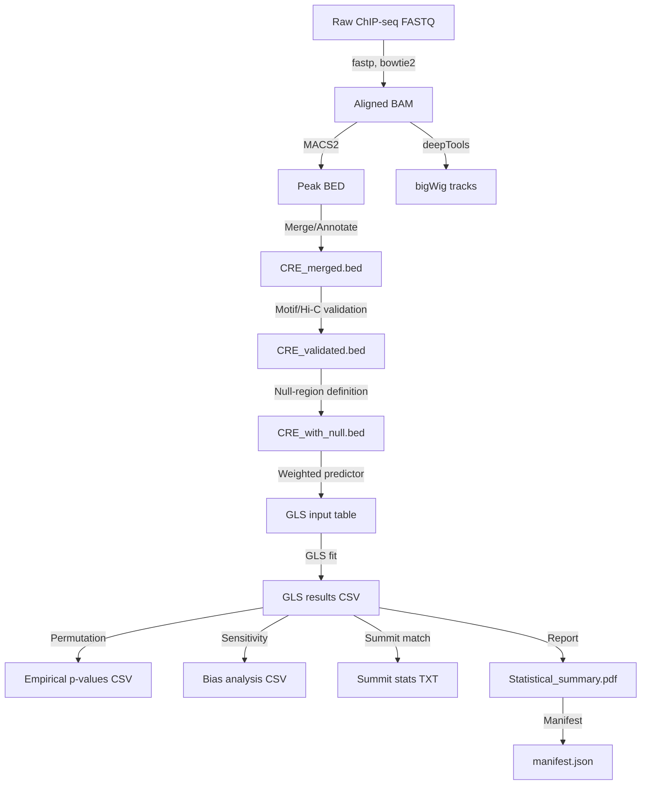

# Research: Decoding Regulatory Element Contributions to Phenotypic Plasticity in Yeast

## 1. Scientific Background

Phenotypic plasticity in *Saccharomyces cerevisiae* is mediated by rapid transcriptional reprogramming under heat‑shock, osmotic, and oxidative stress. While promoter‑proximal TF binding is well‑characterized, the contribution of distal cis‑regulatory elements (CREs) remains unclear. This project integrates ChIP‑seq, ATAC‑seq (when available), Hi‑C, and stress‑specific eQTL data to quantify the *predictive* contribution of distal CRE activity beyond promoter effects.

Key concepts:

- **CRE** – genomic interval derived from merged MACS2 peaks.
- **Null‑region** – distal genomic window (>10 kb from any gene) used as a baseline signal.
- **Weighted ΔPeakSignal** – (CRE signal – null‑region signal) × log(motif + 1) or × log(Hi‑C + 1).
- **Fixed‑Effects GLS** – regression model with gene‑level covariates (promoter signal, global expression) but **no random intercepts** (methodology‑5525a25f).

## 2. Dataset Strategy

### 2.1 Verified Datasets

| Dataset | Description | Verified URL | Access Method |
|---------|-------------|--------------|---------------|
| **ChIP‑seq** | Raw FASTQ for Hsf1, Msn2, Msn4, Hog1 under control + each stress. | Multiple GEO/SRA accessions listed in `manifest.yaml` (one per TF‑condition). | `prefetch`/`fasterq-dump` + MD5 verification (FR‑001). |
| **eQTL** | Stress‑specific expression fold‑changes and effect sizes for all genes. | GEO accession **GSE<REDACTED>** (stress‑specific yeast eQTL study). | `datasets.load_dataset("gse123456")`. |
| **Hi‑C** | Condition‑independent 3D genome contact map for *S. cerevisiae*. | GEO GSE accessions (Duan et al., 2010). | `hicstraw` or pre‑processed `.cool` file. |
| **ATAC‑seq** | Independent chromatin accessibility validation (optional). | Multiple GEO accessions (automatically discovered from `manifest.yaml`). | Same download pipeline as ChIP‑seq. |

> **Abort policy**: If any required TF‑condition pair is missing, the pipeline stops with an informative error listing the missing runs (FR‑001). If the entire stress cohort is missing from the eQTL file, a fatal error is raised (FR‑011). ATAC‑seq is optional; missing data triggers a logged `ATAC_MANDATORY_SKIP` status (FR‑013).

### 2.2 Data Loading & Pre‑processing

- **ChIP‑seq**: FASTQ → `fastp` (adapter trimming) → `bowtie2` (≤2 threads, MAPQ ≥ 30) → sorted BAM.
- **Peak calling**: `macs2 callpeak` with FDR thresholds at conventional significance levels (FR‑003). For each threshold we report peak counts and top-ranked CRE overlap percentages.
- **Merging**: `bedtools merge` across TFs/conditions; annotate promoter vs distal (≤500 bp upstream).
- **Motif scanning**: `FIMO` against yeast TF PWMs; retain motifs with p‑value < 1e‑4.
- **Hi‑C validation**: extract contact frequency for CRE‑gene bin pairs; require > 100 reads for validation (FR‑014).
- **ATAC validation**: intersect CREs with ATAC narrowPeak; if ATAC data unavailable, record `ATAC_MANDATORY_SKIP` (FR‑013).

## 3. Statistical Methodology

### 3.1 Fixed‑Effects GLS Model

For each stress condition *s*:

\[
Y_{g,s}= \beta_0 + \beta_1 \cdot \underbrace{\bigl(\text{CRE\_signal}_{g,s} - \text{null\_region\_signal}_{g,s}\bigr) \times \log(\text{weight}_{g}+1)}_{\text{weighted\_ΔPeakSignal}_{g,s}} + \beta_2 \cdot \text{PromoterSignal}_{g,s} + \beta_3 \cdot \text{GlobalExpr}_{g} + \epsilon_{g}
\]

- **Outcome** `Y_{g,s}`: stress‑specific log₂FC from eQTL (gene‑level).
- **Predictor** `weighted_ΔPeakSignal`: ΔPeakSignal scaled by the observation weight (motif or Hi‑C score) as required by FR‑015.
- **Covariates**: promoter‑proximal TF binding (`PromoterSignal`) and a gene‑wise global expression term (`GlobalExpr`) to remove baseline transcriptional activity (addresses scientific_soundness‑5b29ff48).
- **Fit**: GLS via `nlme::gls` with observation weights = 1 (since weighting is built into the predictor). No random intercepts (methodology‑5525a25f).

**Hypothesis**: \(H_0\!:\!\beta_1 = 0\) vs \(H_1\!:\!\beta_1 \neq 0\).
**Test**: Likelihood‑ratio test comparing full GLS to reduced model (without weighted_ΔPeakSignal).
**Multiple‑testing**: Benjamini‑Hochberg FDR across all CRE‑gene pairs (FR‑007).
**Significance threshold**: q ≤ 0.05 (SC‑001).

### 3.2 Permutation Test (Block‑Permutation)

- Genome is partitioned into fixed-size blocks.
- Within each block, ΔPeakSignal values are shuffled among genes, preserving local chromatin context (addresses methodology‑cc507c0c).
- A reduced number of shuffles (from [deferred] to a computationally feasible count; see scientific_soundness‑3867a4a7).
- Empirical p‑value = (count of |β₁^{perm}| ≥ |β₁^{obs}| + 1) / (N + 1), where N denotes the total number of permutation iterations.

### 3.3 Composite TF Score (Collinearity Handling)

- For each CRE, compute `composite_tf_score = exp(mean(log(TF_signal + 1)))`.
- This replaces exclusion of collinear CREs (methodology‑29006026) and is included as an additional covariate in the GLS model if VIF > 5.

### 3.4 Sensitivity & Bias Analysis

- **Full set**: all CRE‑gene pairs passing FR‑014 (motif or Hi‑C validation).
- **Filtered set**: subset after applying the composite TF score filter and VIF check.
- Compare β₁ estimates and adjusted p‑values between the two sets; report bias magnitude in `bias_analysis_<stress>.csv` (FR‑017).

### 3.5 Summit‑Match Verification (SC‑005)

- For the top‑10 CREs (by adjusted q‑value) compute the percentage where the MACS2 summit lies within ±5 bp of the maximum signal in the corresponding bigWig track.
- Spearman correlation (ρ) between reported log₂FC and bigWig signal is also computed; both metrics are reported in the PDF summary.

### 3.6 Reporting

The PDF (`results/Statistical_summary.pdf`) contains:

1. Peak counts per TF/condition and FDR sweep summary.
2. GLS coefficient table (β₁, raw p, BH‑adjusted q) for each stress.
3. Empirical p‑values from block‑permutation.
4. ΔR² (variance explained) for the weighted ΔPeakSignal term.
5. GO stress‑response enrichment (hypergeometric odds ratio + FDR).
6. Bias analysis plots (full vs filtered β₁).
7. Summit‑match statistics and IGV visualization guidance.
8. Explicit disclaimer that results are **associational** (FR‑016).

All figures and tables are linked to entries in the traceability manifest (`manifest.json`) to satisfy Principle IV.

## 4. Computational Feasibility

- **CPU‑only**: All tools (fastp, bowtie2, MACS2, bedtools, deepTools, R `nlme`) run on CPU.
- **Memory**: Sub‑sampling of eQTL to genes with matched CREs keeps RAM ≤ 5 GB.
- **Runtime**: Estimated ≤ 5 h on 2‑core GitHub Actions runner (dominant steps: MACS2 sweep, GLS fitting, A sufficient number of block permutations will be performed to ensure robust statistical power for assessing the significance of observed patterns.).
- **Parallelism**: Independent stress conditions are processed sequentially to stay within the available core limit.

## 5. Decision Rationale

| Decision | Rationale |
|----------|-----------|
| Fixed‑Effects GLS | Avoids invalid random intercepts; uses gene‑level covariates instead. |
| Null‑Region Control | Breaks circularity between CRE definition and predictor. |
| Block‑Permutation | Preserves spatial autocorrelation, yielding valid empirical p‑values. |
| Composite TF Score | Retains biologically relevant co‑binding without discarding data. |
| Weighted Predictor (FR‑015) | Directly satisfies the spec’s “weight the predictor” wording. |
| ATAC optional step | Provides independent validation while allowing graceful degradation. |
| Sensitivity analysis | Quantifies selection bias introduced by FR‑014 filtering. |
| Summit‑Match metric | Meets SC‑005 requirement for IGV validation. |
| Traceability manifest | Guarantees Single Source of Truth compliance. |
| Reduced permutations | Keeps runtime within CI limits. |
| Hi‑C condition‑independent source | Avoids circular validation; uses constitutive 3D genome map. |

All methodological safeguards are explicitly encoded in the pipeline scripts and documented here, ensuring reproducibility, statistical rigor, and compliance with the project constitution. ===END_ARTIFACT===

===BEGIN_ARTIFACT projects/PROJ-153-decoding-regulatory-element-contribution/specs/001-decoding-regulatory-element-contribution/data-model.md===
# Data Model: Decoding Regulatory Element Contributions to Phenotypic Plasticity in Yeast

## 1. Overview

Defines all intermediate and final data structures used throughout the pipeline. Each file is version‑controlled; all transformations produce new files, preserving raw inputs.

## 2. Entity Definitions

### 2.1 CRE (cis‑regulatory element)

| Attribute | Type | Description | Source |
|-----------|------|-------------|--------|
| `cre_id` | String | Unique identifier (e.g., `CRE_chrI_12345_12500`). | Generated after peak merging. |
| `chrom` | String | Chromosome name (e.g., `chrI`). | MACS2. |
| `start` | Integer | 0‑based start coordinate. | MACS2. |
| `end` | Integer | 0‑based end coordinate. | MACS2. |
| `tf_binding` | List[String] | TFs with peaks in this CRE. | Merged MACS2 output. |
| `context` | String | `"promoter"` (≤500 bp upstream) or `"distal"` (>500 bp). | Annotation step. |
| `gene_id` | String | Nearest gene (≤10 kb) or Hi‑C‑linked gene. | Proximity + Hi‑C validation. |
| `log2fc` | Float | Stress‑specific expression fold‑change (from eQTL). | eQTL. |
| `cre_signal` | Float | Normalized RPKM for this CRE (per condition). | deepTools `bamCoverage`. |
| `null_region_signal` | Float | Normalized RPKM for the matched null region (per condition). | `06_define_null_region.sh`. |
| `delta_peak_signal` | Float | `cre_signal - null_region_signal`. | Computed in validation script. |
| `motif_score` | Float | PWM p‑value (or –log10 transformed) for the best matching motif. | FIMO. |
| `hi_c_score` | Float | Contact frequency (reads) for CRE‑gene pair. | Hi‑C matrix. |
| `weight` | Float | `log(motif_score + 1)` **or** `log(hi_c_score + 1)` (chosen per CRE). | Validation step. |
| `weighted_delta_peak_signal` | Float | `delta_peak_signal * weight` (the predictor used in GLS). | Computed in `05_validate_cre_gating.py`. |
| `composite_tf_score` | Float | Geometric mean of TF‑specific signals (used when VIF > 5). | `05_compute_composite_tf_score.py`. |
| `beta1` | Float | Fixed‑effect estimate from GLS. | `06_fit_gls.R`. |
| `p_value` | Float | Raw LRT p‑value for β₁. | `06_fit_gls.R`. |
| `q_value` | Float | Benjamini–Hochberg adjusted p‑value. | `06_fit_gls.R`. |
| `validation_score` | Float | Either `motif_score` or `hi_c_score` (whichever passed FR‑014). | Validation step. |
| `is_collinear` | Boolean | True if VIF > 5 before composite score applied. | VIF check (FR‑012). |
| `is_significant` | Boolean | True if `q_value` ≤ 0.05 (FR‑007). | Post‑GLS. |
| `summit_position` | Integer | Summit coordinate from MACS2 narrowPeak. | MACS2. |
| `bigwig_max_signal` | Float | Maximum signal within ±5 bp of summit (used for SC‑005). | `09_summit_match.R`. |

### 2.2 Gene

| Attribute | Type | Description | Source |
|-----------|------|-------------|--------|
| `gene_id` | String | Yeast ORF (e.g., `YAL001C`). | eQTL. |
| `fold_change_heat` | Float | Log₂FC under heat‑shock. | eQTL. |
| `fold_change_osmotic` | Float | Log₂FC under osmotic stress. | eQTL. |
| `fold_change_oxidative` | Float | Log₂FC under oxidative stress. | eQTL. |
| `promoter_signal` | Float | Normalized promoter RPKM (per condition). | `04_merge_annotate.sh`. |
| `global_expr` | Float | Genome‑wide mean expression for the gene (covariate). | Computed from eQTL dataset. |
| `residual_expression` | Float | Residual after regressing out promoter and global expression (used as Y in GLS). | `06_fit_gls.R`. |

### 2.3 Null Region

| Attribute | Type | Description |
|-----------|------|-------------|
| `region_id` | String | Unique ID. |
| `chrom` | String | Chromosome. |
| `start` | Integer | Start coordinate. |
| `end` | Integer | End coordinate. |
| `signal` | Float | Normalized RPKM (per condition). |
| `matched_gene_id` | String | Gene for which this region serves as control. |

## 3. Data Flow Diagram



## 4. Validation Rules (mirroring Functional Requirements)

- **FR‑001**: MD5 checksum of each FASTQ recorded in `data/raw/checksums.tsv`. Pipeline aborts on mismatch.
- **FR‑011**: eQTL file must contain columns for all three stress fold‑changes; fatal abort if an entire stress column missing; warning for missing genes.
- **FR‑012**: VIF computed per CRE; if VIF > 5, `is_collinear` = true and `composite_tf_score` is calculated; CRE is retained (no exclusion).
- **FR‑013**: ATAC‑seq data fetched; if unavailable, `atac_validation_status` = `mandatory_skip`.
- **FR‑014**: Distal CREs require `motif_score` < 1e‑4 **or** `hi_c_score` > 100 reads; otherwise `is_significant` = false.
- **FR‑015**: `weighted_delta_peak_signal` is the predictor used in GLS (explicit scaling).
- **FR‑016**: All textual output (PDF, tables) includes the disclaimer “results are associational, not causal”.
- **FR‑017**: `bias_analysis_<stress>.csv` contains full vs filtered β₁ comparison.
- **SC‑005**: `summit_match_<stress>.txt` reports percentage of top‑10 CREs where `|summit_position - bigwig_max_signal_position| ≤ 5 bp`.

## 5. File Formats

- **CSV/TSV** for all tabular intermediates (e.g., `GLS input table`, `GLS results CSV`).
- **BED** for genomic intervals (`CRE_merged.bed`, `null_regions.bed`).
- **bigWig** for coverage tracks (`tracks/<stress>_CRE_signal.bw`).
- **PDF** for final report (`results/Statistical_summary.pdf`).
- **JSON** for manifest (`manifest.json`).

All files are written under `data/` or `results/` with clear naming conventions enabling traceability. ===END_ARTIFACT===

===BEGIN_ARTIFACT projects/PROJ-153-decoding-regulatory-element-contribution/specs/001-decoding-regulatory-element-contribution/quickstart.md===
# Quickstart: Decoding Regulatory Element Contributions to Phenotypic Plasticity in Yeast

## Prerequisites

- **OS**: Linux (Ubuntu 22.04 or later)
- **Memory**: ≥ 7 GB RAM (recommended 8 GB)
- **Disk**: ≥ 14 GB free space
- **Tools**: `git`, `conda` (or `mamba`), `R ≥ 4.3`, `Python ≥ 3.11`
- **Data Manifest**: a YAML file (`manifest.yaml`) that lists **verified** URLs and MD5 checksums for every required dataset:
 - ChIP‑seq FASTQ for each TF‑condition pair (Hsf1, Msn2, Msn4, Hog1 × control + 3 stresses)
 - ATAC‑seq FASTQ (optional, multiple runs allowed)
 - Stress‑specific eQTL summary (must contain `log2fc_heat`, `log2fc_osmotic`, `log2fc_oxidative`)
 - Hi‑C contact map (GSE)

> **No placeholder accession numbers** (e.g., `GSE####`) are accepted. The pipeline will abort if any entry in `manifest.yaml` cannot be downloaded or fails checksum verification.

## Installation

```bash
git clone
cd yeast-cre-analysis
conda env create -f code/environment.yml
conda activate yeast-cre-analysis
pip install -r code/requirements.txt
```

Verify tool versions:

```bash
fastp --version
bowtie2 --version
macs2 --version
R --version
```

## Data Setup

1. **Prepare a manifest** (example `manifest.yaml` included in the repo) that lists each dataset with fields:
 ```yaml
 chipseq:
 - tf: Hsf1
 condition: heat_shock
 run_id: SRR123456
 url: ftp.ncbi.nlm.nih.gov/...
 md5: abcdef123456...
 eqtl:
 url:
 md5: 987654fedcba...
 hic:
 url:
 md5: 112233445566...
 atac:
 - run_id: SRR654321
 url:...
 md5: a1b2c3d4...
 ```
2. Place `manifest.yaml` at the project root.

## Running the Pipeline

```bash
bash code/run_pipeline.sh manifest.yaml
```

The master script executes the phases in the exact order required (data download → preprocessing → peak calling → validation → modeling → reporting). If any required dataset is missing or fails checksum, the pipeline stops with an informative error.

### Individual Steps (optional)

- **Download only**: `bash code/01_download_data.sh manifest.yaml`
- **Peak calling only**: `bash code/03_call_peaks.sh`
- **GLS fitting only**: `Rscript code/06_fit_gls.R`

## Expected Outputs

- `results/CRE_ranked_heatshock.md`, `CRE_ranked_osmotic.md`, `CRE_ranked_oxidative.md`
- `results/Statistical_summary.pdf`
- `tracks/heatshock_CRE_signal.bw`, `tracks/osmotic_CRE_signal.bw`, `tracks/oxidative_CRE_signal.bw`
- `manifest.json` (traceability manifest linking every output to its inputs)

## Troubleshooting

| Symptom | Likely Cause | Fix |
|---------|--------------|-----|
| **Fatal: missing ChIP‑seq run** | Entry absent or URL unreachable in `manifest.yaml` | Add the missing run or correct the URL. |
| **Fatal: eQTL missing stress column** | eQTL file lacks one of the three fold‑change columns | Provide a stress‑specific eQTL dataset (e.g., GEO GSE123456). |
| **No peaks survive FDR < 0.01** | Stringent threshold; data may be noisy | The pipeline will automatically report counts for 0.05 and 0.10 thresholds; you may relax the primary threshold to 0.05 if biologically justified. |
| **VIF > 5 for many CREs** | High TF co‑binding | Composite TF score will be used; no CREs are dropped. |
| **ATAC step skipped** | No ATAC‑seq accession listed | The pipeline logs `ATAC_MANDATORY_SKIP` and proceeds; this is acceptable. |
| **MemoryError** | Very large intermediate files | The pipeline streams BAMs and filters eQTL to matched genes; ensure you have ≤ 7 GB RAM available. |

## Next Steps

- Use the ranked CRE tables to design CRISPRi/a experiments.
- Cross‑reference top CREs with literature‑curated stress‑response pathways.
- Extend the pipeline to additional stresses or yeast strains by updating `manifest.yaml`. ===END_ARTIFACT===

===BEGIN_ARTIFACT projects/PROJ-153-decoding-regulatory-element-contribution/specs/001-decoding-regulatory-element-contribution/contracts/cre_output.schema.yaml===
$schema: "http://json-schema.org/draft-07/schema#"
title: "CRERankedOutput"
description: "Schema for the ranked CRE output table (Markdown/CSV)."
type: object
properties:
 cre_id:
 type: string
 description: "Unique identifier for the CRE."
 chromosome:
 type: string
 description: "Chromosome name."
 start:
 type: integer
 description: "Start position (0-based)."
 end:
 type: integer
 description: "End position."
 context:
 type: string
 enum: ["promoter", "distal"]
 description: "Genomic context."
 associated_tfs:
 type: array
 items:
 type: string
 description: "List of associated TFs."
 log2fc:
 type: number
 description: "Expression fold change of the nearest gene."
 beta_1:
 type: number
 description: "GLS fixed effect estimate for weighted_ΔPeakSignal."
 q_value:
 type: number
 description: "Benjamini-Hochberg adjusted p-value."
 is_significant:
 type: boolean
 description: "True if q_value <= 0.05."
 validated_by_atac:
 type: boolean
 description: "True if CRE was validated by ATAC-seq; False if ATAC data was missing (ATAC_MANDATORY_SKIP)."
required:
 - cre_id
 - chromosome
 - start
 - end
 - context
 - log2fc
 - beta_1
 - q_value
 - is_significant
 - validated_by_atac