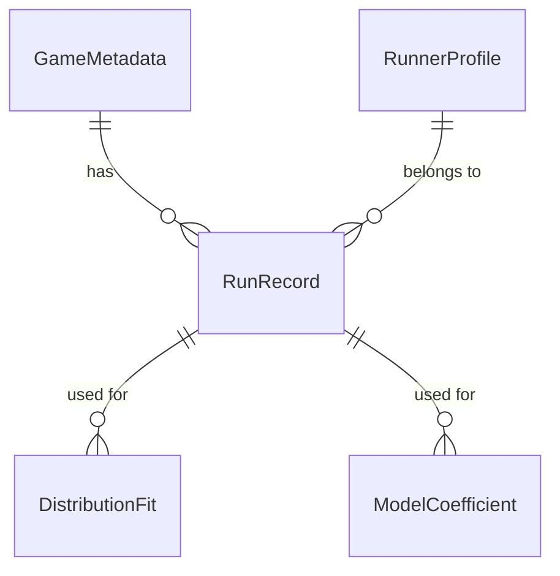

# Data Model: Statistical Analysis of Speedrun Data

## 1. Entity-Relationship Overview

The data model consists of four core entities: `RunRecord`, `RunnerProfile`, `GameMetadata`, and `DistributionFit`. Relationships are one-to-many from `GameMetadata` to `RunRecord`, and one-to-many from `RunnerProfile` to `RunRecord`.

## 2. Entity Definitions

### 2.1 RunRecord
Represents a single speedrun attempt.

| Attribute | Type | Description | Source |
|-----------|------|-------------|--------|
| `run_id` | str | Unique identifier (hash of game_id + runner_id + attempt) | Derived |
| `game_id` | str | Unique game identifier from speedrun.com | API |
| `runner_id` | str | Unique runner identifier from speedrun.com | API |
| `attempt_number` | int | Sequential attempt number for this runner in this game | API |
| `run_time_seconds` | float | Run time in seconds | API |
| `category` | str | Category (e.g., "any%", "[deferred]") | API |
| `submission_date` | date | Date of submission | API |
| `total_prior_runs` | int | Count of runs by this runner before this attempt | Derived (Descriptive only) |
| `time_since_first_run_days` | float | Days since runner's first run in this game | Derived |
| `difficulty_label` | str | External difficulty rating (optional) | External |
| `competitive_pressure` | float | **Lagged** count of active runners in 30-day window prior to submission | Derived (Lagged) |

> **Note on Experience Metrics**: `total_prior_runs` and `attempt_number` are highly collinear. `attempt_number` is used for the mixed-effects model fixed effects. `total_prior_runs` is retained for descriptive statistics only.

### 2.2 RunnerProfile
Aggregates per-runner statistics.

| Attribute | Type | Description | Source |
|-----------|------|-------------|--------|
| `runner_id` | str | Unique runner identifier | API |
| `total_runs` | int | Total runs across all games | Derived |
| `games_played_count` | int | Number of unique games played | Derived |
| `first_run_date` | date | Earliest submission date | Derived |
| `avg_run_time` | float | Mean run time across all games | Derived |

### 2.3 GameMetadata
Represents game-level information.

| Attribute | Type | Description | Source |
|-----------|------|-------------|--------|
| `game_id` | str | Unique game identifier | API |
| `game_name` | str | Human-readable game name | API |
| `difficulty_label` | str | External difficulty rating | External |
| `active_runners_count` | int | Unique runners in last 30 days | Derived |
| `total_runs` | int | Total runs for this game | Derived |
| `sample_flag` | str | "low-sample" if n < 100, "ok" otherwise | Derived |

### 2.4 DistributionFit
Stores results from parametric fitting.

| Attribute | Type | Description | Source |
|-----------|------|-------------|--------|
| `game_id` | str | Unique game identifier | Derived |
| `distribution_family` | str | "log-normal", "Weibull", "gamma" | Model |
| `parameters` | dict | Fitted parameters (e.g., `{"mu": 1.2, "sigma": 0.5}`) | Model |
| `KS_D` | float | Kolmogorov-Smirnov statistic | Model |
| `KS_pvalue` | float | KS test p-value | Model |
| `AIC` | float | Akaike Information Criterion | Model |
| `rejected` | bool | True if Bonferroni-corrected p < 0.05 | Derived |

### 2.5 ModelCoefficient
Stores mixed-effects model outputs.

| Attribute | Type | Description | Source |
|-----------|------|-------------|--------|
| `model_id` | str | Unique model identifier | Derived |
| `predictor_name` | str | Name of predictor (e.g., "log_attempt") | Model |
| `coefficient` | float | Estimated coefficient | Model |
| `standard_error` | float | Standard error of coefficient | Model |
| `p_value` | float | p-value for coefficient (Bonferroni-corrected) | Model |
| `random_effect_variance` | float | Variance of random effect (RunnerID) | Model |

## 3. Data Flow

1. **Raw Data**: `data/raw/speedrun_api.json` (from API)
2. **Preprocessed Data**: `data/processed/run_records.csv` (cleaned, features added)
3. **Derived Data**: 
   - `data/processed/distribution_fits.csv`
   - `data/processed/mixed_effects_results.csv`
4. **Checkpoints**: `data/checkpoints/game_<id>.pkl` (intermediate state)

## 4. Constraints & Validations

- **Uniqueness**: `run_id` must be unique.
- **Non-null**: `run_time_seconds`, `runner_id`, `game_id`, `attempt_number` cannot be null.
- **Range**: `run_time_seconds` > 0; `attempt_number` >= 1.
- **Completeness**: ≥95% of records retained after preprocessing (SC-003).
- **Sample Size**: Games with <100 runs flagged as "low-sample" and excluded from parametric fitting.
- **Collinearity**: `total_prior_runs` is excluded from mixed-effects fixed effects to prevent instability.