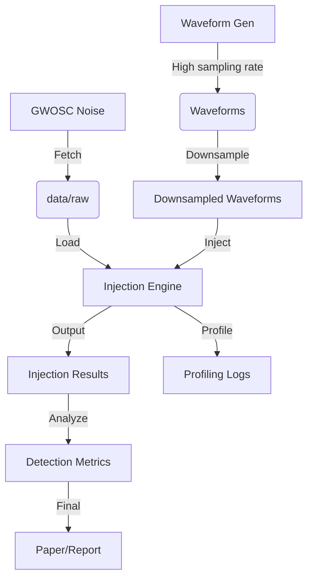

# Data Model: Quantifying the Impact of Data Resolution on Gravitational Wave Signal Detection

## 1. Overview

This document defines the data structures for the gravitational wave resolution study. The data flows from raw noise segments through waveform generation, injection, and matched-filter analysis to final statistical aggregates.

## 2. Entities

### 2.1 Waveform
Represents a simulated BBH signal.
- **Attributes**: `mass_1` (float), `mass_2` (float), `distance` (float), `sampling_rate` (int), `seed` (int), `file_path` (str).

### 2.2 Injection
Represents a specific instance of a waveform embedded in noise.
- **Attributes**: `injection_id` (str), `waveform_id` (str), `noise_segment_id` (str), `gps_time` (float), `resolution` (int), `injected_snr` (float), `recovered_snr` (float), `reweighted_snr` (float), `chi2` (float), `detected` (bool).

### 2.3 ProfilingRecord
Resource usage for a specific resolution level.
- **Attributes**: `resolution` (int), `wall_clock_time` (float), `peak_memory_mb` (float), `cpu_percent` (float).

### 2.4 DetectionMetric
Aggregated statistics for a resolution level.
- **Attributes**: `resolution` (int), `total_injections` (int), `detections` (int), `detection_probability` (float), `median_snr` (float), `ci_lower` (float), `ci_upper` (float).

## 3. File Formats

### 3.1 Raw Noise (HDF5/NetCDF)
- **Source**: GWOSC via `gwosc` library.
- **Format**: Standard GWOSC strain format (HDF5).
- **Storage**: `data/raw/gwosc_segment_<gps>.hdf5`

### 3.2 Processed Waveforms (CSV/Parquet)
- **Format**: Parquet for efficiency.
- **Columns**: `mass_1`, `mass_2`, `distance`, `resolution`, `file_path`.

### 3.3 Injection Results (CSV/Parquet)
- **Format**: Parquet.
- **Columns**: `injection_id`, `resolution`, `injected_snr`, `recovered_snr`, `reweighted_snr`, `detected`, `wall_clock_time`.

### 3.4 Profiling Logs (JSON)
- **Format**: JSON Lines.
- **Structure**: `{ "resolution": 256, "time": 12.5, "memory": 1024 }`

## 4. Data Flow Diagram

## 5. Constraints & Validation

- **Resolution**: Must be one of {4096, 2048, 1024, 512, 256}.
- **SNR Threshold**: Detection defined as `reweighted_snr > 8.0`.
- **Checksum**: All files in `data/` must have corresponding SHA256 in `state/`.
- **No PII**: No personal data involved.
- **Schema Validation**: All injection and metric records must validate against `contracts/injection.schema.yaml` and `contracts/detection_metric.schema.yaml` before being written to disk.