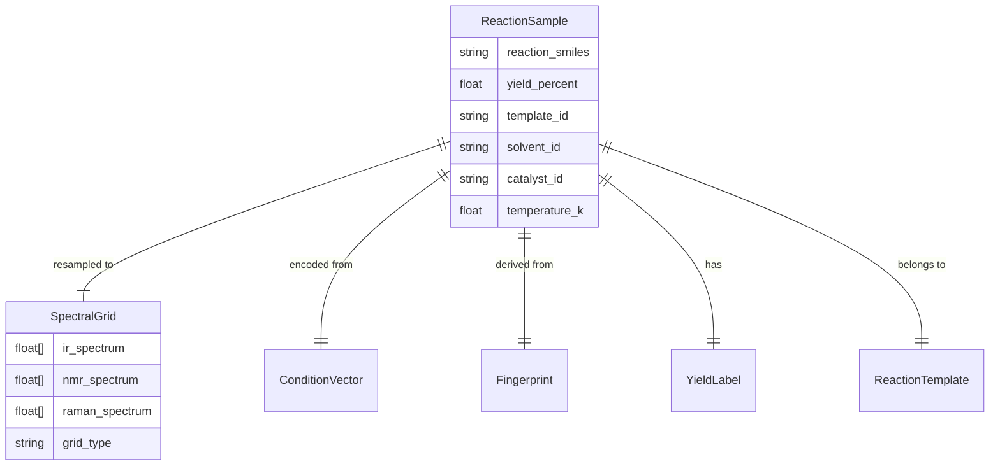

# Data Model: Predicting Chemical Reaction Yields from Spectroscopic Data with Attention Mechanisms

## 1. Entity Relationship Diagram (Conceptual)

## 2. Core Entities

### ReactionSample
The primary unit of analysis. Represents a single chemical reaction instance (real or simulated).

| Attribute | Type | Description | Source |
| :--- | :--- | :--- | :--- |
| `reaction_smiles` | String | Canonical SMILES of the reaction. | Generated (Simulated) |
| `yield_percent` | Float | Reaction yield (0.0 - 100.0). | Generated (Simulated) |
| `ir_spectrum` | Array[Float] | Resampled IR spectrum (400-4000 cm⁻¹). | Generated (Simulated) |
| `nmr_spectrum` | Array[Float] | Resampled NMR spectrum (0-10 ppm). | Generated (Simulated) |
| `raman_spectrum` | Array[Float] | Resampled Raman spectrum (400-4000 cm⁻¹). | Generated (Simulated) |
| `fingerprint` | Array[Float] | ECFP4 vector (1024 dim). | Derived (RDKit) |
| `template_id` | String | MD5 hash of reaction center substructure. | Derived |
| `solvent_id` | Int | Encoded solvent ID. | Derived |
| `catalyst_id` | Int | Encoded catalyst ID. | Derived |
| `temperature_k` | Float | Temperature in Kelvin. | Derived |
| `split` | Enum | `train`, `val`, `test`. | Derived |
| `is_simulated` | Boolean | Flag indicating if data is from simulation. | True (Default) |

### SpectralGrid
Defines the standardized domain for spectral data.

| Attribute | Type | Description |
| :--- | :--- | :--- |
| `type` | String | `IR`, `Raman`, or `NMR`. |
| `min_value` | Float | Minimum wavenumber or ppm. |
| `max_value` | Float | Maximum wavenumber or ppm. |
| `num_bins` | Int | Number of resampled points (e.g., 1000). |

### ModelCheckpoint
Represents a saved state of the trained model.

| Attribute | Type | Description |
| :--- | :--- | :--- |
| `epoch` | Int | Training epoch number. |
| `validation_rmse` | Float | RMSE on validation set. |
| `weights_path` | String | Relative path to model weights. |
| `config_hash` | String | Hash of model configuration. |

## 3. Data Flow

1.  **Ingestion**: Synthetic data is generated via `src/data/ingestion.py` (physics-based simulator with stochastic noise).
2.  **Transformation**:
    -   SMILES -> ECFP4 (RDKit).
    -   Raw Spectra -> Resampled Grid (Interpolation).
    -   Conditions -> One-Hot/Embedding.
    -   Reaction SMILES -> Template ID (MD5).
3.  **Splitting**: Data is partitioned based on `template_id` AND `condition_bucket` to ensure zero overlap and prevent condition shift.
4.  **Storage**: Processed data saved as Parquet files in `data/processed/`.
5.  **Consumption**: PyTorch `DataLoader` streams from Parquet files during training.

## 4. Constraints & Validation

-   **Yield Range**: `0.0 <= yield_percent <= 100.0`.
-   **Spectrum Length**: Fixed length (e.g., 1000) for all spectra.
-   **Template Uniqueness**: No `template_id` appears in more than one split.
-   **Condition Stratification**: Splits are balanced across solvent/catalyst classes.
-   **Checksum**: All generated files must match the SHA256 hash recorded in `state/...yaml`.
-   **Integrity**: VIF < 5 required for valid "independent signal" claim.