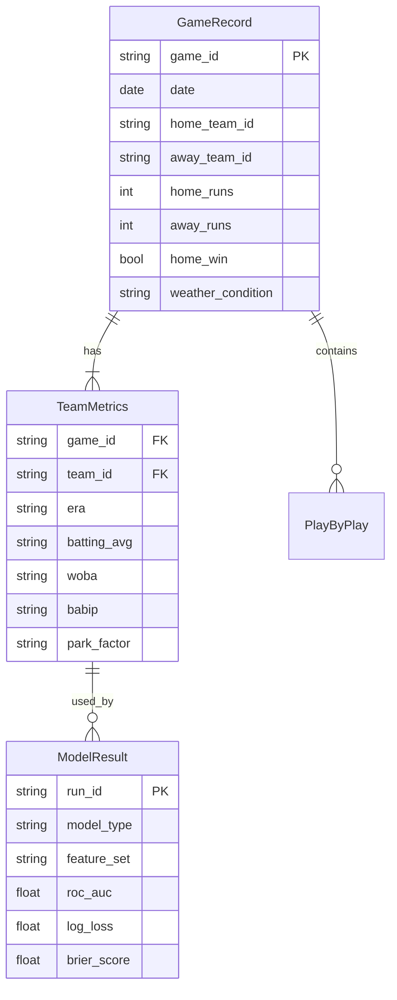

# Data Model: Statistical Analysis of Publicly Available Sports Data for Predictive Modeling

## 1. Entity Relationship Diagram (Conceptual)

## 2. Data Dictionary

### GameRecord
| Column | Type | Description | Source |
| :--- | :--- | :--- | :--- |
| `game_id` | string | Unique identifier (e.g., "20190501_BOS_NYY") | Derived |
| `date` | date | Game date (YYYY-MM-DD) | Raw/Synthetic |
| `home_team_id` | string | 3-letter team code | Raw/Synthetic |
| `away_team_id` | string | 3-letter team code | Raw/Synthetic |
| `home_runs` | int | Runs scored by home team | Raw/Synthetic |
| `away_runs` | int | Runs scored by away team | Raw/Synthetic |
| `home_win` | bool | 1 if home team won, 0 otherwise | Derived |
| `weather_condition` | string | "Clear", "Rain", "Snow" (or "Neutral") | Raw/Synthetic |

### TeamMetrics
| Column | Type | Description | Source |
| :--- | :--- | :--- | :--- |
| `game_id` | string | Foreign Key to GameRecord | Derived |
| `team_id` | string | 3-letter team code | Derived |
| `era` | float | Earned Run Average (3-dec) | Derived |
| `batting_avg` | float | Batting Average (3-dec) | Derived |
| `woba` | float | Weighted On-Base Average (3-dec) | Derived |
| `babip` | float | Batting Average on Balls In Play (3-dec) | Derived |
| `park_factor` | float | Park adjustment factor (1.00 = neutral) | Derived |

### ModelResult
| Column | Type | Description | Source |
| :--- | :--- | :--- | :--- |
| `run_id` | string | Unique run identifier | System |
| `model_type` | string | "LogisticRegression", "RandomForest", "XGBoost" | System |
| `feature_set` | string | "Traditional", "Advanced" | System |
| `roc_auc` | float | Area Under ROC Curve | Eval |
| `log_loss` | float | Logarithmic Loss | Eval |
| `brier_score` | float | Brier Score | Eval |
| `p_value` | float | Diebold-Mariano p-value (if applicable) | Eval |

## 3. Data Flow

1.  **Ingestion**: Raw CSVs -> `data/raw/` (or Synthetic JSON).
2.  **Processing**: Raw -> `data/processed/games.csv` (cleaned, IDs resolved).
3.  **Engineering**: `games.csv` -> `data/processed/features.csv` (wOBA/BABIP added).
4.  **Split**: `features.csv` -> `train.csv` (2000-2018), `test.csv` (2019-2022).
5.  **Modeling**: `train.csv` -> `artifacts/models/` (pickle) + `artifacts/cv_results.csv`.
6.  **Evaluation**: `test.csv` + `models` -> `artifacts/final_results.json`.
