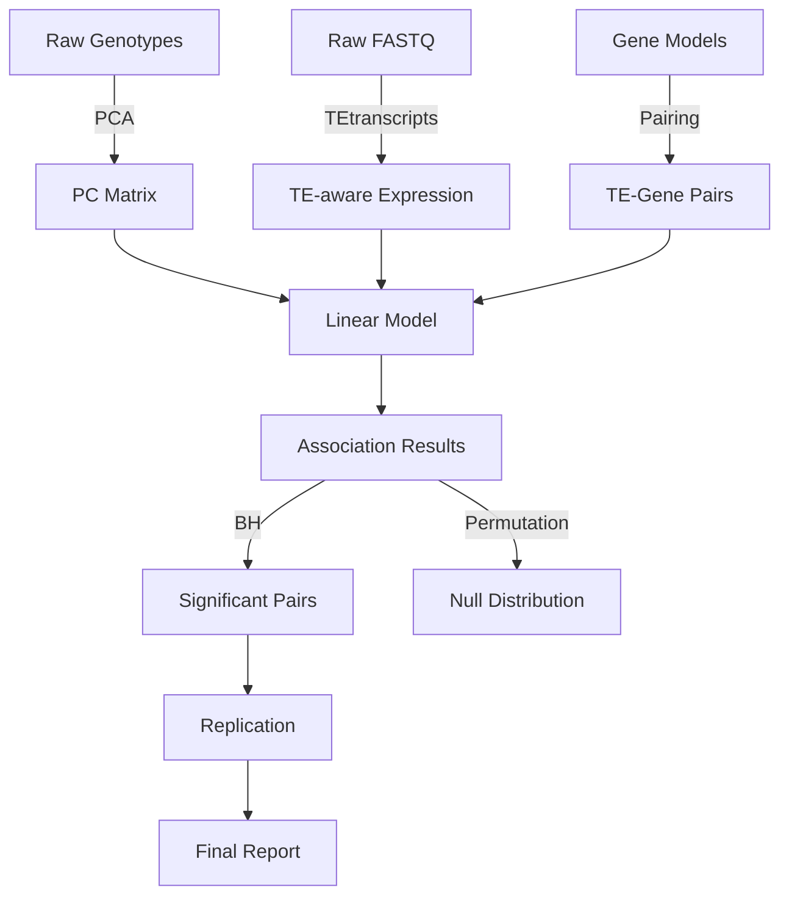

# Data Model: Quantifying the Impact of Transposable Element Activity on Gene Expression Variation in Drosophila

## Overview

Defines all data artifacts produced and consumed by the pipeline. Every output must validate against a schema in `contracts/`. The pipeline follows a strict **raw → processed → derived** flow.

## Input Data

### 1. Genotype Data (VCF‑derived CSV)
* `sample_id`, `te_id`, `te_family`, `chromosome`, `position`, `presence` (0/1), `frequency`.

### 2. Expression Data (TE‑aware TPM matrix)
* `sample_id`, `gene_id`, `expression_value` (TPM or log₂(TPM+1)), `tissue`, `quantification_method` **must be `"TEaware"`**.

### 3. Gene Models (Release 6 GTF)
* `gene_id`, `chromosome`, `strand`, `start`, `end`, `tss`, `tes`.

## Processed Data

### 1. PCA Matrix
* `sample_id`, `PC1`, `PC2`, `PC3`.

### 2. TE‑Gene Pairs
* `te_id`, `gene_id`, `distance_bp`, `proximal_flag` (bool), `ambiguous_flag` (bool), `mac` (minor allele count), `power_flag` (bool, true if MAC ≥ 5).

### 3. Association Results
* `te_id`, `gene_id`, `effect_size`, `ci_lower`, `ci_upper`, `p_value`, `adj_p_value`, `vif`, `vif_flag`, `fdr_significant`.

### 4. Population Structure Control Metric
* `r_squared_with_pcs`, `r_squared_without_pcs`, `reduction`.

### 5. Permutation Summary
* `n_permutations`, `observed_t_stat`, `null_95th_percentile`, `exceeds_null`.

### 6. Replication Summary
* `total_tested`, `concordant_count`, `concordance_rate`.

## Output Data

### 1. Final Association Table (`results/associations.csv`)
* All fields from **Association Results** plus `distance_bp`, `proximal_flag`, `ambiguous_flag`, `mac`, `power_flag`, `null_statistic_95th`.

### 2. Null Distribution Plot (`results/plots/null_distribution.png`)
* Histogram of null t‑statistics with observed statistic vertical line and 95th‑percentile threshold line.

### 3. Population Structure Control Table (`results/population_structure_control.csv`)
* Columns: `r_squared_with_pcs`, `r_squared_without_pcs`, `reduction`.

### 4. Replication Comparison Table (`results/replication/comparison.tsv`)
* `te_id`, `gene_id`, `orig_effect`, `rep_effect`, `direction_concordant`, `rep_p_value`.

### 5. Burden Test Results (optional) (`results/burden_analysis.tsv`)

## Data Flow Diagram

