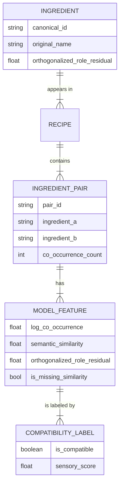

# Data Model: Statistical Analysis of Publicly Available Recipe Data for Ingredient Substitution Prediction

## 1. Entity Relationship Diagram (Conceptual)

## 2. Data Dictionary

### Ingredient
| Field | Type | Description | Source |
| :--- | :--- | :--- | :--- |
| `canonical_id` | string | Unique ID mapped from text embeddings | Recipe1M |
| `original_name` | string | Raw name from Recipe1M | Recipe1M |
| `orthogonalized_role_residual` | float | Residual of rank regressed on frequency | Derived (Orthogonalized) |

### IngredientPair (Processed Dataset)
| Field | Type | Description | Source |
| :--- | :--- | :--- | :--- |
| `pair_id` | string | Unique hash of (A, B) | Derived |
| `ingredient_a` | string | Canonical ID of first ingredient | Ingredient |
| `ingredient_b` | string | Canonical ID of second ingredient | Ingredient |
| `log_co_occurrence` | float | $\log(count + 1)$ | Recipe1M Co-occurrence |
| `semantic_similarity` | float | Cosine similarity of text embeddings | Recipe1M Embeddings |
| `orthogonalized_role_residual` | float | Residual of rank vs frequency | Derived (Orthogonalized) |
| `is_missing_similarity` | boolean | True if similarity was imputed | Derived |
| `compatibility_label` | int | 1 (compatible), 0 (not) | Counterfactual Dataset |

### ModelOutput
| Field | Type | Description | Source |
| :--- | :--- | :--- | :--- |
| `model_type` | string | 'logistic', 'bayesian' | Code |
| `coefficient_semantic` | float | Coefficient for semantic similarity | Model Fit |
| `coefficient_role` | float | Coefficient for orthogonalized role | Model Fit |
| `p_value_semantic` | float | P-value for semantic coefficient | Model Fit |
| `vif_score` | float | Variance Inflation Factor | Diagnostics |
| `auc` | float | Area Under Curve | Evaluation |
| `posterior_mean_semantic` | float | Mean of posterior for semantic (Bayesian) | Model Fit |
| `credible_interval_semantic` | object | 95% CI for semantic (Bayesian) | Model Fit |

## 3. Data Flow

1.  **Raw Ingestion**: `Recipe1M.parquet` -> `Raw_Ingredients.csv`
2.  **Verification**: `Recipe1M` + `Counterfactual` -> `verification_report.json` (Gate)
3.  **Normalization**: `Raw_Ingredients.csv` -> `Canonical_Mapping.json`
4.  **Feature Engineering**: `Canonical_Mapping` + `Recipe1M` -> `Processed_Pairs.parquet` (with Orthogonalized Role)
5.  **Labeling**: `Processed_Pairs.parquet` + `Counterfactual.csv` -> `Final_Dataset.parquet`
6.  **Modeling**: `Final_Dataset.parquet` -> `Model_Results.json`
7.  **Evaluation**: `Model_Results.json` + `Test_Split.parquet` -> `Evaluation_Report.csv`

## 4. Assumptions & Constraints

- **Missing Data**: If `semantic_similarity` is missing, value is imputed (median) and `is_missing_similarity` is set to True.
- **Zero Counts**: `log_co_occurrence` uses `log(count + 1)`.
- **Imbalance**: Dataset may be imbalanced; stratified sampling used.
- **Data Availability**: If Counterfactual dataset is unverified, pipeline halts.