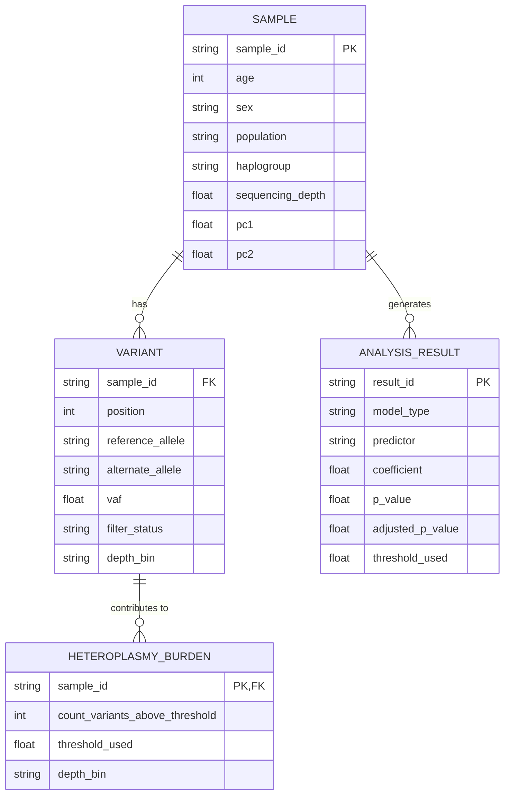

# Data Model: Investigating the Correlation Between Mitochondrial DNA Variation and Aging Rates

## Entity Relationship Diagram (Conceptual)

## Data Flow

1.  **Raw Data Ingestion**:
    -   Download 1000 Genomes Phase 3 VCFs (chrM only) and sample metadata.
    -   **Gate**: Check for `age` column. If missing, halt.
    -   Parse VCFs to extract variants with `PASS` filter status.
    -   Merge with metadata to add `age`, `sex`, `population`, `pc1`, `pc2`.

2.  **Preprocessing**:
    -   Assign `haplogroup` using `haplogrep2`.
    -   Calculate `heteroplasmy_burden` per sample: count of variants with `VAF ≥ 1%`.
    -   **Depth Stratification**: Assign samples to depth bins (Low, Medium, High) and calculate burden per bin.
    -   Filter samples with missing `age`.

3.  **Analysis**:
    -   Rank-transform variables.
    -   Compute Rank-OLS regression with covariates.
    -   Apply Benjamini-Hochberg correction.
    -   Perform sensitivity analyses (threshold sweep, subgroup analysis).

4.  **Output**:
    -   Generate `analysis_results.csv` with all statistical outputs.
    -   Generate `figures/` directory with correlation plots and sensitivity curves.

## Data Schemas

### Raw VCF (Partial)
- `#CHROM`: Chromosome (must be `chrM`)
- `POS`: Position
- `REF`: Reference allele
- `ALT`: Alternate allele
- `QUAL`: Quality score
- `FILTER`: Filter status (must be `PASS`)
- `INFO`: Contains `VAF` (Variant Allele Frequency)
- `FORMAT`: Sample genotype data

### Processed Dataset (CSV/Parquet)
| Column | Type | Description |
|--------|------|-------------|
| `sample_id` | string | Unique sample identifier |
| `age` | int | Chronological age in years |
| `sex` | string | Sex (M/F) |
| `population` | string | Continental ancestry group |
| `haplogroup` | string | Mitochondrial haplogroup |
| `heteroplasmy_burden` | int | Count of variants with VAF ≥ 1% |
| `sequencing_depth` | float | Average coverage depth |
| `depth_bin` | string | Low, Medium, or High |
| `pc1` | float | Principal component 1 |
| `pc2` | float | Principal component 2 |

### Analysis Results (CSV)
| Column | Type | Description |
|--------|------|-------------|
| `result_id` | string | Unique result identifier |
| `model_type` | string | "rank_ols" or "spearman" |
| `predictor` | string | "heteroplasmy_burden" |
| `coefficient` | float | Estimated coefficient |
| `p_value` | float | Raw p-value |
| `adjusted_p_value` | float | BH-adjusted p-value |
| `threshold_used` | float | VAF threshold used (e.g., 0.01) |
| `subgroup` | string | Ancestry group or "all" |
| `depth_bin` | string | "all", "low", "medium", "high" |

## Data Hygiene Rules

-   **Checksums**: All files in `data/raw/` and `data/processed/` must have corresponding checksums recorded in `data/checksums.txt`.
-   **PII**: No personally identifiable information (e.g., names, exact addresses) will be included. Only anonymized `sample_id` will be used.
-   **Immutability**: Raw data files are never modified. All transformations produce new files with versioned names (e.g., `processed_v1.csv`).
-   **Missing Data**: Samples with missing `age` are excluded from the primary analysis but logged in `logs/exclusions.log`.